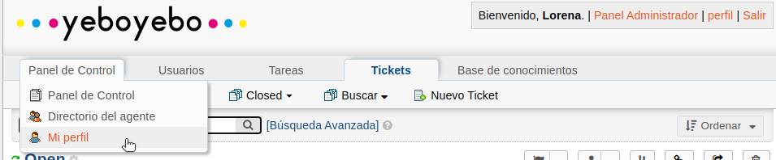
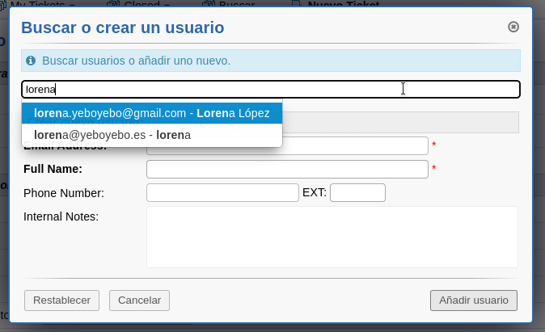
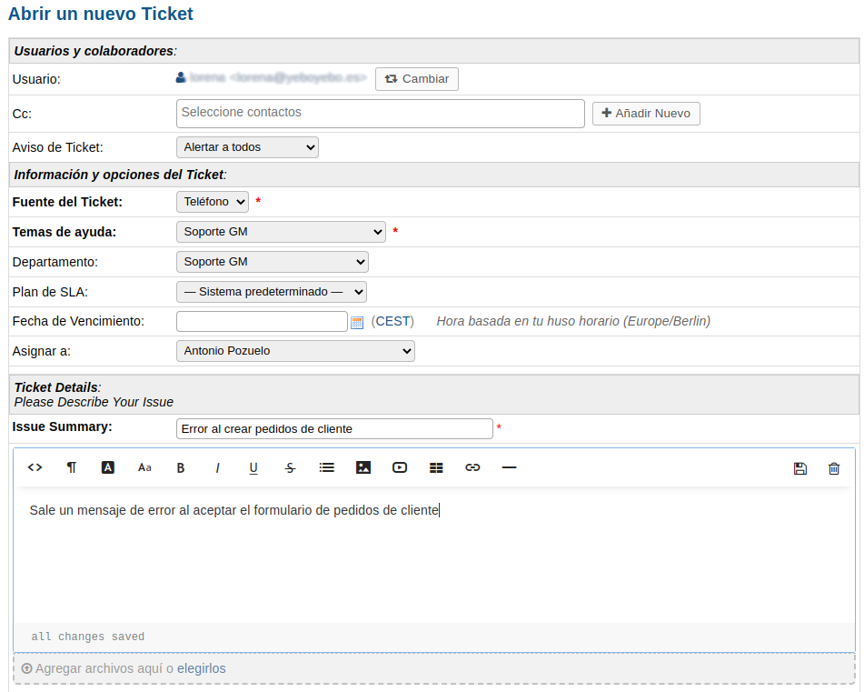
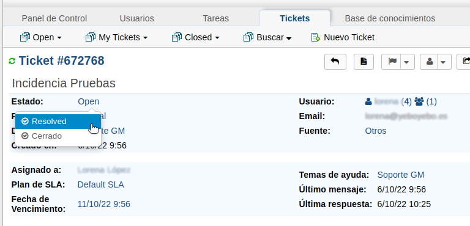

# Gestión de tickets

## Acceso a la plataforma
Accedemos como agente desde un navegador a http://soporte.yeboyebo.es/scp/login.php.

En los datos de login establecemos nuestro usuario y contraseña que se nos debe haber facilitado previamente

## Configuración de firma
Accedemos a nuestro perfil de agente desde **Panel de Control -> Mi Perfil**

En el apartado **Preferencias** hay un campo **Firma predeterminada**. En ese campo podemos establecemos **firma del departamento**

## Creación tickets
Podemos ver los tickets creados en la pestaña **Tickets** de nuestro **Panel de Agente**

En esa pestaña tenemos varias opciones:

- **Open**. Dónde vemos los tickets abiertos
- **My Tickets**. Dónde vemos los tickets que tenemos asignados
- **Closed**. Dónde vemos los tiquets que han sido cerrados
- **Buscar**. Dónde podemos hacer búsquedas avanzadas
- **Nuevo Ticket**. Dónde podremos crear nuevos tickets manualmente

Los tickets pueden crearse de dos formas:

- Enviando un correo a soporte@yeboyebo.es se genera automáticamente un ticket asignado al remitente del correo con el contenido del mismo

- Manualmente desde la opción **Nuevo Ticket**.

Al crear un nuevo ticket manualmente lo primero que nos pedirá es el usuario al que irán dirigidas las comunicaciones, es decir al cliente. Podemos buscar su email si ya está creado o crearlo en ese momento

Al crear el ticket de cualquiera de las dos formas una vez creado debemos abrir el formulario del ticket y configurar algunas cosas:

- **Cc.**: Email de los usuarios a los que debe llegarle una copia de las notificaciones
- **Aviso de ticket**. Debe poner Alertar a todos (es la opción por defecto)
- **Fuente del ticket** Debemos establecer si ha sido por email, teléfono u otros
- **Temas de ayuda** Soporte GM
- **Departamento** Soporte GM
- **Asignar a** Agente al que se asigna la incidencia
- **Issue Summary** Nombre de la incidencia y descrilpción larga (comentarios del cliente, explicación detallada, datos...)

Pulsamos el botón inferior abrir y el ticket quedará creado

Una vez creado el ticket copiamos su id en la tarea de dailyjob

## Enviar mensajes
Para enviar notificaciones al cliente cuando se crea un ticket utilizaremos el apartado de **Respuesta**.
Podemos seleccionar una **Respuesta predefinida**. Estas respuestas on de 3 tipos:
- **Confirmación apertura** La enviaremos en el momento en que recibamos el ticket
- **Solicitud de información** Cuando necesitemos solicitar información al cliente sobre codigos de registros, capturas de pantalla... que nos faciliten la resolución de la incidencia. Después de seleccionar la plantilla en el texto del mensaje debemos especificar los datos que necesitamos que nos envíe
- **Confirmación resolución** Cuando el ticket esté resuelto

## Resolver tickets
Cuando podamos dar la incidencia por resuelta debemos poner también el tiquet como Resuelto y enviar la respuesta de **confirmación de resolución**

- Primero debemos enviar la **confirmación de resolución**. Para ello vamos al apartado de **Respuesta** y seleccionamos la **Respuesta predefinida** **confirmación resolución** y pulsamos **Publicar respuesta**. Esta acción enviará un email a todos los usuarios asociados al ticket

- Después cambiaremos el estado del ticket. Pulsamos sobre el valor de Estdo y nos aparecerán todos los estados posibles. Para darlo por resuelto seleccionamos la opción Resolved. Podremos especificar un motivo de resolución

Una vez resuelto el ticket debemos registralo en el documento [motivos_ticket](https://docs.google.com/spreadsheets/d/1zinygYjlrDLStBCm1qKVw6brCKrl_Okv6S7A79Iy4ZM/edit#gid=0) de la carpeta Calidad del drive.

En este documento debemos especificar el motivo por el que se ha generado el ticket. Ha podido ser por error de especificacion, un malentendido con el cliente, error nuestro en un desarrollo, error del cliente...