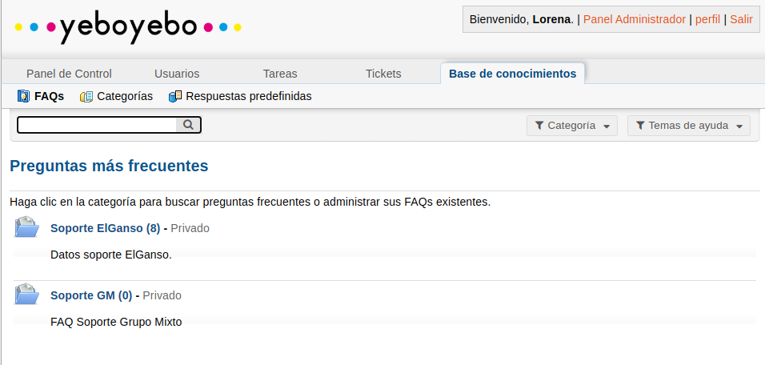

# Guía rápida soporte

Esto es una guía esquemática de cómo actuar con las incidencias de soporte.

[Aquí](./gestion_tickets) tenéis la documentación más extendida de cómo crear tikets, traspasarlos...

## PARA TODOS

- Si llega un correo de soporte. Reenviamos a soporte@yeboyebo.es
    - Si es urgente avisamos a la persona de soporte
    - Escribimos una nota interna explicativa si fuese necesario

- Si incidencia por teléfono. Creamos tiket en soporte
    - Si es urgente avisamos a la persona de soporte
    - Escribimos una nota interna explicativa
    - Enviar desde soporte correo de **Confirmación apertura**

## PERSONA DE SOPORTE

- Cada cierto tiempo revisar si hay tikets nuevos
    - Traspasarlos al grupo mixto
    - Crear tarea en dailyjob y asignar numero de ticket de soporte Ej #4512368
    - Enviar desde soporte correo de **Confirmación apertura**

- Prioridades de tareas de dailyjob: 
    - #P1 Fecha Entrega hoy o mañana
    - #P2 Fecha Entrega 3 días
    - #P3 Fecha Entrega 5 días

- Si tiene demasiada carga avisar (si hay muchas tareas con fecha entrega hoy o hay muchas urgentes)

- Todas las comunicaciones con el cliente se harán desde la aplicación de tickets. Si es necesario solicitar información hay una plantilla de **Solicitud de información**

- Se pasan a **Bloqueado** las tareas bloqueadas por motivos internos. Indicar:
    - Un comentario con el motivo del bloqueo y la siguiente acción a realizar
    - Fecha Ejecución el dia en que revisaremos la tarea

- Se pasan a **Revisión cliente** las tareas que están a la espera de que el cliente nos confirme el funcionamiento. Indicar:
    - Enviar correo de **Actualización de tiket** desde soporte
    - La siguiente acción a realizar
    - Fecha Ejecución el dia en que revisaremos la tarea

- Al pasar una tarea a **Resuelto** indicar:
    - Un comentario con el motivo de la tarea. Ej. Daba error la consulta del informe porque el campo x no existia
    - Fecha Ejecución el día que se finaliza
    - Desde soporte enviar correo de **Confirmación Resolución**
    - Si hay que explicar el funcionamiento de algo incluirlo en la documentación y enviarles el enlace en el correo

## BASE DE CONOCIMIENTOS

- Al resolver una incidencia si es algo que pasa a menudo y podemos crear documentación de cómo resolverla, lo hacemos en manuales_desarrollo y ponemos el enlace en la aplicación de tiquets en el apartado **Base de Conocimientos**->**Soporte GM**.

