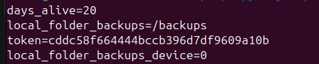
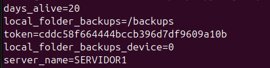
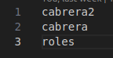
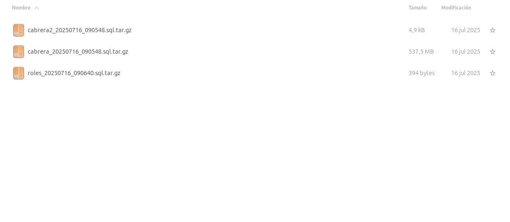
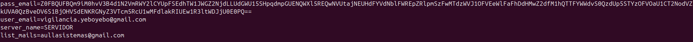
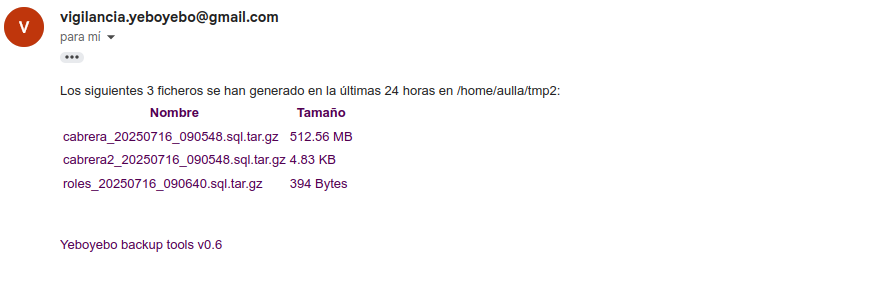

# Herramienta backup_tools

Esta herramienta sustituye a los scripts usados para copias de seguridad y el paquete sendMail usado para envios a vigilancia@yeboyebo.es. Engloba todas las necesidades que se conocen para gestionar las copias de un servidor : dump a ficheros comprimidos, copia de ficheros, email de información, etc ...

### Descarga

- Necesitamos descargar ficheros contenidos en la siguiente carpeta de git ```https://github.com/yeboyebo/utils/tree/master/backup_tools```
- El único fichero necesario se llama **backup_tools.py**, el resto (**config.ini** y **lista.txt**) son a modo de ejemplo

### Configuración
- La primera vez que se ejecute **backup_tools.py** se creará el fichero config.ini con los siguientes datos:
    - token: Valor usado para ofuscar los datos delicados. Este token se crea con un valor aleatorio. Si el token cambia en un futuro, los datos ofuscados serán ilegibles.
    - days_alive: Días que van a durar los ficheros de copia de seguridad antes de ser borrados.
    - local_folder_backups: Carpeta local donde se almacenan los ficheros comprimidos con las copias de seguridad.
    - local_folder_backups_device: Dispositivo a montar para que se use en la ubicación especificada en **local_folder_backup**. Por defecto 0, para no montar nada.




- Además se han de configurar varios atributos más, segun las tareas que queremos realizar. Este proceso se realiza con el argumento config:
```
python3 backup_tools.py config atributo valor ofuscado?:False
```
- Argumentos a usar:
    - config: Argumento que indica que vamos a setear una configuración.
    - atributo: Nombre del atributo a setear.
    - valor: valor en texto plano a guardar en el atributo.
    - ofuscado: Indica si el dato se ofusca para que no sea legible. Si no se especifica este argumento, por defecto es False. Cuando se ofusca un dato, se usa el valor de token, para ofuscar con fernet el valor especificado. El valor se almacenará dentro de config.ini, de manera ofuscada. **OJO!. Solo algunos valores de los atributos tienen que estar ofuscados**:
        - **user_db**
        - **pass_db**
        - **pass_email**


    - Copias de seguridad:
        - user_db: Usario de la BD. **OFUSCADO**
        - pass_db: Contraseña del usuario de la BD. **OFUSCADO**
        - port_db: Puerto de la BD. Si no se especifica se creará con el valor 5432.
        - host_db: Url del servidor de BD. Si no se especifica se creara con el valor 127.0.0.1.
    - Restaurar copias a otra BD.
        - replicate_host_db: Url del servidor secundario.
    - Envio emails:
        - user_email: usuario usuado en la autenticación SMTP.
        - pass_email: Contraseña usada en autenticación SMTP. **OFUSCADO**
        - lists_mails: Lista separada por comas de emails que tienen que recibir el email generado.
        -server_name: Nombre que describa de manuera unequivoca el servidor. Si no se especifica nada se usará **ubuntu-server**
- Un ejemplo de setear el atributo **server_name** sería:
```
python3 backup_tools.py config server_name SERVIDOR1
```
Este comando añade el atributo **server_name** al fichero **config.ini**



### Crear copias

#### BD a carpeta

 Para crear copias se ejecuta el comando db dump, seguido con el nombre de un fichero que contiene la lista de Bases de datos a copiar.

En el siguiente ejemplo se realizaría backup de las siguientes tablas incluidas en lista.txt.
```
python3 backup_tools.py db dump lista.txt
```


Como resultado se crearan 3 ficheros en la carpeta especificada en el atributo **local_folder_backups**, con un timestamp de la fecha de creación.



#### Carpeta a dispositivo externo

Para copiar ficheros desde nuestra carpeta de copias especificada en el atributo **local_folder_backups**,  a un emplazamiento externo, se usará los argumentos 

```
 python3 backup_tools.py file remote local_folder remote_device horas? 12
 ```
 - Argumentos:
    - file: Indica que vamos a trabajar con ficheros.
    - remote: Indica que vamos a mover ficheros a un emplazamiento externo.
    - local_folder: Punto de monetaje del dispositivo externo.
    - remote_device: Dispositivo externo a montar. Por defecto se usan argumentos entendiendo que es una carpeta compartida via cifs/samba.
    - horas: Recoge los ficheros que se han creado desde el valor especificado hasta ahora. Si no se espeicifa nada, se recogen los ficheros generados en las 12 últimas horas.

### Restaurar copias

#### Desde carpeta a BD

Usaremos el comando db restore fichero

```
 python3 backup_tools.py db restore lista.txt
 
```
- Argumentos:
    - db: Vamos a realizar trabajos realionados con al BD.
    - restore: Vamos a restuarar datos en BD.
    - fichero: Nombre del fichero que contiene la lista de BD`s a restaurar.

Al ejecutarse el comando buscará los ficheros más recientes de cada BD y los restaurará el el Servidor de postgres principal.

#### Desde carpeta a otra BD

Usaremos el comando db replicate fichero
**OJO!. Es necesario el atributo replicate_host_db en config.ini indicando la url del servidor de postgres alternativo y que este configura con mismo user/pass y puerto que el servidor principal.**

```
 python3 backup_tools.py db replicate lista.txt
 
```
- Argumentos:
    - db: Vamos a realizar trabajos realionados con al BD.
    - replicate: Vamos a restuarar datos en BD que no es la principal.
    - fichero: Nombre del fichero que contiene la lista de BD`s a restaurar.

Al ejecutarse el comando buscará los ficheros más recientes de cada BD y los restaurará el el Servidor de postgres espeicicado.


### Email resumen ficheros generados

- Se utiliza el argumento resume. **OJO!. Es necesario configurar la parte de email en config.ini como se describe en el apartado configuración**. Un ejemplo sería algo así:



```
 python3 backup_tools.py resume
 ```
 Al ejecutarlo se enviará un email a las direcciones especifcadas en el atributo list_mails con una lista de los ficheros generados en las últimas 24 horas.

 


## Más

- [Volver al índice de copias de seguridad](../index.md)