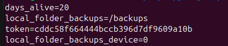
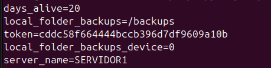
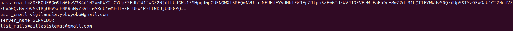
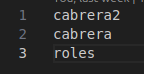
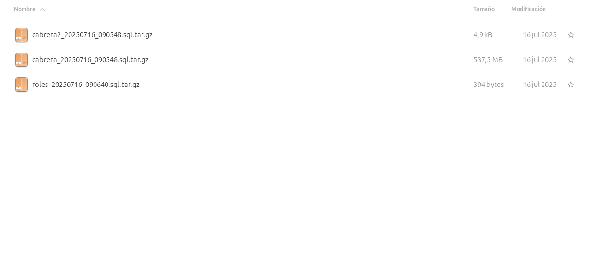
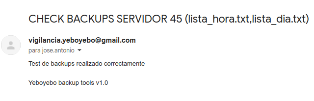

# Herramienta backup_tools

Esta herramienta sustituye a los scripts usados para copias de seguridad y el paquete sendMail usado para envíos a vigilancia@yeboyebo.es. Engloba todas las necesidades que se conocen para gestionar las copias de un servidor: dump a ficheros comprimidos, copia de ficheros, email de información, etc.

## Instalación

- Descargar `backup_tools.py` desde `https://github.com/yeboyebo/utils/tree/master/backup_tools`
- El único fichero necesario es **backup_tools.py**. El resto (**config.ini** y **lista.txt**) son a modo de ejemplo.

```bash
pip install fernet
```

Dependencias del sistema: `pg_dump`, `psql`, `tar`, `nice`, `mount`/`mount.cifs`, `ping`.

## Configuración

La primera vez que se ejecute **backup_tools.py** se creará el fichero `config.ini` con estos valores por defecto:

| Parámetro | Default | Ofuscado | Descripción |
|---|---|---|---|
| `days_alive` | `20` | no | Días de retención de backups antes de ser borrados |
| `token` | auto (UUID4) | — | Clave de cifrado para ofuscar credenciales. No setear manualmente. Si cambia, los datos ofuscados serán ilegibles |
| `local_folder_backups` | `/backups` | no | Carpeta local donde se almacenan los ficheros comprimidos |
| `local_folder_backups_device` | `0` | no | Dispositivo a montar en `local_folder_backups`. `0` = no montar nada (directorio local) |
| `user_db` | — | **sí** | Usuario PostgreSQL |
| `pass_db` | — | **sí** | Contraseña PostgreSQL |
| `port_db` | `5432` | no | Puerto PostgreSQL |
| `host_db` | `127.0.0.1` | no | URL del servidor de BD |
| `replicate_host_db` | — | no | URL del servidor secundario para replicación |
| `user_email` | — | no | Usuario usado en autenticación SMTP (Gmail) |
| `pass_email` | — | **sí** | Contraseña usada en autenticación SMTP |
| `server_name` | `unbutu-server` | no | Nombre descriptivo del servidor, usado en asuntos de email |
| `list_mails` | — | no | Lista separada por comas de emails destinatarios |
| `current_copies` | `1` | no | Nº de backups recientes a mantener en subcarpeta `currents/` |
| `current_folder` | `currents` | no | Nombre de la subcarpeta para copias recientes |
| `min_size` | `5000` | no | Tamaño mínimo en bytes de un backup; si es menor se envía alerta |



### Establecer parámetros

Se usa el argumento `config`:

```
python3 backup_tools.py config atributo valor ofuscado?:False
```

- **config**: Indica que vamos a setear una configuración.
- **atributo**: Nombre del atributo a setear.
- **valor**: Valor en texto plano a guardar.
- **ofuscado** (opcional): `true` para que el dato se ofusque con Fernet usando el `token`. Solo 3 atributos deben ir ofuscados: **user_db**, **pass_db** y **pass_email**.

```bash
# Parámetros planos (sin ofuscar)
python3 backup_tools.py config server_name SERVIDOR1
python3 backup_tools.py config port_db 5432
python3 backup_tools.py config host_db 192.168.1.100
python3 backup_tools.py config replicate_host_db 192.168.1.200
python3 backup_tools.py config user_email vigilancia.yeboyebo@gmail.com
python3 backup_tools.py config list_mails admin@example.com,otro@example.com
python3 backup_tools.py config days_alive 30
python3 backup_tools.py config current_copies 3
python3 backup_tools.py config min_size 10000
```



```bash
# Credenciales (ofuscadas — 3er argumento true)
python3 backup_tools.py config user_db postgres true
python3 backup_tools.py config pass_db SECRETO true
python3 backup_tools.py config pass_email CLAVE_GMAIL true
```




### Ficheros de lista

Ficheros de texto con nombres de BBDD, uno por línea. Ejemplo (`lista.txt`):

```
naranjas
roles
```

La herramienta busca el fichero en este orden:
1. Ruta absoluta (`/home/user/mis_dbs.txt`)
2. Relativa al directorio de `backup_tools.py`
3. Relativa al home del usuario (`~/mis_dbs.txt`)

Pueden usarse varios ficheros de lista para agrupar BBDD por frecuencia de backup (críticas vs grandes).

### Montaje de dispositivos

`local_folder_backups_device` controla si la carpeta de backups necesita montaje previo:
- `0`: la carpeta es un directorio local normal, no se monta nada
- Cualquier otro valor: se usa como dispositivo en `mount {device} {local_folder_backups}`

En la acción `file remote`, el destino siempre se monta vía CIFS (`mount.cifs`) con opciones `rw,guest,vers=2.0`. La herramienta usa un fichero centinela `no_tocar.txt` en la carpeta montada para verificar que el montaje fue exitoso.

## Crear copias

### BD a carpeta

Para crear copias se ejecuta `db dump` seguido del fichero con la lista de BBDD:

```
python3 backup_tools.py db dump lista.txt
```



El comando:
- Vuelca cada BBDD con `pg_dump` (la BBDD especial `roles` usa `pg_dumpall --globals-only` para capturar roles globales del cluster)
- Comprime con `tar -czvf`
- Verifica que el tamaño supere `min_size`; si no, envía alerta por email
- Borra los backups más antiguos de `days_alive` días
- Mantiene las `current_copies` más recientes en la subcarpeta `currents/`

Los ficheros generados siguen el patrón `{db}_{YYYYMMDD}_{HHMMSS}.sql.tar.gz`.



### Carpeta a dispositivo externo

Para copiar ficheros desde `local_folder_backups` a un emplazamiento externo:

```
python3 backup_tools.py file remote local_folder remote_device horas?=12
```

- **file**: Indica que vamos a trabajar con ficheros.
- **remote**: Indica que vamos a mover ficheros a un emplazamiento externo.
- **local_folder**: Punto de montaje del dispositivo externo.
- **remote_device**: Dispositivo externo a montar vía CIFS/Samba.
- **horas** (opcional): Recoge los ficheros modificados en las últimas N horas. Por defecto 12.

## Restaurar copias

### Desde carpeta a BD principal

```
python3 backup_tools.py db restore lista.txt
```

Busca el `.tar.gz` más reciente de cada BD, lo descomprime, dropea la BD, la recrea y restaura el dump con `psql`. Usa `nice -n -20` para prioridad alta durante el restore.

### Desde carpeta a BD secundaria (replicación)

**OJO: Necesita el atributo `replicate_host_db` en config.ini con la IP del servidor alternativo. Este debe tener mismo user/pass/puerto que el principal.**

```
python3 backup_tools.py db replicate lista.txt
```

Hace dump local y restaura en el host definido en `replicate_host_db`. Equivale a `db dump` + `db restore` contra otro servidor.

## Verificar integridad de backups

```
python3 backup_tools.py db test lista.txt
```

Para cada BD, coge el backup más reciente, lo restaura en una BD temporal (`{db}_test`), verifica que el tamaño de la BD restaurada > 0, la borra y envía email con el resultado. La BD `roles` solo comprueba que el fichero existe (no se restaura).

**OJO: Necesita la parte de email configurada.**



## Email resumen de ficheros generados

```
python3 backup_tools.py resume
```

Lista los `.tar.gz` creados en las últimas 24h en `local_folder_backups`, ordenados por tamaño descendente, y envía email con tabla resumen.

**OJO: Necesita la parte de email configurada.**


## Monitorización de conectividad

```
python3 backup_tools.py alive 192.168.1.30
```

Hace ping al host. Si no responde, envía email de alerta con timestamp y nombre del servidor. **Necesita la parte de email configurada.**

## Prioridad de ejecución

La herramienta usa `nice` para ajustar la prioridad de los comandos que ejecuta:

| Acción | Prioridad `nice` | Efecto |
|---|---|---|
| `db dump` | `0` (normal) | El pg_dump y el tar no compiten pero tampoco se retrasan |
| `db restore` | `-20` (alta) | El restore tiene prioridad máxima para acabar cuanto antes |
| `db test` (restore) | `-20` (alta) | Igual que restore |
| Resto de comandos | `19` (baja) | Copies, borrados y tareas de mantenimiento ceden CPU a otros procesos |

## Logging

- `-v`: nivel INFO
- `-vv`: nivel DEBUG
- Sin flag: nivel WARNING

## Crontab

Asumiendo la herramienta en `/opt/backup_tools/backup_tools.py` y `lista.txt` junto a ella.

### Primer despliegue

```bash
# Parámetros planos
python3 /opt/backup_tools/backup_tools.py config user_email vigilancia.yeboyebo@gmail.com
python3 /opt/backup_tools/backup_tools.py config list_mails admin@example.com
python3 /opt/backup_tools/backup_tools.py config server_name PRODUCCION
python3 /opt/backup_tools/backup_tools.py config local_folder_backups /mnt/backups
python3 /opt/backup_tools/backup_tools.py config host_db 127.0.0.1
python3 /opt/backup_tools/backup_tools.py config port_db 5432
python3 /opt/backup_tools/backup_tools.py config days_alive 30

# Credenciales (ofuscadas)
python3 /opt/backup_tools/backup_tools.py config user_db postgres true
python3 /opt/backup_tools/backup_tools.py config pass_db SECRETO true
python3 /opt/backup_tools/backup_tools.py config pass_email CLAVE_GMAIL true
```

### Crontab completo

```
# Backup PostgreSQL diario (3:17 AM)
17 3 * * * cd /opt/backup_tools && python3 backup_tools.py db dump lista.txt

# Replicación a contingencia (5:17 AM)
# 17 5 * * * cd /opt/backup_tools && python3 backup_tools.py db replicate lista.txt

# Test integridad (domingos 7:17 AM)
17 7 * * 0 cd /opt/backup_tools && python3 backup_tools.py db test lista.txt

# Informe diario (8:17 AM)
17 8 * * * cd /opt/backup_tools && python3 backup_tools.py resume

# Sincro a NAS cada 6h
17 */6 * * * cd /opt/backup_tools && python3 backup_tools.py file remote /mnt/nas //192.168.1.200/backups 6

# Ping a servidores cada 30 min
*/30 * * * * cd /opt/backup_tools && python3 backup_tools.py alive 192.168.1.1
*/30 * * * * cd /opt/backup_tools && python3 backup_tools.py alive 192.168.1.30
```

### Volcado de logs

```
17 3 * * * cd /opt/backup_tools && python3 backup_tools.py -v db dump lista.txt >> /var/log/backup_tools.log 2>&1
```

### Varias listas de BBDD

```
# Diario: BBDD críticas
17 3 * * * cd /opt/backup_tools && python3 backup_tools.py db dump criticas.txt

# Solo domingos: BBDD grandes o poco cambiantes
17 4 * * 0 cd /opt/backup_tools && python3 backup_tools.py db dump grandes.txt
```

## Notas

- Las contraseñas en `config.ini` se ofuscan con Fernet (AES-128-CBC) derivando clave vía PBKDF2-SHA256 + salt fijo. No es seguridad fuerte pero evita plaintext.
- El envío de email usa SMTP de Gmail con STARTTLS en puerto 587.
- `check_current_backups` mantiene las N copias más recientes en la subcarpeta `currents/` y borra las obsoletas automáticamente.
- La acción `version` (`python3 backup_tools.py version`) imprime la versión y sale.

## Más

- [Volver al índice de copias de seguridad](../index.md)
