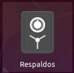
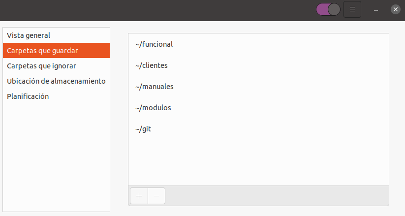
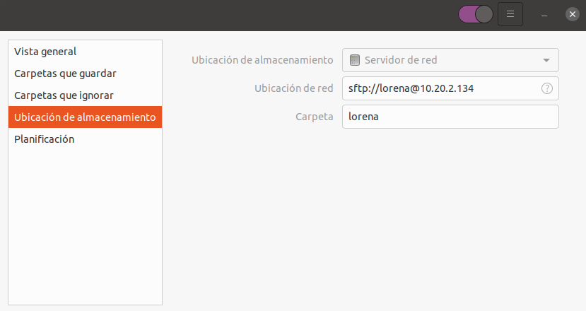
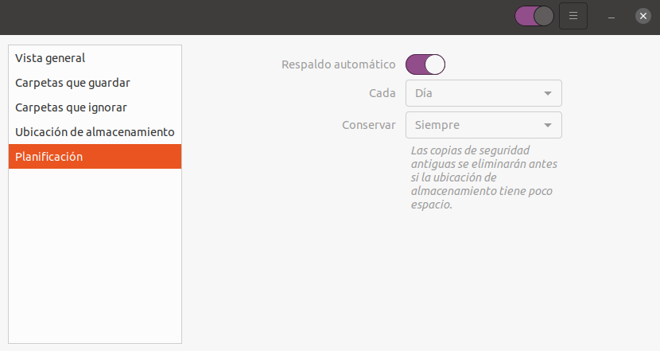
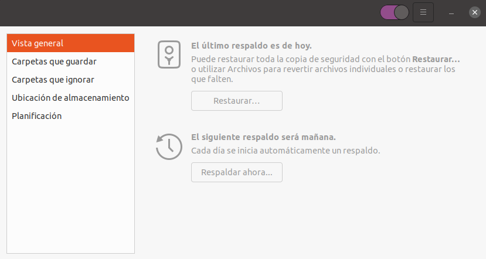

# Copias de seguridad (deja-dup)

Para configurar nuestro equipo y hacer copias de seguridad periódicas debemos seguir los siguientes pasos:

- He creado un usuario para cada uno en el servidor donde se harán las copias (10.20.2.134). Intentad acceder por ssh. Usuario vuestro nombre y contraseña c0m... Si queréis podéis cambiar la contraseña

- Conectamos a la VPN de Yeboyebo. Para que haga las copias todos los días, hay que estar conectado a la VPN

- Abrimos la aplicación de **Respaldos**

- Configuramos las **Carpetas que guardar** y **Carpetas que ignorar** (si las hubiera)

- Configuramos la **Ubicación de almacenamiento**
Aquí debemos establecer los siguientes valores:
    - **Ubicación de almacenamiento** como **Servidor de red**
    - **Ubicación de red** como sftp://usuario@10.20.2.134
    - **Carpeta** con el nombre de la carpeta donde se guardaran las copias en el servidor. Debería ser nuestro usuario

- En el apartado **Planificación** podemos configurar la frecuencia con la que se harán los respaldos
    - Activamos la opción **Respaldo automático**
    - Establecemos la periodicidad en el campo **Cada**
    - Establecemos hasta cuando deseamos guardar las copias en el campo **Conservar**

    
- Podemos hacer un respaldo manualmente para comprobar que la configuración es correcta. Para ello vamos a **Vista general** y pulsamos el botón **Respaldar ahora**. Es posible que nos pida nuestra contraseña de usuario

## Más

- [Volver al índice de copias de seguridad](../index.md)