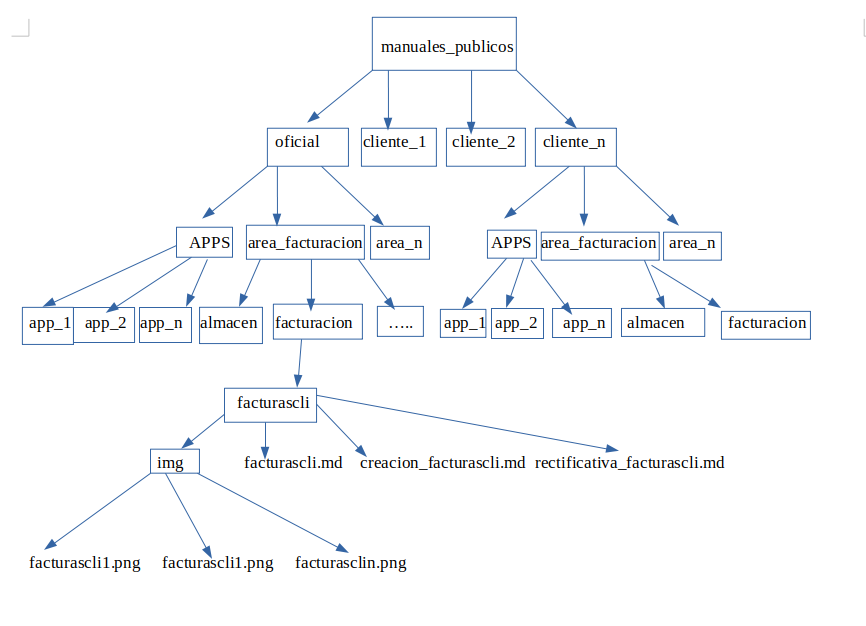

# Estructura de carpetas

Se ha organizado una estructura de carpetas de la siguiente forma:

En la carpeta **manuales_publicos** tendremos una carpeta para **oficial** y una carpeta para cada cliente con el nombre del proyecto que utilizamos en yeboyebo (euromoda, elganso, jsenar...), este sería el primer nivel.

Dentro de oficial y de cada uno de los clientes tendremos un segundo nivel de carpetas, en este segundo nivel tendremos una carpeta para **APPS** y una carpeta para cada una de las áreas de forma similiar a la que utilizamos en el ERP (**area_facturacion, area_financiera etc...**). 

Dentro de las carpetas APPS tendremos las aplicaciones correspondientes a oficial (en el caso de que estemos en la de oficial) y las aplicaciones correspondintes del cliente (en el caso de que estemos dentro de la carpeta APPS de un cliente).

Dentro de las carpetas de las áreas seguimos con la misma estructura que en ERP hasta llegar a la funcionalidad que queremos documentar.

Por ejemplo si queremos documentar la **creacion de una factura** de oficial, crearemos la siguiente estructura:

En la carpeta **img**, introduciremos todas las imágenes que se utilizan en el manual con el mismo nombre que la acción (facturascli1.png, facturascli2.png ...)

En el  fichero **facturascli.md** escribiremos el índice de todas las funcionalides correspondientes a facturas de clientes.

En el fichero **creacion_facturascli** documentaremos el manual de como crear una factura.

### Más

  * [Volver al Índice](./index.md)