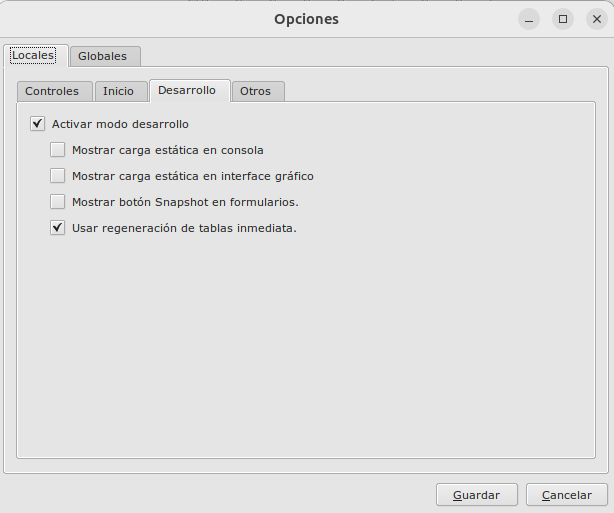

# Eneboo / Actualizar tablas

### Configuración
Se puede activar el modo rápido para actualizar tablas de la siguiente manera:

#### Comportamiento
Desde Sistema/Administración/Opciones de comportamiento/Locales/Desarollo:



#### Argumento eneboopkg desde consola

Añadiendo un tercer argumento a true al especificar -a. **A partir de eneboo 2.6.3 y sup.**

```
./bin/eneboo -silentconn "test:postgres:PostgreSQL:localhost:5432:dkn42m:nogui" -c "sys.loadAbanQPackage" -a "/home/aulla/temporal/eneboo/paqueteria/principal.eneboopkg:false:true" -q
```

#### Notas
Si tenemos activada carga estática y especificadas las carpetas de los mtd, e instantamos importar módulos con el mismo contenido, no se detectarán diferencias y no funcionará el modo.

### Más

- [Volver al Índice](./index.md)