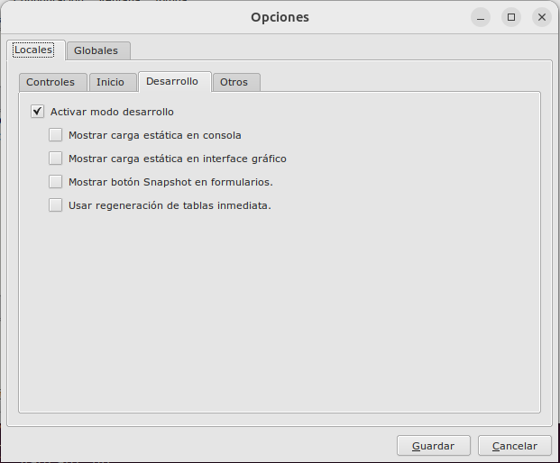
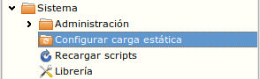
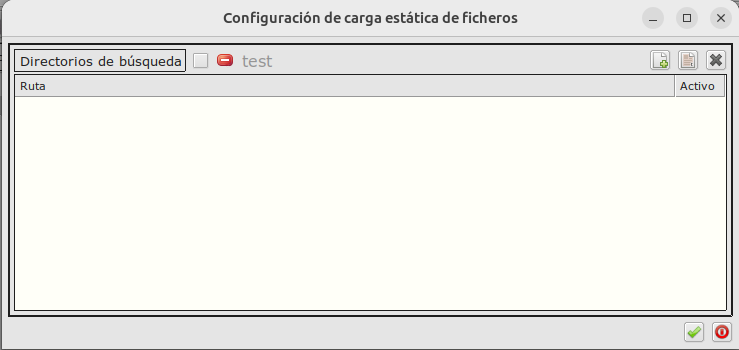
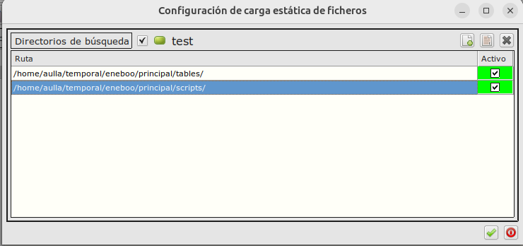

# Eneboo / Actualizar tablas

### Configuración
Para habilitaar la carga estática tenemos que habilitar la siguiente opción:

Una vez activada podremos acceder via Sistema:

Aparecerá la siguiente pantalla donde podremos habilitar carga estática para la base de datos actual, pulsando en el check al lado del icono rojo.

Las carpetas se van añadiendo. **Para que la lista de carpetas tenga efecto es necesario reiniciar eneboo**. 

Las capretas no hacen busqueda recursiva, solo informarán de los archivos que continene y no de las subcarpetas.

Cada base de datos usa estructura de carga estática diferente.

### Más

- [Volver al Índice](./index.md)