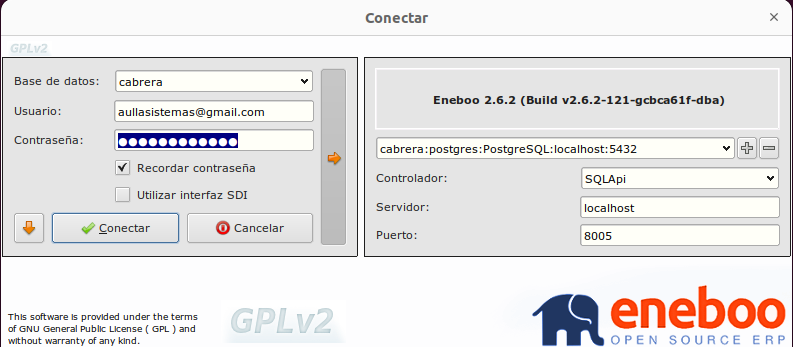
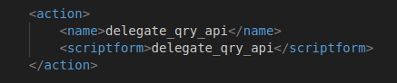
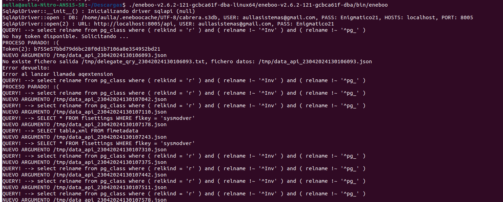

# Eneboo / SqlApi (Actualmente en desarrollo)
### Instalación

Descargamos desde este enlace el último eneboo que contiene el driver sqlApi.
*https://eneboo.org/pub/contrib/tests/eneboo-v2.6.2-sqlapi-dba-linux64.tar.bz2*

### Configuración

El la ventana de login especificamos:
- Base de datos : La base de datos a la que nos queremos conectar. Este campo aún no tiene utilidad, pues usamos la BD a la que está conectaba pinebooapi.

- Usuario : El email del usuario que se va a conectar.
- Constraseña : La contraseña del usuario asignada en su registro de usuario.
- Controlador : SQLApi.
- Servidor : host de pinebooapi.
- Puerto : 8005 ( por defecto).

Dentro la base de datos de pinebooapi , debemos tener el módulo fllibreria actualizado con el action __delegate_query_api__.

Esto se está desarrollando en la rama __DEV-H3579-driver_sqlapi__ de codebase

Ahora podemos encender el servidor pinebooapi para que gestione las consultas.

#### Comportamiento

Al conectar e inicializar una conexión solicitará el token del usuario y lo usuará para las sigueitnes conexiones.

Actualmente,  solo es capaz de hacer consultas select, pues el resto de consultas han sido filtradas.

### Más

- [Volver al Índice](./index.md)