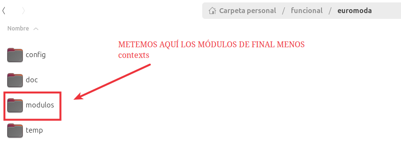
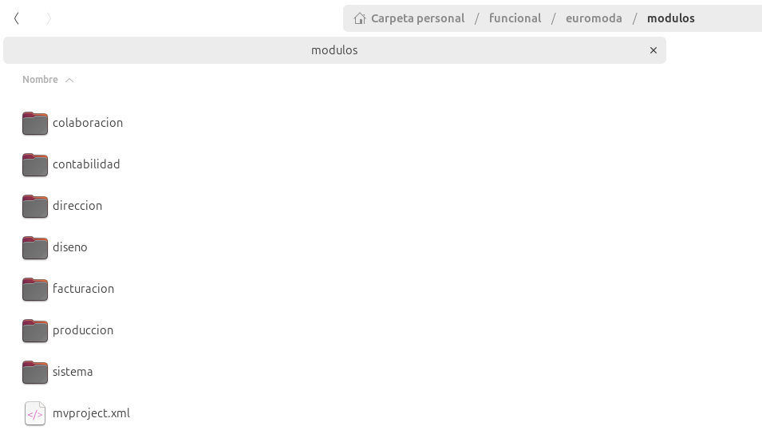
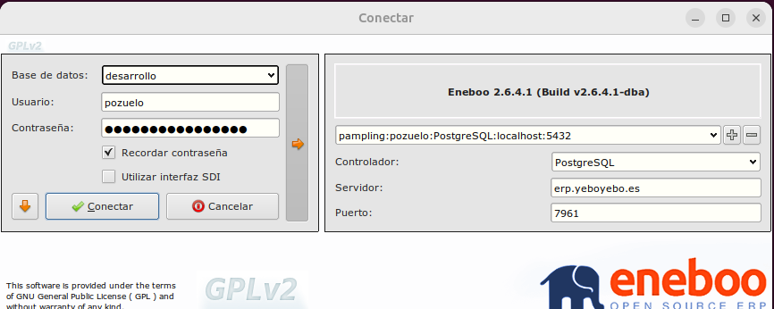
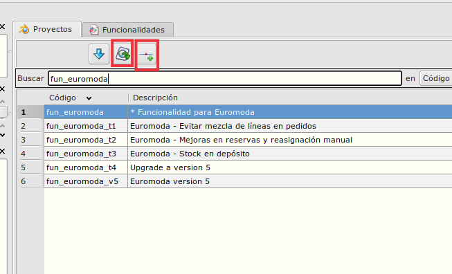

# ÚTILES EUROMODA

## Instalación en servidor de Euromoda (abanq)

1. El paquete hay que hacerlo a la vieja usanza (**paquete abanq**), para ello cogeremos el contenido de nuestra carpeta final y lo copiamos en la antigua estructura de carpetas que usábamos para hacer paquetes **/home/xxxxxx/funcional/euromoda/modulos**, el módulo de **contexts NO** hay que ponerlo si no da error.

    Aquí se puede descargar el contenido que tendría que tener la carpeta **/funcional/euromoda** para el correcto funciomiento al crear el paquete.

    [Carpeta /funcional/euromoda](euromoda.tar.bz2)

    

    

2. Abrir en eneboo la base de datos de desarrollo, se conecta igual que a yeboyebo pero se llama desarrollo.

    

3. Vamos a proyectos y teniendo seleccionado fun_euromoda, pulsaremos en hacer paquete o hacer paquete parcial.


    


4. Guardamos el paquete abanq en una ruta y le cambiamos el nombre para ponerle fecha y hora	

5. Para instalar, conectamos por remmina (hay que estar en la oficina o tener activada la VPN de yeboyebo).

6. Hacemos la copia antes de instalar, la copia hay que realizarla por consola:
	
``` sql
	/pgsqldb/PostgreSQL/9.6/bin/pg_dump abanq_creaciones > abanq_creaciones_aaammddThh.dump -U antonio	
```
7. Entramos a **abanq** (la base de datos se llama **abanq_creaciones** y se entra con usuario **antonio**) y cargamos el paquete, al terminar hay que lanzar el proceso de crear vistas 

8. Como desde Euromoda crean sus propias vistas, es posible que de algún error al regenerar la base de datos o al crear vistas porque hay vistas suyas que dan conflicto, hay que borrarlas:
Estas dos que pongo dieron error en pruebas por lo que seguramente den error en producción, las podéis borrar directamente antes de empezar.

    8.1. Entramos a postgresql por consola:

    /pgsqldb/PostgreSQL/9.6/bin/psql abanq_creaciones -U antonio	

    8.2. Borramos las vistas
	
``` sql		
    drop view v_ssensor_060_det;
	drop view v_ssensor_060;
``` 
