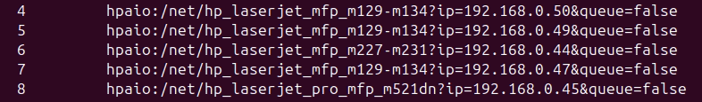
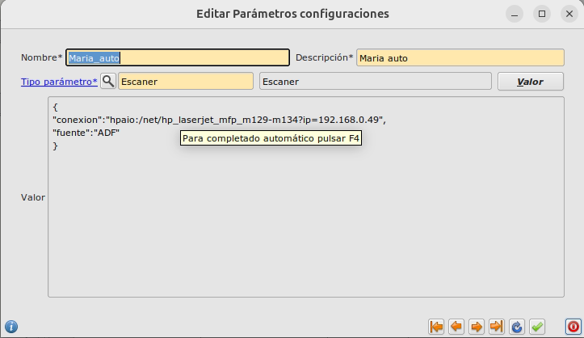
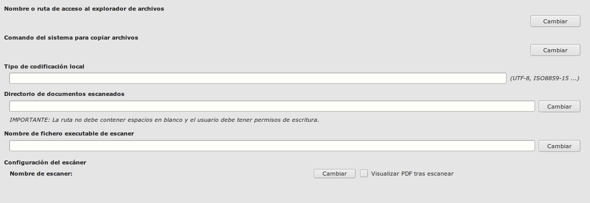

# Pasos para configurar un escaner conectado a un equipo

## Descargar ejecutable

En nuestro repositorio de git/utils descargamos el fichero **ImageScan_v1.py**

## 1. Comprobar escaneres en red

Ejecutarmos el siguiente comando para detectar los escaneres en la red.

```
hp-scan
```
Saldran una lista de escaneres/impresoras del cual tendremos que obtener la direccion IP que suele ser de la siguiente forma.



## 2. Instalar paquetes necesarios

Puede ser que no esten instalados unos paquetes al ejecutar el programa para escenear

```
sudo apt update
sudo apt install libtiff-tools
sudo apt install imagemagick
```

## 3. Instalar plugin HP

Puede ser que nos falte el plugin de HP para que funcione correctamente por lo que habria que descargar e instalar el plugin visitando la siguiente url y seleccionando la version que tenemos instalada.

```
https://developers.hp.com/hp-linux-imaging-and-printing/plugins
```

## 4. Configurar en Eneboo las rutas y las variable

Una vez ejecutado y comprobado que funciona el escaneo, tenemos que ir a eneboo y configurar lo siguiente:

* Vamos a **Sistema -> Mantenimiento -> Valores parámetros**.

Creamos un registro nuevo para nuestro usuario con el formato **Usuario_auto**. Tipo **Escaner**
y pulsamos el botón valor para añadir el siguiente formato de valor, cambiando la IP por la del dispositivo que vayamos a usar.

```
{
"conexion":"hpaio:/net/hp_laserjet_mfp_m129-m134?ip=192.168.0.49",
"fuente":"ADF"
}
```
El registro deberia verse parecido a la siguiente captura.



* Una vez creado vamos a **Area de colaboración -> Gestión documental -> Configuración**.

Configuraremos el **Directorio de los documentos escaneados** donde se guardara el escaneo, el nombre del fichero donde hayamos guardado **ImageScan_v1.py** y el nombre del escaner pulsamos sobre el botón **Cambiar** y seleccionamos el registro creado en los parametros del paso anterior.

