## Integración con Fiskaly

- En la siguiente dirección podemos ver todo el proceso de integración https://developer.fiskaly.com/es/sign-es/integration_process

- En la siguiente imagen podemos ver el diagrama de flujo para realiazar la integración y que herramientas hay que utilizar en cada paso.

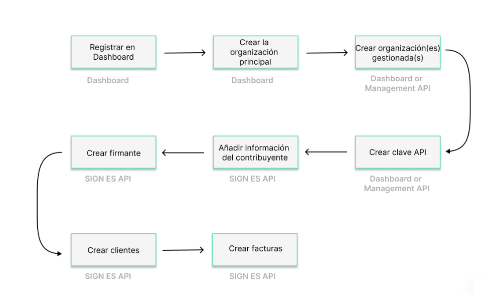

### 1. Registrar en Dashboard
- Lo primero es registrarte en el Dashboard. Crearemos la cuenta y a partir de ahí se creará la estructura organizativa de la empresa.

    https://dashboard.fiskaly.com/
    

### 2. Crear organización principal

- Entraremos en el Dashboard con las credenciales facilitadas y lo primero que se muestra es la lista de organizaciones que hay y la opción de crear una nueva, pulsaremos en **Crear nueva organización**

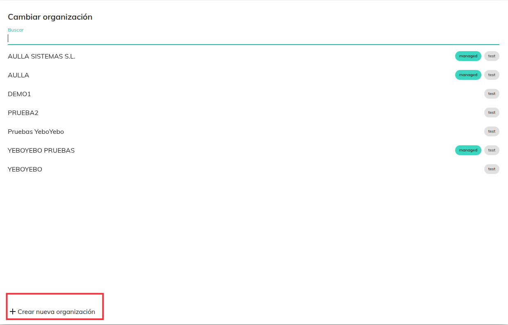

    1. Seleccionamos España


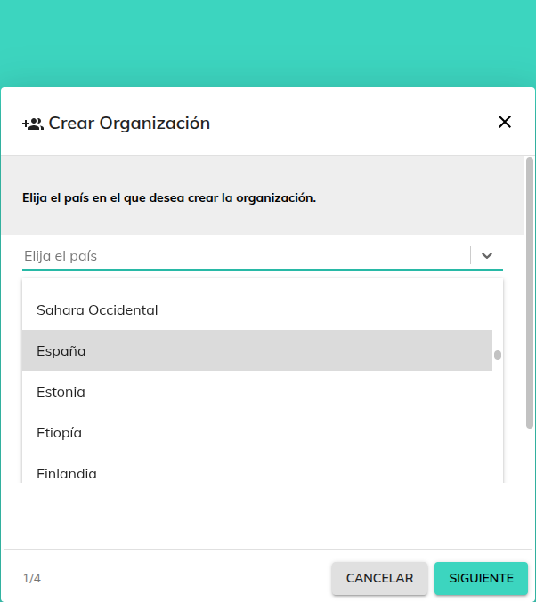

    2. Informamos los datos generales

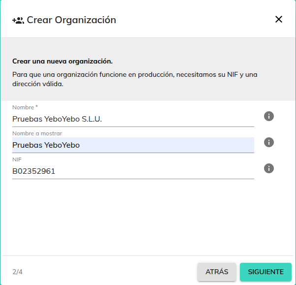

    3. Informamos la dirección

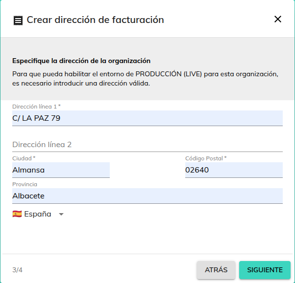

    4. Creamos si es necesario la dirección de facturación.

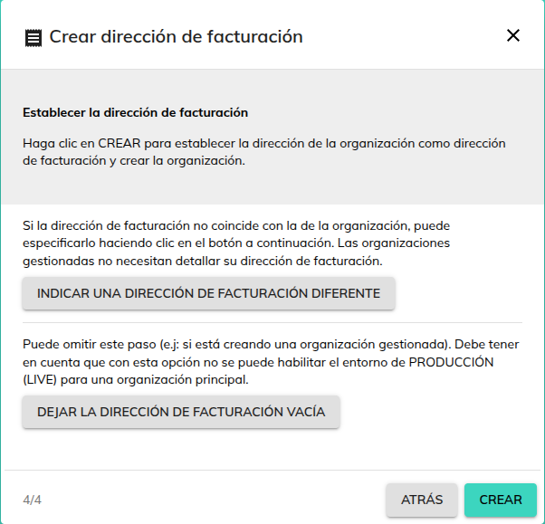


### 3. Crear organización gestionada
- Teniendo seleccionada nuestra organización principal, pulsaremos en **Crear nueva organización** 

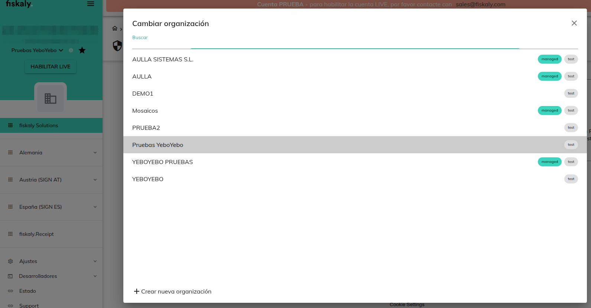

Los pasos son los mismos que al crear una organización pero en el paso de informar los datos generales marcaremos el check de **Crear organización gestionada** y podremos ver que nos aparece la organización que la gestiona, en nuestro ejemplo *Pruebas YeboYebo*

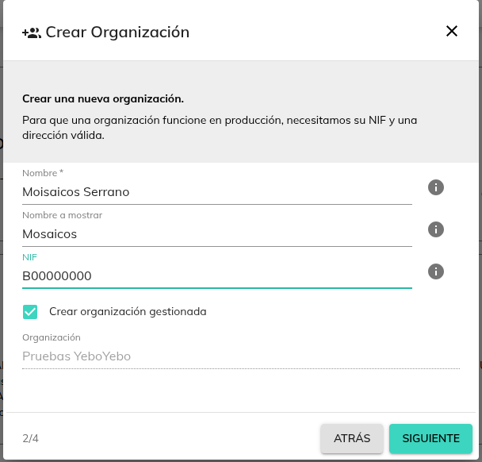

- Una vez creados los datos de la organización gestionada (Mosaicos Serrano) nos aparecerán las distintas opciones que tenemos, en nuestro caso **ESPAÑA - SIGN ES**

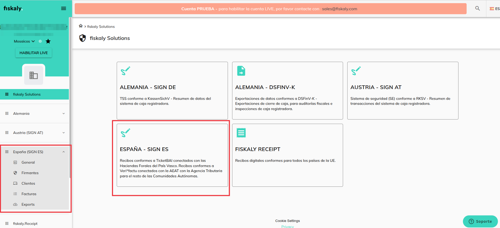

- Al entrar en la opción de *ESPAÑA - SIGN ES* podemos ver en la parte de la izquierda un submenú con las distintas opciones.

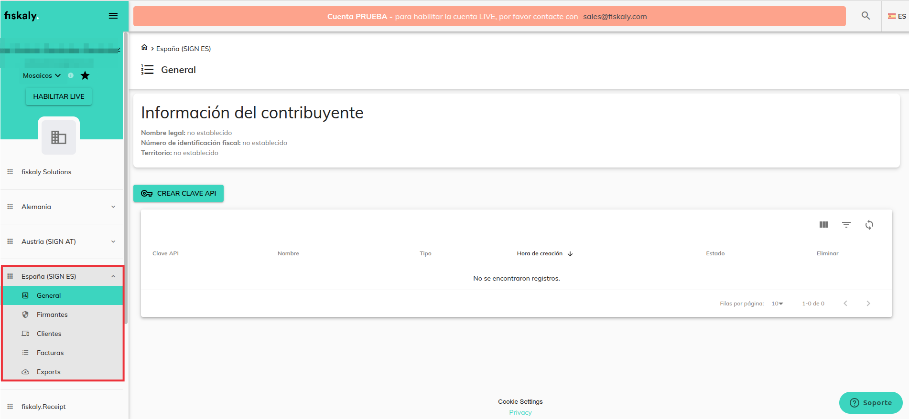


### 4. Crear clave API
- En el apartado de General, tenemos la opción de creear la clave API, pulsaremos y daremos un nombre.

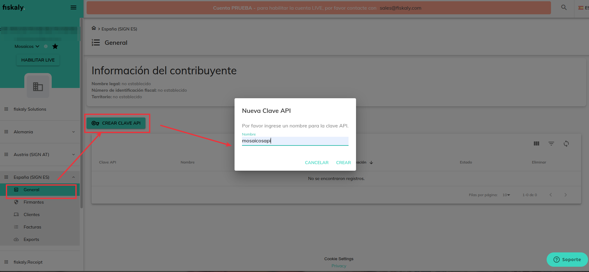


- Al aceptar se mostrará la *clave API* generada (podremos verla en cualquier momento) y la *clave API secret*, **ESTA DEBE SER COPIADA Y GUARDADA PORQUE LUEGO NO SE PUEDE ACCEDER A ELLA**

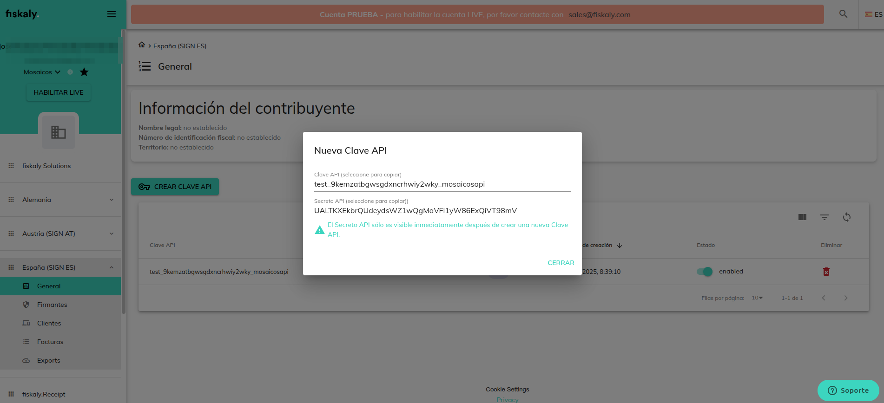

- Inserta tu Clave API y Secreto API para descargar el entorno de Postman de fiskaly SIGN ES como archivo personalizado de configuración basado en JSON, esto lo haremos en el punto 3 de la guía rápida:

https://developer.fiskaly.com/es/api/sign-es/v1#section/Guia-Rapida


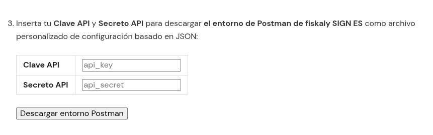


- Al introducirlo y pulsar el botón de descargar, se descargará un fichero **environment.json** el cual reservaremos


- Realizaremos el punto 4, descargaremos la colección **Postman de fiskaly SIGN ES**

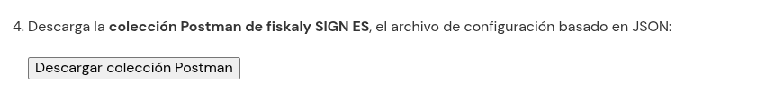

- Al pulsar el botón de Descargar se descargará un fichero **collection.json** el cual reservaremos.

- Una vez que tengamos el fichero de environment y el de collection, iniciaremos Postman e importaremos los archivos del entorno y la colección de Postman.

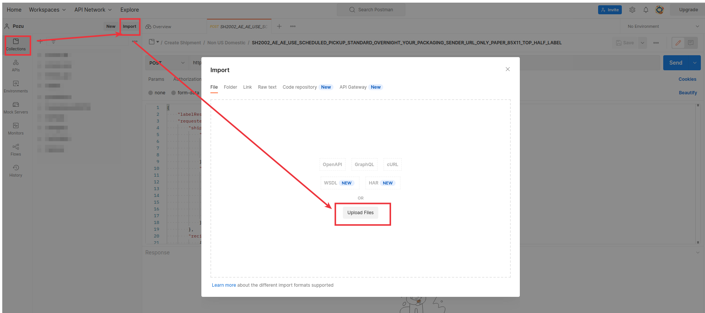

- Seleccionamos los dos ficheros en la ruta donde los hayamos guardado


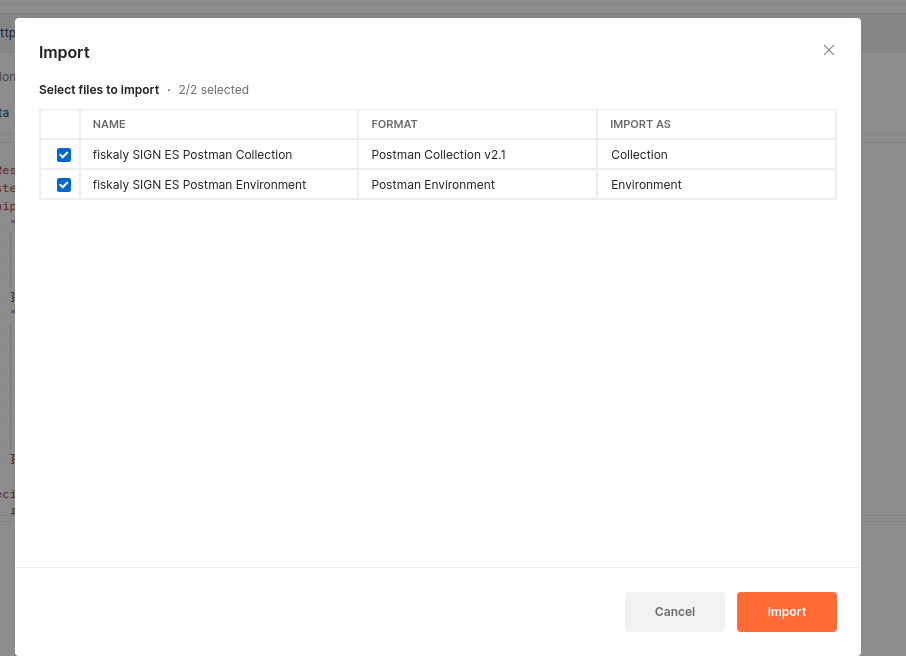

- Pulsamos en Importar y por un lado tenemos que tener la colección **fiskaly SIGN ES Postman Collection** y por otro lado el environment **fiskaly SIGN ES Postman Environment**

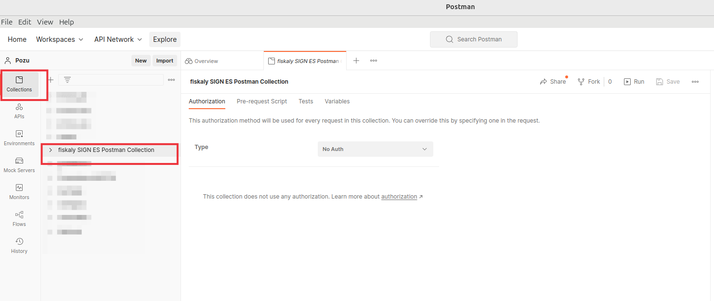

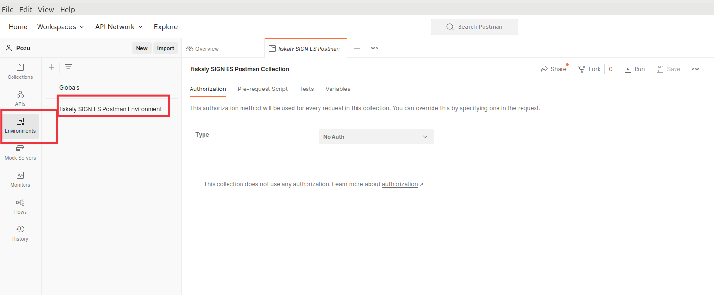


- Una vez tenemos las importaciones, teniendo seleccionado la colección de fiskaly, seleccionaremos el enviromente de fiskaly.

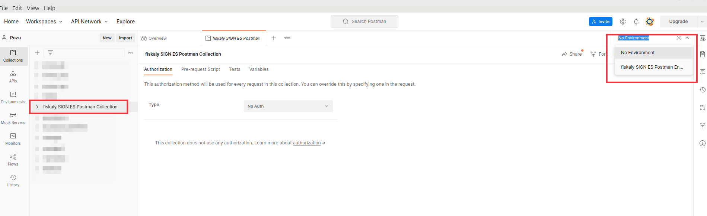

- Si desplegamos la colección, podemos ver las distintas llamadas que podemos hacer, la primera que tendremos que realizar es la de **Retrieve access token** para obtener el token

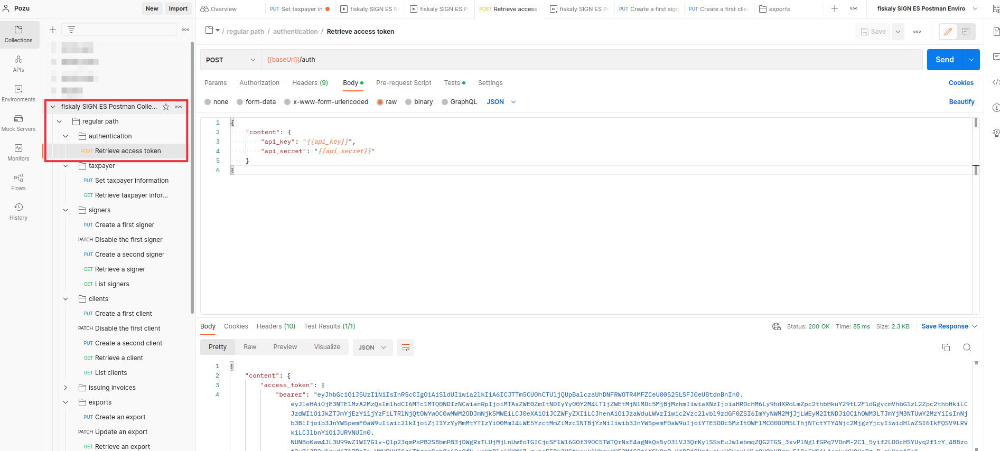

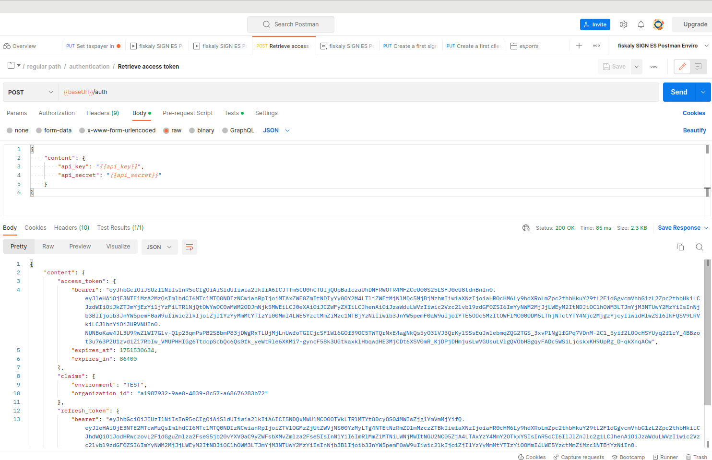

### 5. Añadir información del contribuyente

- El siguiente paso es añadir la información del contribuyente al sistema, para ello lo haremos con al sistema a través del endpoint **Set taxpayer information** de la API de SIGN ES.

Asegúrate de indicar correctamente el campo territory de acuerdo con el domicilio fiscal del contribuyente. La API SIGN ES aplicará la legislación correspondiente basada en esto:

Verifactu para SPAIN_OTHER (España Peninsular), CANARY_ISLANDS, CEUTA y MELILLA
TicketBAI para ARABA, BIZKAIA y GIPUZKOA
Actualmente, no se aplica ninguna normativa fiscal a NAVARRA
Este es un paso obligatorio para garantizar que todas las facturas generadas cumplan con la normativa fiscal e incluyan todos los datos necesarios del contribuyente.

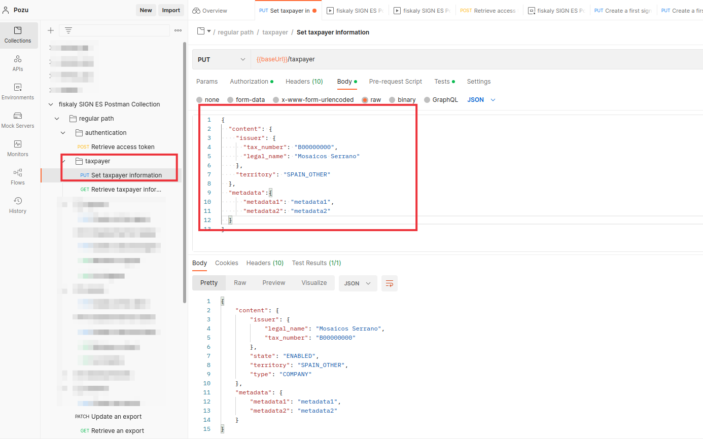

### 6. Crear un firmante

- A continuación, se debe de crear un Firmante a través del endpoint **Create a first signer** para cada organización gestionada. El firmante es responsable de la firma digital de las facturas.

Cada dispositivo de firma requiere un certificado:

Para el cumplimiento de Verifactu, un certificado electrónico gestionado por fiskaly se asigna automáticamente durante la creación de un firmante. fiskaly está registrado como colaborador social con la AEAT para Verifactu, por lo que el contribuyente necesita firmar un acuerdo de colaboración social con fiskaly. Puedes encontrar más información en la sección Colaboración social.
Para el cumplimiento de TicketBAI, un certificado de dispositivo se asigna automáticamente durante la creación de un firmante, a menos que desees proporcionar tu propio certificado de dispositivo externo. Este certificado se puede obtener de la respuesta de la llamada a la API. Si tus clientes están ubicados en el País Vasco, asegúrate de enviarles la guía de registro que proporcionamos desde fiskaly. Esto les ayudará a registrar correctamente los certificados de dispositivo con la autoridad fiscal correspondiente.


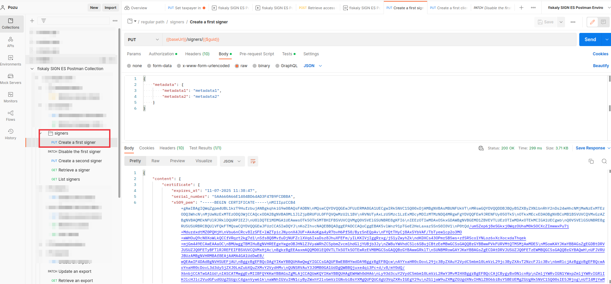

### 7. Crear clientes

- El siguiente paso es crear clientes, el flujo de trabajo incluye la creación de createClient a través del endpoint **create a first Client**. Debes crear un Cliente para cada dispositivo POS u otros dispositivos de facturación utilizados en tu organización.


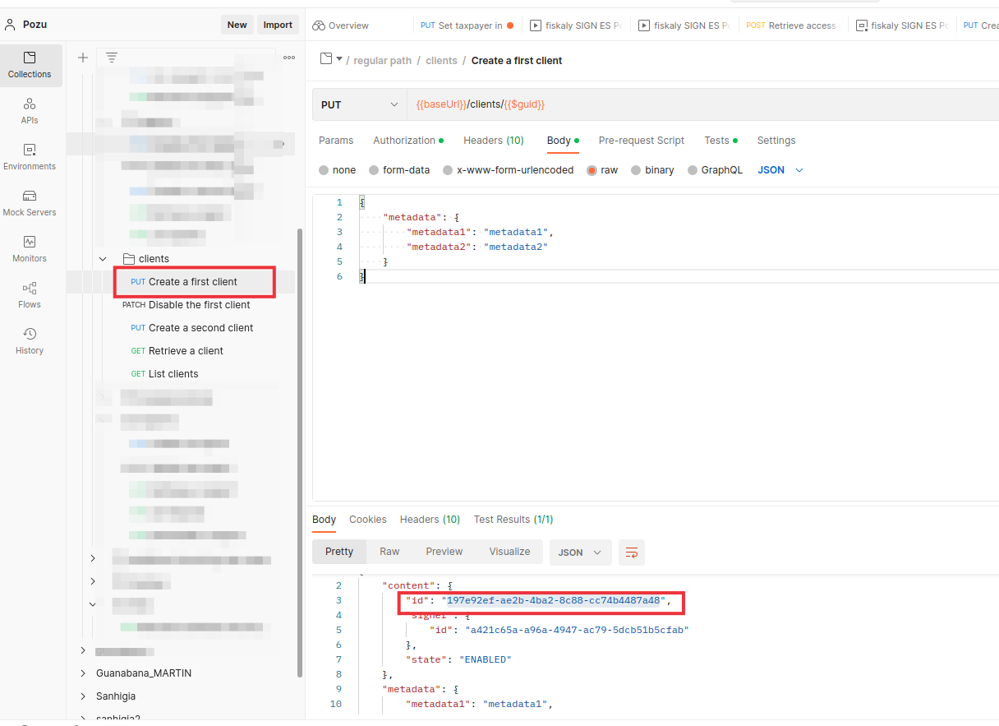


- En la respuesta, obtenemos el idcliente que tendremos que guardar en la configuración de verifactu en el campo id.


### 8. Crear facturas

- El siguiente paso es crear facturas desde el ERP y firmalas, antes de eso vamos a configurar los datos en el ERP dentro de la pestaña **VERI*FACTU** del formulario de configuración de **Facturación**:

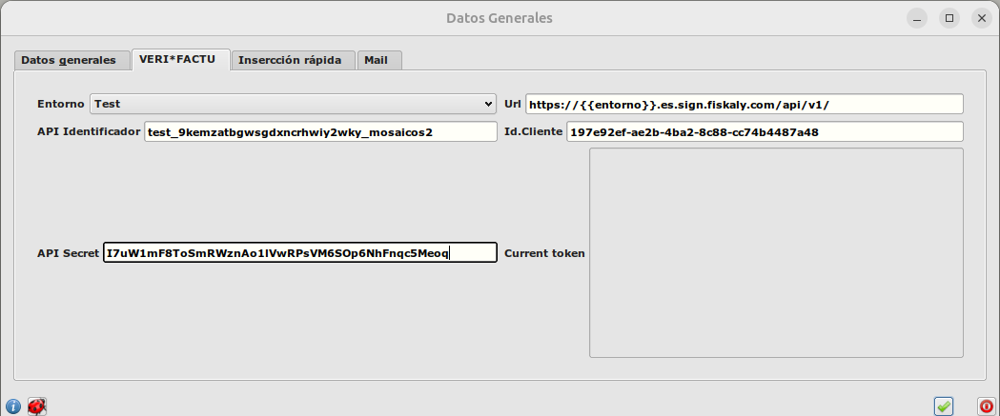

* API Identificador --> Informamos el valor obtenido en el punto 4 clave API.

* API Secret --> Informamos el valor obtenido en el punto 4 lave API secret.

* URL --> Valor fijo:
```
    https://{{entorno}}.es.sign.fiskaly.com/api/v1/

```


* Id.Cliente --> Valor obtenido en el punto 7 en el campo id.

#### 8.1. Proceso crear/firmar facturas 

- Una vez informados esta configuración podremos crear facturas y firmarlas con fiskaly.

- El proceso de creación de facturas es el estandard del ERP pero hasta que la factura no se emite a Fiskaly y queda firmada no estará en firme.

- Al crear la factura, no tiene un código estándard, nos da un código de borrador y el estado será **Borrador**

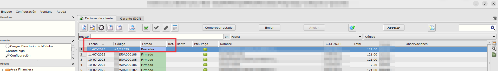

- Con la factura seleccionada, pulsamos en el botón **Emitir** 

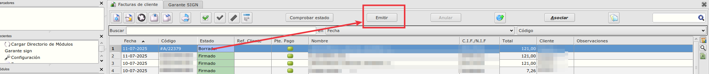

- La factura pasará por los estados de **Pte.Emitir** y **Pte.Firma**, cuando está **Pte.Emitir** automáticamente se envía a Fiskaly y si no ha habido problema en el envío la factura se queda como **Pte.Firma**.

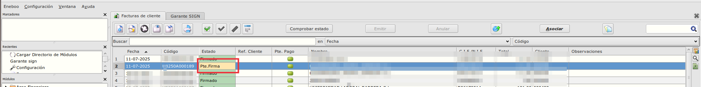

- Una vez en este punto, la factura será firmada por Fiskaly y la siguiente factura que se presente obtendrá la información del estado de las facturas en estado **Pte.Firma** y actualizará el estado como **Firmada** si todo ha ido bien.

- Una forma alternativa de actualizar el estado sin tener que esperar a enviar otra factura es pulsando el botón de **Comprobar estado**

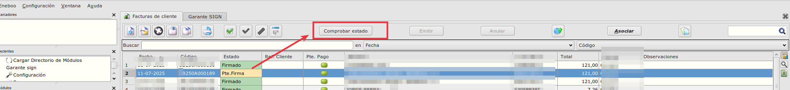

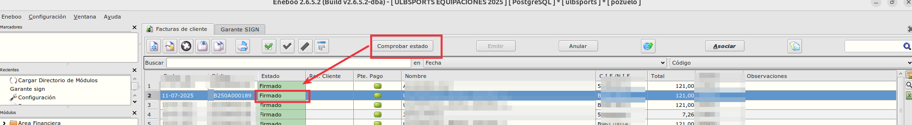


### 9. Ver facturas presentadas a Fiskaly desde el ERP

- En principio, todas las facturas en estado **Firmada** están firmadas pero es posible que haya habido errores y podemos verlos desde el **Área de Facturación --> Facturación --> Más --> Garante Sign**

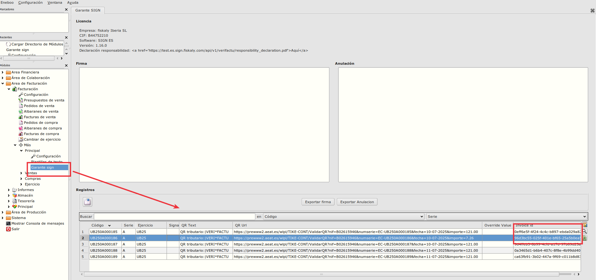

- En esta pantalla podemos ver las facturas firmadas en Fiskaly y podemos ver el id que le ha asignado Fiskaly con el que se pueden ver las facturas en el dashboard


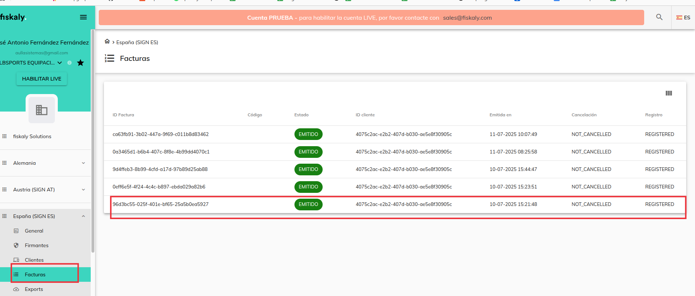


