## Integración con Fiskaly

- En la siguiente dirección podemos ver todo el proceso de integración https://developer.fiskaly.com/es/sign-es/integration_process

- En la siguiente imagen podemos ver el diagrama de flujo para realiazar la integración y que herramientas hay que utilizar en cada paso.


- Los pasos a seguir serían:
1. Registrarse en Dashboard de Fiskaly.

2. Crear organización principal gestionadora, esta organización no emite facturas, lo que hace es ser la que da de alta y gestiona a las demás empresas.

3. Crear organización(s) gestionada(s). Estas organizaciones si que emiten facturas y serán las distintas empresas que tengamos en el ERP.

4. Para cada organización gestionada hay que crear la Clave API, la Clave API Secret y el token.

5. Añadir información del contribuyente a la organización gestionada.

6. Crear firmante a la organización gestionada.

7. Crear cliente a la organización gestionada.

8. Configuración en el ERP

### 1. Registrar en Dashboard
- Lo primero es registrarte en el Dashboard. Crearemos la cuenta y a partir de ahí se creará la estructura organizativa de la empresa.

    https://dashboard.fiskaly.com/
    

### 2. Crear organización principal gestionadora

- Entraremos en el Dashboard con las credenciales facilitadas y lo primero que se muestra es la lista de organizaciones que hay y la opción de crear una nueva, pulsaremos en **Crear nueva organización**

    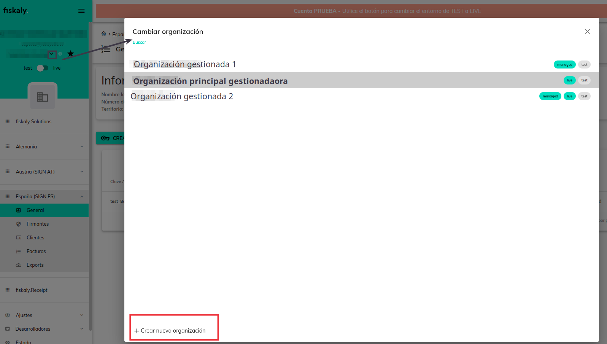


    1. Seleccionamos España

    


    2. Informamos los datos generales

    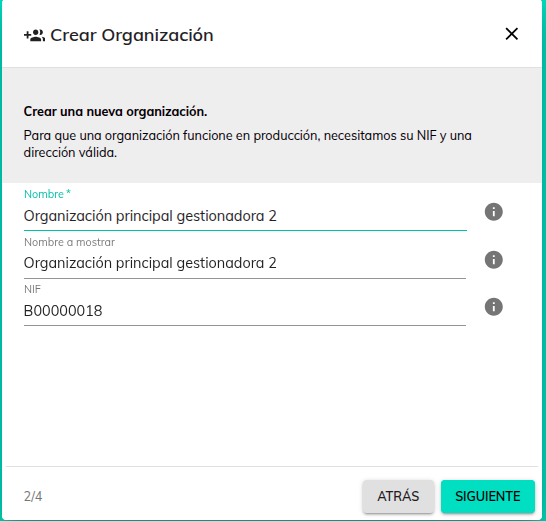

    3. Informamos la dirección

    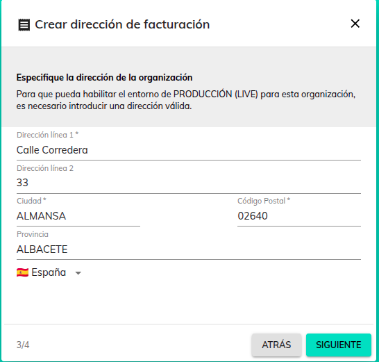

    4. Creamos si es necesario la dirección de facturación.

    

    5. Pulsamos en **CREAR** y se creará la organización principal.

    6. Si pulsamos en el icono de info podemos ver los datos de la organización.

    En este caso está en **test** y el id de organización que nos ha dado ya será el mismo aunque pasemos la organización a **live**. (Para pasar una organización principal gestionadora a **live** hay que contactar con soporte de fiskaly, para pasar una organización gestionada no hará falta contactar con ellos.)

    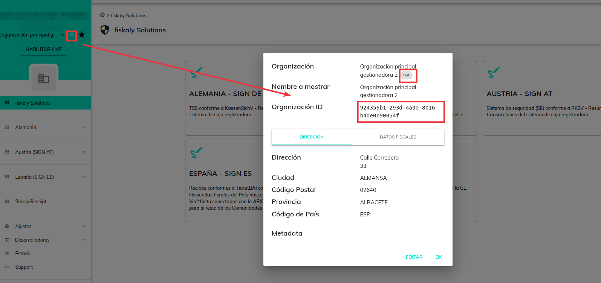


### Pasos 3-4-5-6-7.

- Los pasos 3 - 4 - 5 - 6 - 7 se utilizan para crear una organización gestionada, estos pasos los podemos realizar de forma manual utilizando el dasboard y postman o realizarlo con la herramienta **fiskaly_tools** de forma automática


#### Forma manual

- La forma manual está descrita en los puntos 3 - 4 - 5 - 6 y 7 del siguiente enlace:

[Manual instalación y configuración Fiskaly-Veri*Factu](./instconfverifactu.md)


#### Herramienta fiskaly_tools.py

Fiskaly_tools es una herramienta que facilita la creación de entidades intermedias que van desde dar de alta la organización (Empresa), tokens, keys, certificados, firmantes, contribuyente, hasta dar de alta la instalación. Todo en un solo paso.

La podemos encontrar en el repositorio de git **utils**

##### Configuración

- Se crea el fichero fiskaly_config.json en la misma carpeta donde está el fichero fiskaly_tools.py con los siguientes datos:

``` json
{
  "enviroments": {
    "uuid" : "uid_organizacion_gestionadora",
    "test" : {
      "key" : "api_key_organizacion_gestionadora_en_test",
      "secret" : "api_secret_organizacion_gestionadora_en_test"
    },
    "live" : {
      "key" : "api_key_organizacion_gestionadora_en_live",
      "secret" : "api_secret_organizacion_gestionadora_en_live"
    }
  },
  "agreement_folder" : ""
}

```
- En el json se puede configuara tanto las claves para entorno de pruebas (test) como para el entorno de proucción (live)

- uuid: uuid de la empresa gestionadora, es común tanto para test como para live.

- key: clave api_key de la empresa gestionadora (test o live)

- secret: clave api_secret de la empresa gestionadora (test o live)


##### Ejecución

- Lanzamos la herramienta con python3 ./fiskaly_tools.py

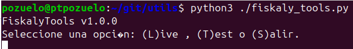


- Seleccionaremos la opción **L** si queremos crear la organización en Live, **T** si queremos crear la empresa en Test o **S** si queremos salir.

- Para nuestro ejemplo seleccionamos para crear en test y nos muestra que el perfil de Test se ha creado correctamente y nos aparece un menú con distintas acciones, seleccionamos la opción **1** para crear una nueva empresa

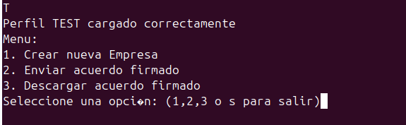

- Al pulsar **1** nos irá pidiendo una serie de datos, rellenaremos todos y al terminar con el último dato, nos dará un resumen para ver si están correctos los datos.

- **Ojo!!** los datos deben de ser los mismos del formulario de empresa y el número de la dirección debe de ir fuera del campo de dirección, debe de ir en el campo número habilitado para ello.

- Pulsamos **1** y rellenamos los datos que nos van solicitando.

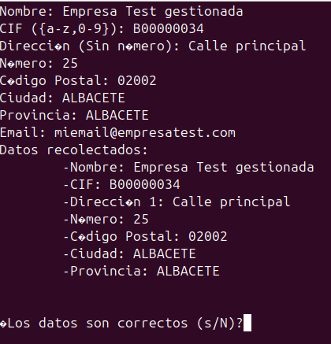

- Si los datos son correctos seleccionaremos **s**

- Al pulsar **s** se crerá:

    - La organización gestionada (Paso 3)

    - La Clave API, la Clave API Secret y el token. (Paso 4)

    - Información del contribuyente  (Paso 5)

    - Firmante (Paso 6)

    - Cliente (Paso 7)

    - Acuerdo de fiskaly para poder firmarlo. El acuerdo se descarga en la carpeta **acuerdos** que debe de estar creada en la misma carpeta que está la herramienta **fiskaly_tools**. Este acuerdo se puede volver a descargar desde el ERP y para el entorno test no tiene mucho sentido ya que se utilizará solo en Live.

- Además de crearse lo anterior, se muestra un resumen de la operación con los siguientes datos: 


    - Organización ID --> Id de la organización gestionada creada. Aunque este valor es recuperable desde el dashboard, es recomendable guardarlo en el gestor de contraseñas.

    - Cliente ID --> Id del cliente de la organización gestionada creada, este valor hay que guardarlo en el ERP en el formulario de empresa. Aunque este valor es recuperable desde el dashboard, es recomendable guardarlo en el gestor de contraseñas.

    - API Key --> Clave API de la organización gestionada creada, este valor hay que guardarlo en el ERP en el formulario de empresa. Aunque este valor es recuperable desde el dashboard, es recomendable guardarlo en el gestor de contraseñas.

    - API Secret --> Clave API Secret de la organización gestionada creada, este valor hay que guardarlo en el ERP en el formulario de empresa. **Ojo!!** Este valor no es recuperable, hay que guardarlo en el gestor de contraseñas.


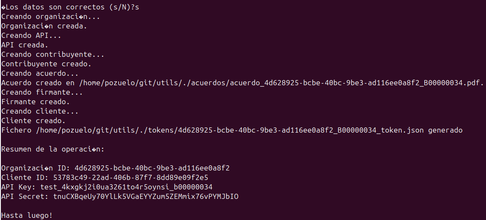


### 8. Configuración en el ERP

- En el ERP hay que configurar: 

    1. Datos obtenidos de Fiskaly al realizar la creación de la empresa gestionada.

    2. Claves que son específicas de Veri*factu.

    3. Declaración Responsable del programa

    4. Versión SIF

    5. Descargar, Firmar y Subir acuerdo de Fiskaly
 
 #### 8.1. Configuración de los datos obtenidos en Fiskaly

- En la pestaña VERI*FACTU del formulario de empresa informaremos los siguientes campos:

* API Identificador --> Informamos el valor obtenido en el punto 4 **clave API**.

* API Secret --> Informamos el valor obtenido en el punto 4 clave **API secret**.

* URL --> Valor fijo: 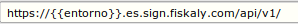

* Id.Cliente --> Valor obtenido en el punto 7 en el campo **id**.

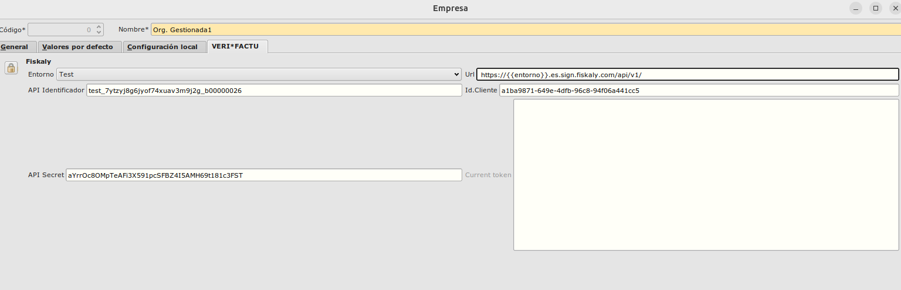

#### 8.2. Claves que son específicas de Veri*factu.

##### 8.2.1. Regímenes de IVA específicos de Veri*Factu

En el **Área de Facturación -> Principal -> Más -> Fiscalidad -> Regímenes IVA Veri*Factu** hay que crear los distintos regímenes de iva que puede utilizar Verifactu:

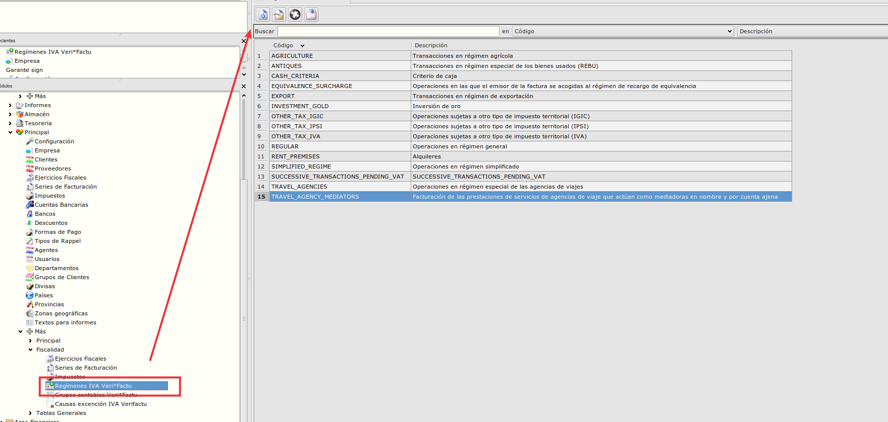

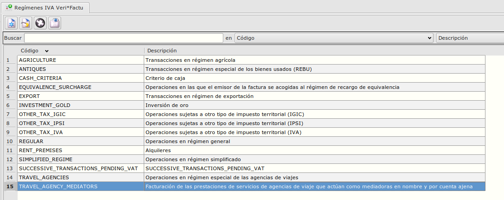

**Insert para insertar de forma rápida los regímenes de iva verifactu:**

``` sql
    INSERT INTO veri_regimenesiva (veri_regimeniva, descripcion) VALUES ('REGULAR','Operaciones en régimen general');
    INSERT INTO veri_regimenesiva (veri_regimeniva, descripcion) VALUES ('SIMPLIFIED_REGIME','Operaciones en régimen simplificado');
    INSERT INTO veri_regimenesiva (veri_regimeniva, descripcion) VALUES ('EQUIVALENCE_SURCHARGE','Operaciones en las que el emisor de la factura se acogidas al régimen de recargo de equivalencia');
    INSERT INTO veri_regimenesiva (veri_regimeniva, descripcion) VALUES ('EXPORT','Transacciones en régimen de exportación');
    INSERT INTO veri_regimenesiva (veri_regimeniva, descripcion) VALUES ('AGRICULTURE','Transacciones en régimen agrícola');
    INSERT INTO veri_regimenesiva (veri_regimeniva, descripcion) VALUES ('ANTIQUES','Transacciones en régimen especial de los bienes usados (REBU)');
    INSERT INTO veri_regimenesiva (veri_regimeniva, descripcion) VALUES ('TRAVEL_AGENCIES','Operaciones en régimen especial de las agencias de viajes');
    INSERT INTO veri_regimenesiva (veri_regimeniva, descripcion) VALUES ('TRAVEL_AGENCY_MEDIATORS','Facturación de las prestaciones de servicios de agencias de viaje que actúan como mediadoras en nombre y por cuenta ajena');
    INSERT INTO veri_regimenesiva (veri_regimeniva, descripcion) VALUES ('OTHER_TAX_IVA','Operaciones sujetas a otro tipo de impuesto territorial (IVA)');
    INSERT INTO veri_regimenesiva (veri_regimeniva, descripcion) VALUES ('OTHER_TAX_IGIC','Operaciones sujetas a otro tipo de impuesto territorial (IGIC)');
    INSERT INTO veri_regimenesiva (veri_regimeniva, descripcion) VALUES ('OTHER_TAX_IPSI','Operaciones sujetas a otro tipo de impuesto territorial (IPSI)');
    INSERT INTO veri_regimenesiva (veri_regimeniva, descripcion) VALUES ('CASH_CRITERIA','Criterio de caja');
    INSERT INTO veri_regimenesiva (veri_regimeniva, descripcion) VALUES ('SUCCESSIVE_TRANSACTIONS_PENDING_VAT','SUCCESSIVE_TRANSACTIONS_PENDING_VAT');
    INSERT INTO veri_regimenesiva (veri_regimeniva, descripcion) VALUES ('INVESTMENT_GOLD','Inversión de oro');
    INSERT INTO veri_regimenesiva (veri_regimeniva, descripcion) VALUES ('RENT_PREMISES','Alquileres');

```

##### 8.2.2. Regímenes de IVA específicos de Veri*Factu

En el **Área de Facturación -> Principal -> Más -> Fiscalidad -> Causas Excepción IVA Veri*Factu** crearemos las distintas causas por las que será exento o no sujeto el iva de una factura según la nomenclatura de Verifactu:

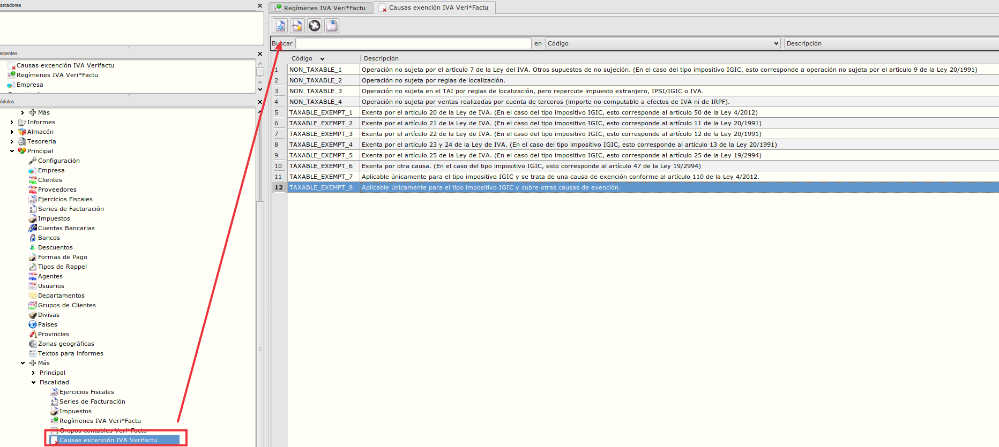

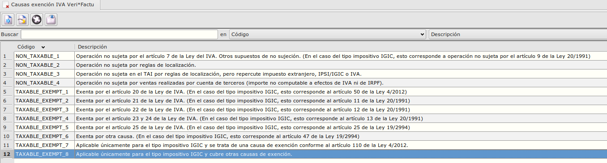

**Insert para insertar de forma rápida las causasde excepción:**

``` sql
    INSERT INTO veri_causasexencioniva(veri_causaexencioniva,descripcion) VALUES('TAXABLE_EXEMPT_1','Exenta por el artículo 20 de la Ley de IVA. (En el caso del tipo impositivo IGIC, esto corresponde al artículo 50 de la Ley 4/2012)');
    INSERT INTO veri_causasexencioniva(veri_causaexencioniva,descripcion) VALUES('TAXABLE_EXEMPT_2','Exenta por el artículo 21 de la Ley de IVA. (En el caso del tipo impositivo IGIC, esto corresponde al artículo 11 de la Ley 20/1991)');
    INSERT INTO veri_causasexencioniva(veri_causaexencioniva,descripcion) VALUES('TAXABLE_EXEMPT_3','Exenta por el artículo 22 de la Ley de IVA. (En el caso del tipo impositivo IGIC, esto corresponde al artículo 12 de la Ley 20/1991)');
    INSERT INTO veri_causasexencioniva(veri_causaexencioniva,descripcion) VALUES('TAXABLE_EXEMPT_4','Exenta por el artículo 23 y 24 de la Ley de IVA. (En el caso del tipo impositivo IGIC, esto corresponde al artículo 13 de la Ley 20/1991)');
    INSERT INTO veri_causasexencioniva(veri_causaexencioniva,descripcion) VALUES('TAXABLE_EXEMPT_5','Exenta por el artículo 25 de la Ley de IVA. (En el caso del tipo impositivo IGIC, esto corresponde al artículo 25 de la Ley 19/2994)');
    INSERT INTO veri_causasexencioniva(veri_causaexencioniva,descripcion) VALUES('TAXABLE_EXEMPT_6','Exenta por otra causa. (En el caso del tipo impositivo IGIC, esto corresponde al artículo 47 de la Ley 19/2994)');
    INSERT INTO veri_causasexencioniva(veri_causaexencioniva,descripcion) VALUES('TAXABLE_EXEMPT_7','Aplicable únicamente para el tipo impositivo IGIC y se trata de una causa de exención conforme al artículo 110 de la Ley 4/2012.');
    INSERT INTO veri_causasexencioniva(veri_causaexencioniva,descripcion) VALUES('TAXABLE_EXEMPT_8','Aplicable únicamente para el tipo impositivo IGIC y cubre otras causas de exención.');
    INSERT INTO veri_causasexencioniva(veri_causaexencioniva,descripcion) VALUES('NON_TAXABLE_1','Operación no sujeta por el artículo 7 de la Ley del IVA. Otros supuestos de no sujeción. (En el caso del tipo impositivo IGIC, esto corresponde a operación no sujeta por el artículo 9 de la Ley 20/1991)');
    INSERT INTO veri_causasexencioniva(veri_causaexencioniva,descripcion) VALUES('NON_TAXABLE_2','Operación no sujeta por reglas de localización.');
    INSERT INTO veri_causasexencioniva(veri_causaexencioniva,descripcion) VALUES('NON_TAXABLE_3','Operación no sujeta en el TAI por reglas de localización, pero repercute impuesto extranjero, IPSI/IGIC o IVA.');
    INSERT INTO veri_causasexencioniva(veri_causaexencioniva,descripcion) VALUES('NON_TAXABLE_4','Operación no sujeta por ventas realizadas por cuenta de terceros (importe no computable a efectos de IVA ni de IRPF).');
```

##### 8.2.3. Actualizar paises

- Todos los países deben de tener el codigo ISO informado
- Es necesario poder saber si un país es Europeo o no por lo que hay que marcar el check de Pertenece a U.E. en los paises que corresponda

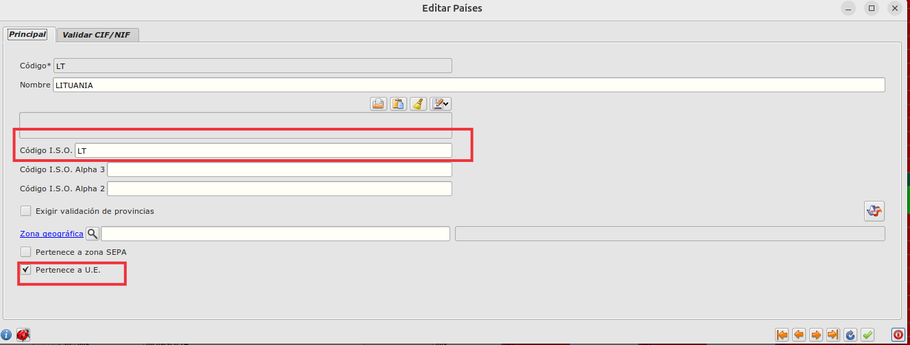

**UPDATE para marcar el check de pertenece a la UE:**

``` sql
    UPDATE paises set perteneceue = true where codiso ='AT';  
    UPDATE paises set perteneceue = true where codiso ='BE'; 
    UPDATE paises set perteneceue = true where codiso ='BG';  
    UPDATE paises set perteneceue = true where codiso ='CY';  
    UPDATE paises set perteneceue = true where codiso ='CZ';  
    UPDATE paises set perteneceue = true where codiso ='DE';  
    UPDATE paises set perteneceue = true where codiso ='DK';  
    UPDATE paises set perteneceue = true where codiso ='EE';  
    UPDATE paises set perteneceue = true where codiso ='GR';  
    UPDATE paises set perteneceue = true where codiso ='FI';  
    UPDATE paises set perteneceue = true where codiso ='FR';  
    UPDATE paises set perteneceue = true where codiso ='HR';  
    UPDATE paises set perteneceue = true where codiso ='HU';  
    UPDATE paises set perteneceue = true where codiso ='IE';  
    UPDATE paises set perteneceue = true where codiso ='IT'; 
    UPDATE paises set perteneceue = true where codiso ='LT';  
    UPDATE paises set perteneceue = true where codiso ='LU';  
    UPDATE paises set perteneceue = true where codiso ='LV';  
    UPDATE paises set perteneceue = true where codiso ='MT';  
    UPDATE paises set perteneceue = true where codiso ='NL';  
    UPDATE paises set perteneceue = true where codiso ='PL';  
    UPDATE paises set perteneceue = true where codiso ='PT';  
    UPDATE paises set perteneceue = true where codiso ='RO';  
    UPDATE paises set perteneceue = true where codiso ='SE';  
    UPDATE paises set perteneceue = true where codiso ='SI'; 
    UPDATE paises set perteneceue = true where codiso ='SK';
``` 

##### 8.2.4. Grupos contables Veri*Factu

En este apartado se configurarán grupos de iva de negocio para cada tipo de factura que se pueda tener.

Estos grupo de iva de negocio viene de la extensión **IVA_NAV_BASE** que se ha extraido de la extensión **IVA_NAV** por lo que si la mezcla ya tenía dicha extensión solo habrá que configurar los campos nuevos de Verifactu que se han añadido, si no se tiene la extensión de **IVA_NAV**, habrá que crear distinos grupos de iva de negocio como si se tuviera la extensión, configurar los campos de Verifactu y asignárselos a los clientes según su naturaleza.

**Para quién NO tuviera la extensión de IVA_NAV** y le han aparecido los campos nuevos, hacemos estos inserts para crear los 4 tipos de grupos de ivas de negocio básicos que se pueden usar y los updates para actualizar los clientes y documentos de ventas con el iva de negocio correspondiente a partir del regimen de iva estandard.


``` sql
    INSERT INTO public.gruposcontablesivaneg (sii_exentacausaemi,isp,agrario,descripcion,sii_claveoperacionrec,criteriocaja,sii_tiponoexentaemi,veri_causaexencioniva,sii_claveoperacionemi,sii_servicios,modelo349,siniva,regimeniva,veri_regimeniva,aplicarrecargo,ventasadistancia,sii_exentaiva,codgrupoivaneg) VALUES
        (NULL,false,false,'Clientes Nacionales',NULL,false,NULL,NULL,NULL,false,false,false,'General','REGULAR',false,false,false,'NACIONAL'),
        (NULL,false,false,'Otros clientes y proveedores (No NAC, No UE)',NULL,false,NULL,'TAXABLE_EXEMPT_2',NULL,false,false,true,'Exportaciones','EXPORT',false,false,true,'EXPORT'),
        (NULL,false,false,'Intracomunitario',NULL,false,NULL,'TAXABLE_EXEMPT_5',NULL,false,false,true,'U.E.','EXPORT',false,false,true,'U.E.'),
        (NULL,false,false,'EXENTOS',NULL,false,NULL,'NON_TAXABLE_1',NULL,false,false,false,'Exento','REGULAR',false,false,true,'EXENTO');


    update clientes set codgrupoivaneg = 'NACIONAL' WHERE regimeniva = 'General';
    update presupuestoscli set codgrupoivaneg = 'NACIONAL' WHERE regimeniva = 'General';
    update pedidoscli set codgrupoivaneg = 'NACIONAL' WHERE regimeniva = 'General';
    update albaranescli set codgrupoivaneg = 'NACIONAL' WHERE regimeniva = 'General';
    update facturascli set codgrupoivaneg = 'NACIONAL' WHERE regimeniva = 'General';

    update clientes set codgrupoivaneg = 'EXPORT' WHERE regimeniva = 'Exportaciones';
    update presupuestoscli set codgrupoivaneg = 'EXPORT' WHERE regimeniva = 'Exportaciones';
    update pedidoscli set codgrupoivaneg = 'EXPORT' WHERE regimeniva = 'Exportaciones';
    update albaranescli set codgrupoivaneg = 'EXPORT' WHERE regimeniva = 'Exportaciones';
    update facturascli set codgrupoivaneg = 'EXPORT' WHERE regimeniva = 'Exportaciones';

    update clientes set codgrupoivaneg = 'EXENTO' WHERE regimeniva = 'Exento';
    update presupuestoscli set codgrupoivaneg = 'EXENTO' WHERE regimeniva = 'Exento';
    update pedidoscli set codgrupoivaneg = 'EXENTO' WHERE regimeniva = 'Exento';
    update albaranescli set codgrupoivaneg = 'EXENTO' WHERE regimeniva = 'Exento';
    update facturascli set codgrupoivaneg = 'EXENTO' WHERE regimeniva = 'Exento';

    update clientes set codgrupoivaneg = 'U.E.' WHERE regimeniva = 'U.E.';
    update presupuestoscli set codgrupoivaneg = 'U.E.' WHERE regimeniva = 'U.E.';
    update pedidoscli set codgrupoivaneg = 'U.E.' WHERE regimeniva = 'U.E.';
    update albaranescli set codgrupoivaneg = 'U.E.' WHERE regimeniva = 'U.E.';
    update facturascli set codgrupoivaneg = 'U.E.' WHERE regimeniva = 'U.E.';

```

En el **Área de Facturación -> Principal -> Más -> Fiscalidad -> Grupos Contables Veri*Factu** crearemos/configuraremos dichos grupos:

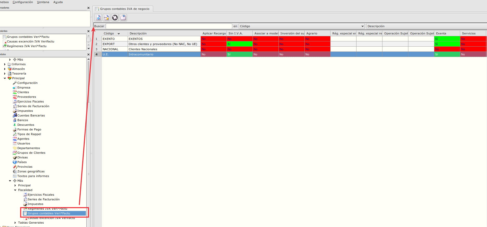

Los campos que hay que configurar de Verifactu son:

- Régimen IVA Veri*Factu --> Se informará un régimen de IVA especifico de Verifactu acorde a la naturaleza del grupo de iva de negocio

- Causa Exención IVA Veri*Factu --> Cuando proceda, se informará una la causa de exención de iva Verifactu acorde al régimen de iva de Verifactu que se haya informado

- Régimen IVA --> Si no se tiene la extensión de IVA_NAV, se informará también el ŕegimen de IVA.

**Configuración Básica de grupos de Iva de Negocio**

- Dejamos unos ejemplo de como podrían ser los 4 grupos básicos de iva de negocio:

1. Clientes Nacionales en Régimen General:

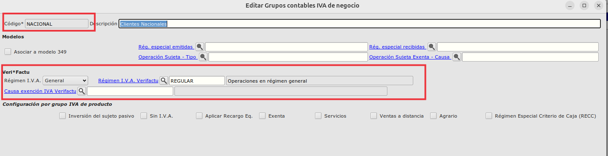

2. Clientes Exentos:

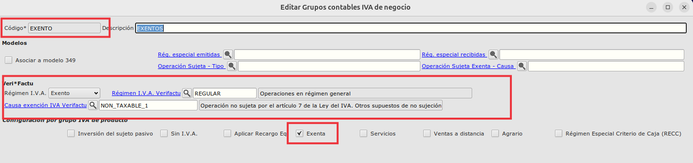

3. Clientes Exportación:

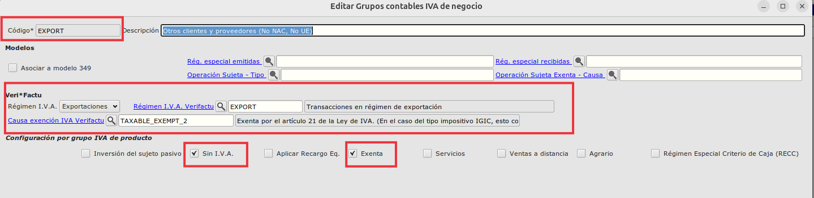

4. Clientes Intracomunitarios:

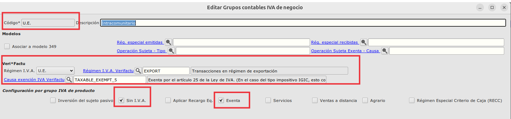


#### 8.3. Declaración Responsable del programa (Eneboo)

Es obligatorio que la declaración responsable del programa sea accesible desde el ERP.

En el **Área de Facturación -> Facturación -> Más -> Principal -> Garante Sign** se encuentra el botón de **Declaración Responsable Eneboo** el cual al pulsar debe de mostrar la declaración responsable.

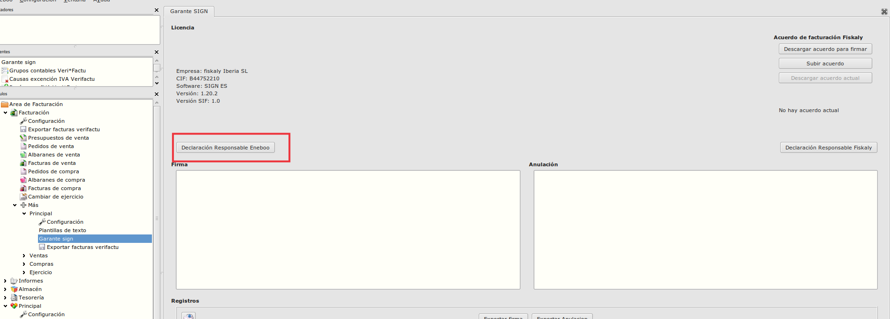

Para que este botón funcione, en la mezcla habría que sobrecargar la función **veriFactu_dameURLDeclaracionResponsable** de tal forma que devuelva una URL:

```
    function veriFactu_dameURLDeclaracionResponsable()
    {
	    return "(No definido)";
    }
```

```
    function mezclaCliente_dameURLDeclaracionResponsable()
    {
	    return "https://xxx.pdf";
    }
```

Para los **clientes de YeboYebo**, pondremos la extensión de **datos_verifactu** a la mezcla, la cual ya tiene esta función sobrecargada con la URL de YeboYebo.

#### 8.4. Versión SIF

Otro elemento que es obligatiorio que se muestre en el ERP es la versión SIF.

La version SIF es la versión de la parte del ERP que se dedica a la facturación y envío de facturas a la AEAT. Este número de versión es el que hay que indicar en la declaración responsable que cada empresa debe colgar el su web y ser accesible desde Eneboo. Si tenemos varias instalaciones, cada una con un número de versión, debemos tener publicadas otras tantas declaraciones responsables.

Si se cambia el software del SIF, habría que cambiar la versión y el documento. Esto lo debe hacer cada empresa para asegurarnos de que las declaraciones - versiones de cada uno de nosotros estén bien publicadas y sean coherentes.

A medida que vayamos variando el software por incidencias o ajustes podemos ver si es mejor llevar una versión común todos o que cada uno lo haga por separado, pero el tema de la publicación de la declaración con el mismo código de versión es una tarea individual de cada empresa.


En el **Área de Facturación -> Facturación -> Más -> Principal -> Garante Sign** está visible la Versión SIF.

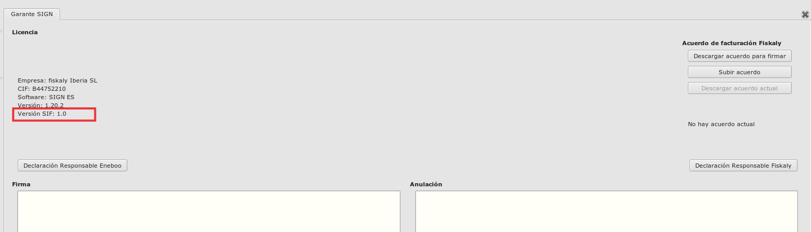

Para que este botón funcione, en la mezcla habría que sobrecargar la función **veriFactu_mostrarVersionSIF** de tal forma que devuelva una URL:

```
    function veriFactu_mostrarVersionSIF() {
	    return "(No definido)";
    }
```

```
    function mezclaCliente_mostrarVersionSIF() {
	    return "xx.xx";
    }
```

Para los **clientes de YeboYebo**, pondremos la extensión de **datos_verifactu** a la mezcla, la cual ya tiene esta función sobrecargada con la versión SIF de YeboYebo.

#### 8.5. Descargar, Firmar y Subir acuerdo de Fiskaly

Para que Fiskaly pueda realizar las presentaciones en nombre del cliente, hay que firmar un acuerdo de facturación con Fiskaly.

En el **Área de Facturación -> Facturación -> Más -> Principal -> Garante Sign** hay un botón para descargar el acuerdo y un botón para subir el acuerdo una vez firmado con certificado digital.

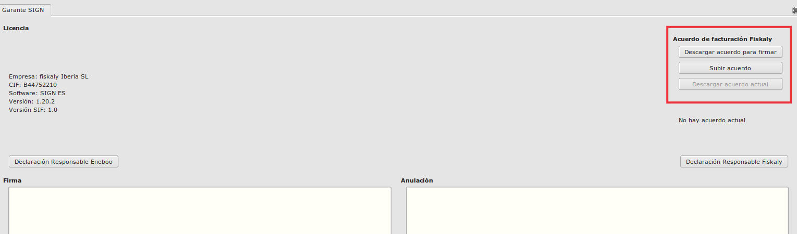

1. Descargar acuerdo: Habría que pulsar sobre el botón de **Descargar acuerdo para firmar**, este botón descargará un fichero el cual habrá que firmar digitalmente.


2. Subir acuerdo: Habría que pulsar sobre el botón de **Subir acuerdo**, este botón nos pedirá que seleccionemos el acuerdo ya firmado y lo subirá a Fiskaly.


### 9. Impresión de facturas

- En las facturas que se impriman, tienen que tener el QR generado al presentarse, para ello nos ayudaremos de las siguientes funciones que están en *flfactinfo* para poder imprimir tanto en **.jasper** como en **.kut**.

```
    veriFactu_crearFicheroVeriFactu(curFactura : FLSqlCursor)
    veriFactu_qrVeriFactu(nodo : FLDomNode , campo : String)

```

- El QR debe de seguir las especificaciones que están incluidas en el siguiente documento:

https://www.agenciatributaria.es/static_files/AEAT_Desarrolladores/EEDD/IVA/VERI-FACTU/DetalleEspecificacTecnCodigoQRfactura.pdf

- Las más importantes son:

    - Se tiene que imprimir en la primera página, arriba centrado.
    - El tamaño tiene que ser entre 3x3 y 4x4 cm.
    - El QR tiene que ir precedido por el texto **QR tributario:**
    - El QR tiene que ir sucedido por el texto **Factura verificable en la sede electrónica de la AEAT** o **VERI*FACTU**


