## Integración con Fiskaly

- En la siguiente dirección podemos ver todo el proceso de integración https://developer.fiskaly.com/es/sign-es/integration_process

- En la siguiente imagen podemos ver el diagrama de flujo para realiazar la integración y que herramientas hay que utilizar en cada paso.


- Los pasos a seguir seróan:
1. Registrarse en Dashboard de Fiskaly.

2. Crear organización principal gestionadora, esta organización no emite facturas, lo que hace es ser la que da de alta y gestiona a las demás empresas.

3. Crear organización(s) gestionada(s). Estas organizaciones si que emiten facturas y serán las distintas empresas que tengamos en el ERP.

4. Para cada organización gestionada hay que crear la Clave API, la Clave API Secret y el token.

5. Añadir información del contribuyente a la organización gestionada.

6. Crear firmante a la organización gestionada.

7. Crear cliente a la organización gestionada.

8. Configuración en el ERP

### 1. Registrar en Dashboard
- Lo primero es registrarte en el Dashboard. Crearemos la cuenta y a partir de ahí se creará la estructura organizativa de la empresa.

    https://dashboard.fiskaly.com/

### 2. Crear organización principal gestionadora

- Entraremos en el Dashboard con las credenciales facilitadas y lo primero que se muestra es la lista de organizaciones que hay y la opción de crear una nueva, pulsaremos en **Crear nueva organización**

    

    1. Seleccionamos Espaóa

    


    2. Informamos los datos generales

    

    3. Informamos la dirección

    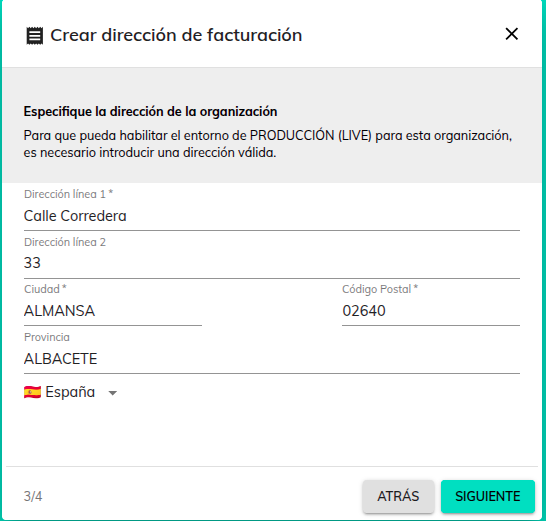

    4. Creamos si es necesario la dirección de facturación.

    

    5. Pulsamos en **CREAR** y se creará la organización principal.

    6. Si pulsamos en el icono de info podemos ver los datos de la organización.

    En este caso está en **test** y el id de organización que nos ha dado ya será el mismo aunque pasemos la organización a **live**. (Para pasar una organización principal gestionadora a **live** hay que contactar con soporte de fiskaly, para pasar una organización gestionada no hará falta contactar con ellos.)

    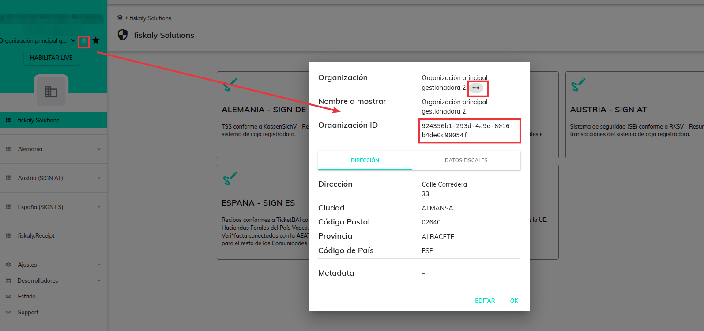


### 3. Crear organización gestionada

- Teniendo seleccionada nuestra organización principal, pulsaremos en **Crear nueva organización** 


Los pasos son los mismos que al crear una organización pero en el paso de informar los datos generales marcaremos el check de **Crear organización gestionada** y podremos ver que nos aparece la organización que la gestiona, en nuestro ejemplo *Organización principal gestionadora 2*

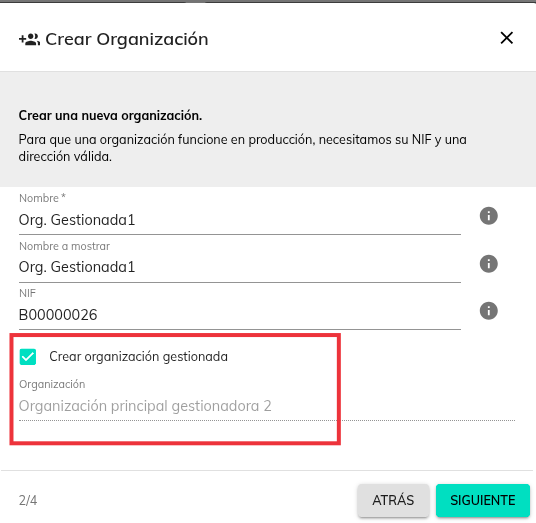

- Una vez creados los datos de la organización gestionada (Org. Gestionada1) nos aparecerán las distintas opciones que tenemos, en nuestro caso **ESPAÑA - SIGN ES** y al pulsar sobre el vemos en la parte de la derecha las distintas opciones

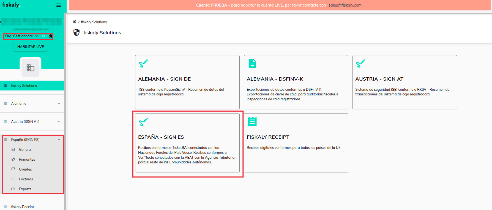


### 4. Crear claves API

- En el apartado de General, tenemos la opción de creear la clave API, pulsaremos y daremos un nombre, en nuestro caso le hemos dado como nombre el cif de la empresa con la letra en minúscula.

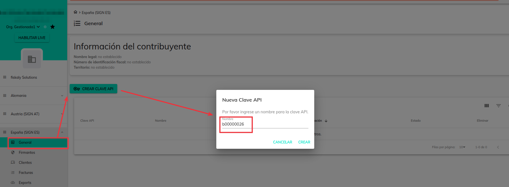

- Al aceptar se mostrará la *clave API* generada (podremos verla en cualquier momento) y la *clave API secret*, **ESTA DEBE SER COPIADA Y GUARDADA PORQUE LUEGO NO SE PUEDE ACCEDER A ELLA**


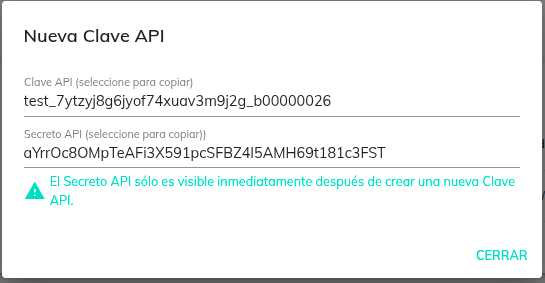

- Inserta tu Clave API y Secreto API para descargar el entorno de Postman de fiskaly SIGN ES como archivo personalizado de configuración basado en JSON, esto lo haremos en el punto 3 de la guía rápida:

https://developer.fiskaly.com/es/api/sign-es/v1#section/Guia-Rapida


- Al introducirlo y pulsar el botón de descargar, se descargará un fichero **environment.json** el cual reservaremos


- Realizaremos el punto 4, descargaremos la colección **Postman de fiskaly SIGN ES**


- Al pulsar el botón de Descargar se descargará un fichero **collection.json** el cual reservaremos.

- Una vez que tengamos el fichero de environment y el de collection, iniciaremos Postman e importaremos los archivos del entorno y la colección de Postman.


- Seleccionamos los dos ficheros en la ruta donde los hayamos guardado


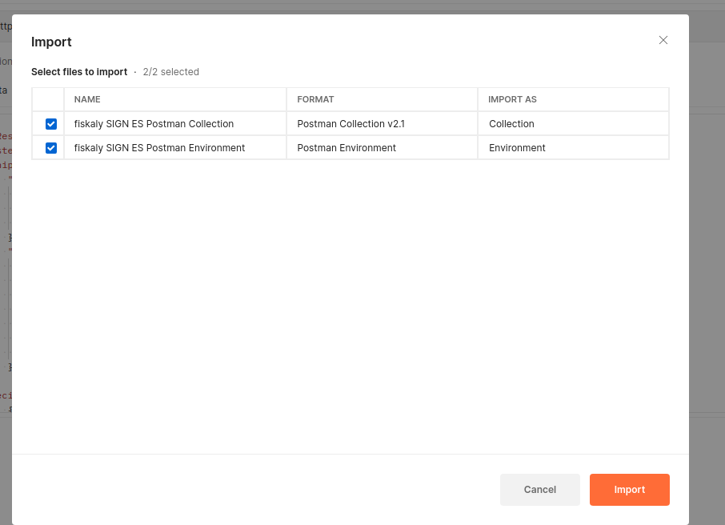

- Pulsamos en Importar y por un lado tenemos que tener la colección **fiskaly SIGN ES Postman Collection** y por otro lado el environment **fiskaly SIGN ES Postman Environment**


- Una vez tenemos las importaciones, teniendo seleccionado la colección de fiskaly, seleccionaremos el enviromente de fiskaly.


- Si desplegamos la colección, podemos ver las distintas llamadas que podemos hacer, la primera que tendremos que realizar es la de **Retrieve access token** para obtener el token.


### 5. Añadir información del contribuyente a la organización gestionada

- El siguiente paso es añadir la información del contribuyente al sistema, para ello lo haremos con al sistema a través del endpoint **Set taxpayer information** de la API de SIGN ES.

Asegúrate de indicar correctamente el campo territory de acuerdo con el domicilio fiscal del contribuyente. La API SIGN ES aplicará la legislación correspondiente basada en esto:

Verifactu para SPAIN_OTHER (España Peninsular), CANARY_ISLANDS, CEUTA y MELILLA
TicketBAI para ARABA, BIZKAIA y GIPUZKOA
Actualmente, no se aplica ninguna normativa fiscal a NAVARRA
Este es un paso obligatorio para garantizar que todas las facturas generadas cumplan con la normativa fiscal e incluyan todos los datos necesarios del contribuyente.


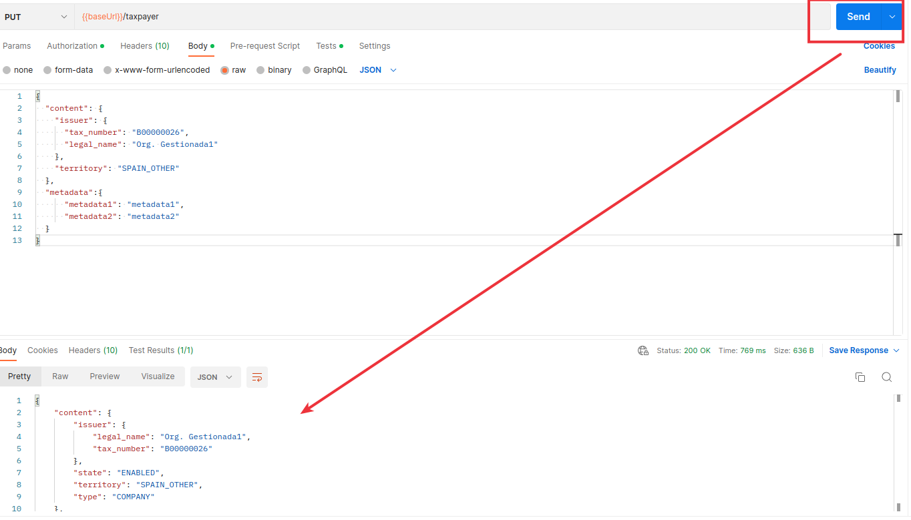

### 6. Crear firmante a la organización gestionada

- A continuación, se debe de crear un Firmante a través del endpoint **Create a first signer** para cada organización gestionada. El firmante es responsable de la firma digital de las facturas.

Cada dispositivo de firma requiere un certificado:

Para el cumplimiento de Verifactu, un certificado electrónico gestionado por fiskaly se asigna automáticamente durante la creación de un firmante. fiskaly está registrado como colaborador social con la AEAT para Verifactu, por lo que el contribuyente necesita firmar un acuerdo de colaboración social con fiskaly. Puedes encontrar más información en la sección colaboración social.
Para el cumplimiento de TicketBAI, un certificado de dispositivo se asigna automáticamente durante la creación de un firmante, a menos que desees proporcionar tu propio certificado de dispositivo externo. Este certificado se puede obtener de la respuesta de la llamada a la API. Si tus clientes están ubicados en el País Vasco, asegúrate de enviarles la guía de registro que proporcionamos desde fiskaly. Esto les ayudará a registrar correctamente los certificados de dispositivo con la autoridad fiscal correspondiente.


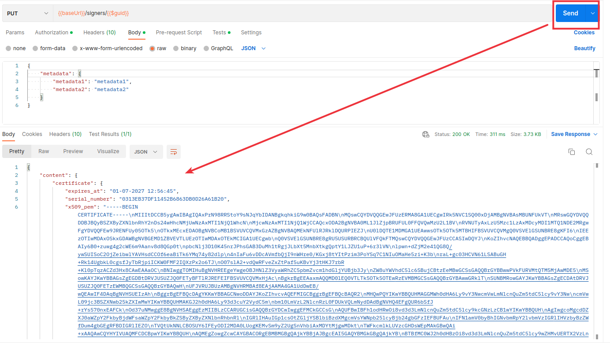

### 7. Crear cliente a la organización gestionada.

- El siguiente paso es crear clientes, el flujo de trabajo incluye la creación de createClient a través del endpoint **create a first Client**. Debes crear un Cliente para cada dispositivo POS u otros dispositivos de facturación utilizados en tu organización.


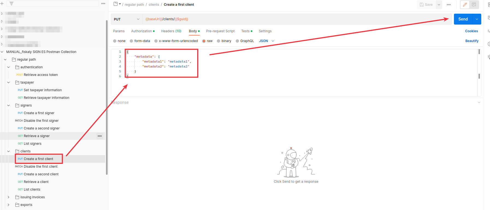


- En la respuesta, obtenemos el idcliente el cual tendremos que reservar junto a la api y la api secret para introducirlos en el ERP.

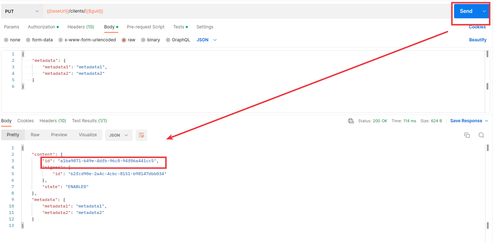


### 8. Configuración en el ERP

- En el ERP hay que configurar: 

    1. Datos obtenidos de Fiskaly al realizar la creación de la empresa gestionada.

    2. Claves que son específicas de Veri*factu.

    3. Declaración Responsable del programa

    4. Versión SIF

    5. Descargar, Firmar y Subir acuerdo de Fiskaly
 
 #### 8.1. Configuración de los datos obtenidos en Fiskaly

- En la pestaña VERI*FACTU del formulario de empresa informaremos los siguientes campos:

* API Identificador --> Informamos el valor obtenido en el punto 4 **clave API**.

* API Secret --> Informamos el valor obtenido en el punto 4 clave **API secret**.

* URL --> Valor fijo: 

* Id.Cliente --> Valor obtenido en el punto 7 en el campo **id**.


#### 8.2. Claves que son específicas de Veri*factu.

##### 8.2.1. Regímenes de IVA específicos de Veri*Factu

En el **Área de Facturación -> Principal -> Más -> Fiscalidad -> Regímenes IVA Veri*Factu** hay que crear los distintos Regímenes de iva que puede utilizar Verifactu:

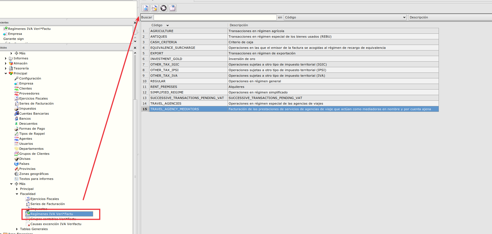

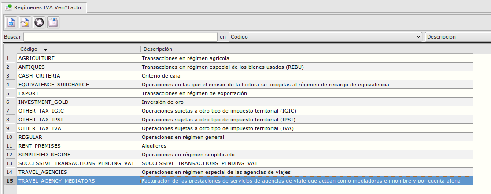


##### 8.2.2. Regímenes de IVA específicos de Veri*Factu

En el **Área de Facturación -> Principal -> Más -> Fiscalidad -> Causas Excepción IVA Veri*Factu** crearemos las distintas causas por las que será exento o no sujeto el iva de una factura según la nomenclatura de Verifactu:


##### 8.2.3. Actualizar paises

- Todos los países deben de tener el codigo ISO informado
- Es necesario poder saber si un país es Europeo o no por lo que hay que marcar el check de Pertenece a U.E. en los paises que corresponda

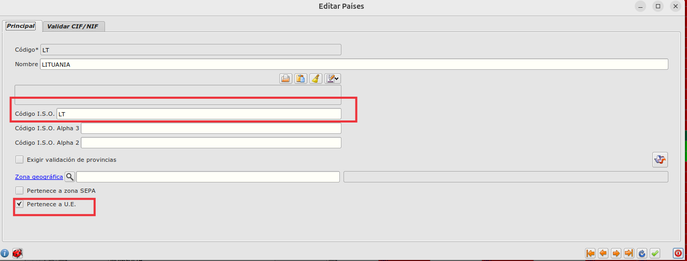

##### 8.2.4. Grupos contables Veri*Factu

En este apartado se configurarón grupos de iva de negocio para cada tipo de factura que se pueda tener.

Estos grupo de iva de negocio viene de la extensión **IVA_NAV** por lo que si la mezcla ya tenía dicha extensión solo habrá que configurar los campos nuevos de Verifactu que se han añadido, si no se tiene la extensión de **IVA_NAV**, habrá que crear distinos grupos de iva de negocio como si se tuviera la extensión, configurar los campos de Verifactu y asignárselos a los clientes según su naturaleza.

En el **Área de Facturación -> Principal -> Más -> Fiscalidad -> Grupos Contables Veri*Factu** crearemos/configuraremos dichos grupos:


Los campos que hay que configurar de Verifactu son:

- Régimen IVA Veri*Factu --> Se informará un régimen de IVA especifico de Verifactu acorde a la naturaleza del grupo de iva de negocio

- Causa Exención IVA Veri*Factu --> Cuando proceda, se informará una la causa de exención de iva Verifactu acorde al régimen de iva de Verifactu que se haya informado

- Régimen IVA --> Si no se tiene la extensión de IVA_NAV, se informará también el régimen de IVA.

**Configuración Básica de grupos de Iva de Negocio**

- Dejamos unos ejemplo de como podrían ser los 4 grupos básicos de iva de negocio:

1. Clientes Nacionales en Régimen General:


2. Clientes Exentos:


3. Clientes Exportación:


4. Clientes Intracomunitarios:


#### 8.3. Declaración Responsable del programa (Eneboo)

Es obligatorio que la declaración responsable del programa sea accesible desde el ERP.

En el **Área de Facturación -> Facturación -> Más -> Principal -> Garante Sign** se encuentra el botón de **Declaración Responsable Eneboo** el cual al pulsar debe de mostrar la declaración responsable.


Para que este botón funcione, en la mezcla habráa que sobrecargar la función **veriFactu_dameURLDeclaracionResponsable** de tal forma que devuelva una URL:

```
    function veriFactu_dameURLDeclaracionResponsable()
    {
	    return "(No definido)";
    }
```

```
    function mezclaCliente_dameURLDeclaracionResponsable()
    {
	    return "https://xxx.pdf";
    }
```

#### 8.4. Versión SIF

Otro elemento que es obligatiorio que se muestre en el ERP es la versión SIF.

La version SIF es la versión de la parte del ERP que se dedica a la facturación y envío de facturas a la AEAT. Este número de versión es el que hay que indicar en la declaración responsable que cada empresa debe colgar el su web y ser accesible desde Eneboo. Si tenemos varias instalaciones, cada una con un número de versión, debemos tener publicadas otras tantas declaraciones responsables.

Si se cambia el software del SIF, habráa que cambiar la versión y el documento. Esto lo debe hacer cada empresa para asegurarnos de que las declaraciones - versiones de cada uno de nosotros están bien publicadas y sean coherentes.

A medida que vayamos variando el software por incidencias o ajustes podemos ver si es mejor llevar una versión común todos o que cada uno lo haga por separado, pero el tema de la publicación de la declaración con el mismo código de versión es una tarea individual de cada empresa.


En el **Área de Facturación -> Facturación -> Más -> Principal -> Garante Sign** está visible la Versión SIF.


Para que este botón funcione, en la mezcla habráa que sobrecargar la función **veriFactu_mostrarVersionSIF** de tal forma que devuelva una URL:

```
    function veriFactu_mostrarVersionSIF() {
	    return "(No definido)";
    }
```

```
    function mezclaCliente_mostrarVersionSIF() {
	    return "xx.xx";
    }
```


#### 8.5. Descargar, Firmar y Subir acuerdo de Fiskaly

Para que Fiskaly pueda realizar las presentaciones en nombre del cliente, hay que firmar un acuerdo de facturación con Fiskaly.

En el **Área de Facturación -> Facturación -> Más -> Principal -> Garante Sign** hay un botón para descargar el acuerdo y un botón para subir el acuerdo una vez firmado con certificado digital.


1. Descargar acuerdo: habráa que pulsar sobre el botón de **Descargar acuerdo para firmar**, este botón descargará un fichero el cual habrá que firmar digitalmente.


2. Subir acuerdo: habráa que pulsar sobre el botón de **Subir acuerdo**, este botón nos pedirá que seleccionemos el acuerdo ya firmado y lo subirá a Fiskaly.

### 9. Impresión de facturas

- En las facturas que se impriman, tienen que tener el QR generado al presentarse, para ello nos ayudaremos de las siguientes funciones que están en *flfactinfo* para poder imprimir tanto en **.jasper** como en **.kut**.

```
    veriFactu_crearFicheroVeriFactu(curFactura : FLSqlCursor)
    veriFactu_qrVeriFactu(nodo : FLDomNode , campo : String)

```

- El QR debe de seguir las especificaciones que están incluidas en el siguiente documento:

https://www.agenciatributaria.es/static_files/AEAT_Desarrolladores/EEDD/IVA/VERI-FACTU/DetalleEspecificacTecnCodigoQRfactura.pdf

- Las Más importantes son:

    - Se tiene que imprimir en la primera página, arriba centrado.
    - El tamaño tiene que ser entre 3x3 y 4x4 cm.
    - El QR tiene que ir precedido por el texto **QR tributario:**
    - El QR tiene que ir sucedido por el texto **Factura verificable en la sede electrónica de la AEAT** o **VERI*FACTU**


