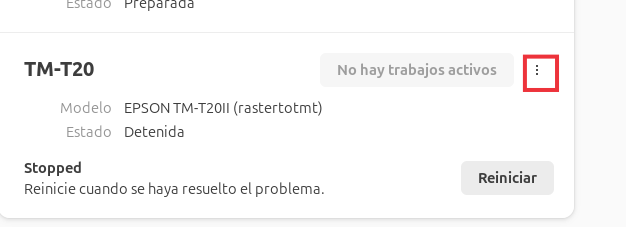
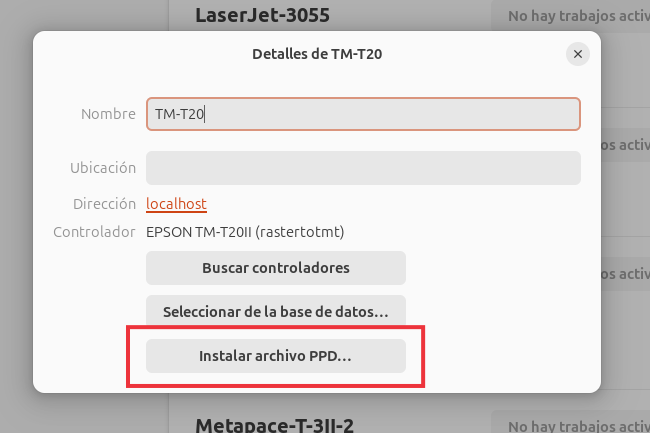
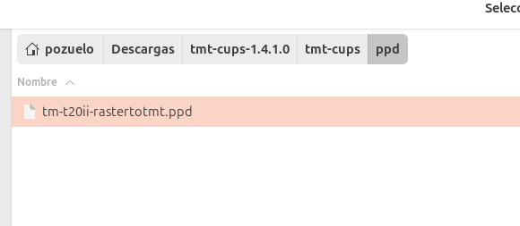
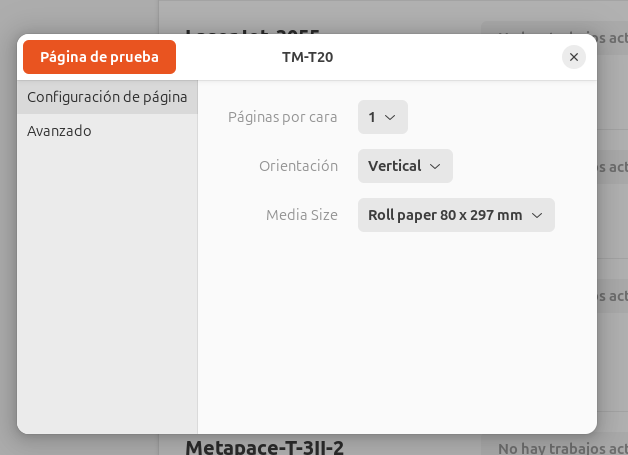
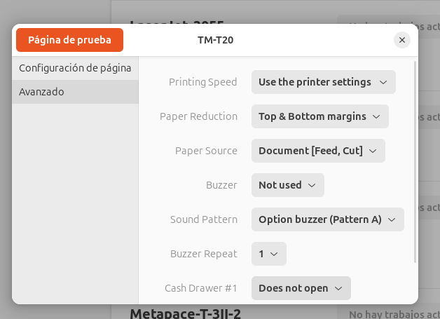

## IMPRESORA TM-T20II (EPSON)

### Instalación Linux
- Dentro de la carpeta 
``` console
    /tmt-cups-1.4.1.0/tmt-cups 
``` 
tenemos un fichero sh, el cual hay que instalar

``` sh
    sudo sh install.sh
``` 
```
    install.sh  for "TM/BA Series Printer Driver for Linux"  Ver.1.4.1 Copyright (C) 2010-2013 Seiko Epson Corporation. All rights reserved.


    Please select your distribution.
    1.Ubuntu 9.04 x86(32bit)
    2.Ubuntu 9.04 x86_64(64bit)
    3.openSUSE 11.1 x86(32bit)
    4.openSUSE 11.1 x86_64(64bit)
```

Seleccionaremos la opción correspondiente para nuestra distribución:

``` console
    Select number [0(cancel)/1/2/3/4]? 2
```

Se instalará:

```
    Selecting previously unselected package epson-port-communication-service.
    (Reading database ... 308548 files and directories currently installed.)
    Preparing to unpack .../pcs-3.6.0.0-1.amd64.deb ...
    Unpacking epson-port-communication-service (3.6.0.0-1) ...
    Setting up epson-port-communication-service (3.6.0.0-1) ...
    update-rc.d: warning: start and stop actions are no longer supported; falling back to defaults
    update-rc.d: warning: start runlevel arguments (1 2 3 4 5) do not match epson_devicecontrollogserviced Default-Start values (1 2 3 4 5 6)
    update-rc.d: warning: stop runlevel arguments (6 0) do not match epson_devicecontrollogserviced Default-Stop values (0)
    update-rc.d: warning: start and stop actions are no longer supported; falling back to defaults
    update-rc.d: warning: start runlevel arguments (1 2 3 4 5) do not match epson_pcsvcd Default-Start values (1 2 3 4 5 6)
    update-rc.d: warning: stop runlevel arguments (6 0) do not match epson_pcsvcd Default-Stop values (0)
    Starting epson_devicecontrollogserviced (via systemctl): epson_devicecontrollogserviced.service.
    Starting epson_pcsvcd (via systemctl): epson_pcsvcd.service.
    Selecting previously unselected package tmt-cups-backend.
    (Reading database ... 308580 files and directories currently installed.)
    Preparing to unpack .../tmt-cups-backend-1.1.0.0-2.amd64.deb ...
    Unpacking tmt-cups-backend (1.1.0.0-2) ...
    Setting up tmt-cups-backend (1.1.0.0-2) ...
    Restarting cups (via systemctl): cups.service.
    Selecting previously unselected package tmt-cups.
    (Reading database ... 308587 files and directories currently installed.)
    Preparing to unpack .../tmt-cups_1.1.0-1_amd64.deb ...
    Unpacking tmt-cups (1.1.0-1) ...
    Setting up tmt-cups (1.1.0-1) ...

    install.sh: 663: test: no: unexpected operator
    *** The installation test finished. ***

    Press the Enter key.
```

- Una vez instalado, conectaremos la impresora e iremos a la configuración de impresoras y pulsaremos sobre los 3 puntos arriba a la derecha para acceder a las opciones:



- Seleccionaremos *Detalles de la impresora*

- Pulsaremos sobre Instalar archivo PPD



- Seleccioneremos de nuestra carpeta la ruta el archivo ppd




### Configuración Linux

- Dentro de la configuración de la impresora, pulsaremos sobre los 3 puntos arriba a la derecha para acceder a las opciones: 


- Seleccionaremos *Opciones de impresión*

- En configuración seleccionaremos el tamaño del papel



- En opciones avanzadas, modificaremos las opciones necesarias, por ejemplo, quietaremos los márgenes de arriba y abajo en la opción de *Paper Reduction* 




### Drivers

- Podemos encontrar los drivers en la siguiente dentro de GIT en:

manuales_desarrollo/drivers/impresoras/TM-T20II

- [Descargar drivers](../drivers/impresoras/TM-T20II/)


- [Volver al índice de manuales](../README.md)