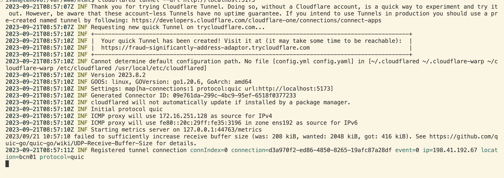

# Cloudflare (Tuneles para ver Apps en desarrollo desde internet)

## 1. Download and install cloudflared

Abrimos un terminal y nos posicionamos en una carpeta con permisos para almacenar ficheros. Descargamos e instalamos con el siguiente comando:
```
wget -q https://github.com/cloudflare/cloudflared/releases/latest/download/cloudflared-linux-amd64.deb && sudo dpkg -i cloudflared-linux-amd64.deb
```
## 2. Uso de Cloudflare
Para utilizarlo, en primer lugar arrancamos nuestra aplicación y lanzamos:
```
cloudflared tunnel --url http://localhost:5173
```
La url debe ser la url de tu aplicación en función de la configuración de  dominio y puerto que utilices.

Una vez ejecutado, verás un log en el terminal en el que te informa de la url que ha generado para el tunel desde la que se puede acceder a tu aplicación.



Puedes encontrar más información en la [documentación oficial](https://developers.cloudflare.com/cloudflare-one/connections/connect-networks/install-and-setup/tunnel-guide/local/)

## 2. Uso de Cloudflare con Quimera y pinebooapi
Si el servicio que vamos a usar llama a pinebooapi, proceremos del siguiente modo:

- Si queremos acceder a la aplicación desde una IP externa, modificamos la variable *allowed* del fichero *local.py* de *pinebooapi/app/AQNEXT* para que admita cualquier IP añadiendo al array el elemento "*".

- Localizamos el puerto por el que hacemos solicitudes al servidor en el fichero de enviroment del mismo, por ejemplo el 8005.

- Levantamos un tunel como se ha descrito en punto anterior usando el puerto del enviroment.
```
cloudflared tunnel --url http://localhost:8005
```

- Copiamos la url que ha generado para el tunel y la sustituimos por la exista en la aplicación de quimera en el archivo *.env*, en la variable de entorno de la api, sin especificar el puerto:
```
VITE_API_URL=url_generada/api/
```

- Levantamos otro tunel como se ha descrito en punto anterior.
```
cloudflared tunnel --url http://localhost:5173
```

Levantamos cliente y servidor y usamos la url generada en el segundo tunel para acceder a la aplicación.


  * [Volver al Índice](./index.md)