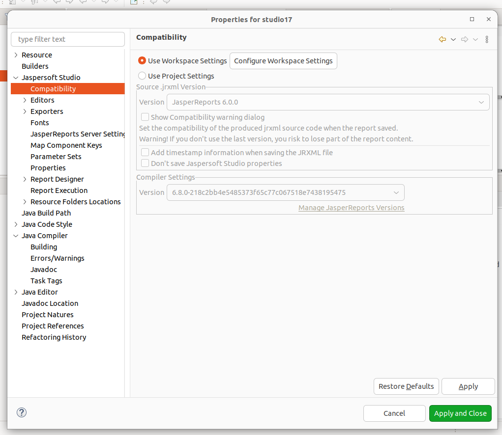

# Jasper Reports

- Instalar y configurar libreria EnebooReports-6.8.0-20200811. Descargar en https://eneboo.org/pub/contrib/eneboo_reports/

- Instalar versión de javascript "1.8.0_362"

- Instalar JasperSoft Studio 6.19.1

- Configurar compatibilidad de la siguiente forma:

  * [Volver al Índice](./index.md)