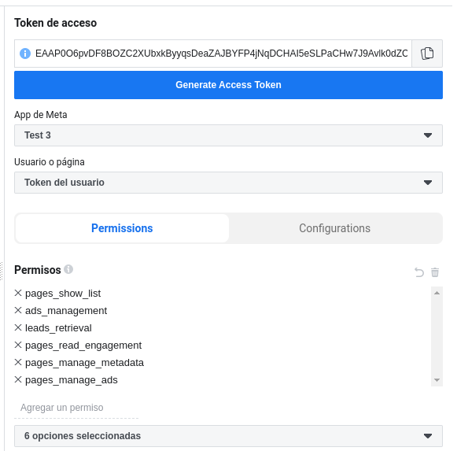
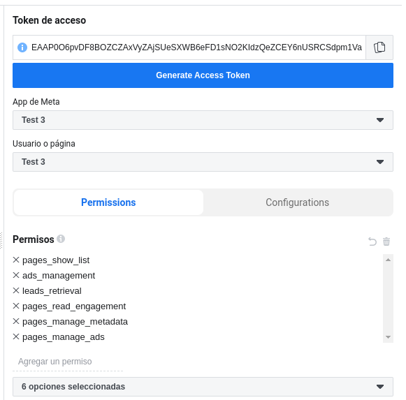
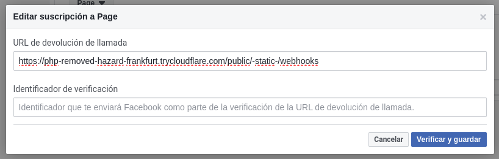
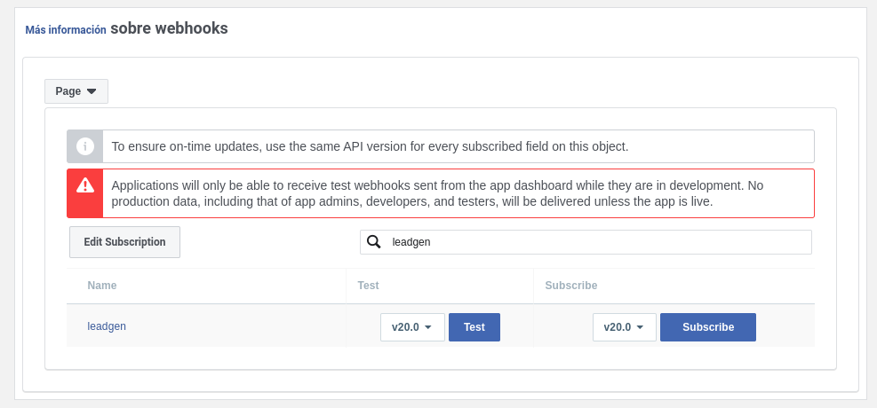

# Crear y gestionar una App

## Portfolio empresarial
Opcionalmente podemos crear un portfolio que permite a las organizaciones centralizar sus páginas de Facebook, cuentas de Instagram, cuentas publicitarias, catálogos de productos y otros activos comerciales, y administrarlos desde un solo lugar usando herramientas empresariales como Meta Business Suite y el administrador comercial. Para más información consultar [aquí](https://www.facebook.com/business/help/1710077379203657). 


## Crear app
Desde nuestra cuenta de [*Meta para desarrolladores*](https://developers.facebook.com/?locale=es_ES), podemos acceder al menú *'Mis aplicaciones'* en la parte superior desde el que clicaremos *Crear aplicación* y seguimos los pasos indicados.


## Generar tokens de accesso de usuario y página
Desde la herramienta [*explorador de la API Graph*](https://developers.facebook.com/tools/explorer/) generamos un token añadiendo los siguientes [permisos](https://developers.facebook.com/docs/permissions/):
- pages_show_list
- ads_management
- leads_retrieval
- pages_read_engagement
- pages_manage_metadata
- pages_manage_ads
- business_management(*Si tenemos un portfolio empresarial*)



Seleccionamos las páginas a las que queremos que la aplicación tenga acceso y confirmamos.

El token generado es de muy corta duración, podemos comprobarlo desde la herramienta [*depurador de identificadores de acceso*](https://developers.facebook.com/tools/debug/accesstoken/) . Desde esta herramienta podemos ampliar su caducidad hasta dos meses. Pdemos darle una duración infinita lanzando la siguiente solicitud a la api sustituyendo los datos entre llaves {} por los tuyos: 

```sh
curl -i -X GET "https://graph.facebook.com/{graph-api-version}/oauth/access_token?grant_type=fb_exchange_token&client_id={app-id}&client_secret={app-secret}&fb_exchange_token={your-access-token}" 
```

Una vez tenemos un token de usuario sin caducidad, volvemos a la herramienta [*explorador de la API Graph*](https://developers.facebook.com/tools/explorer/), copiamos en la caja *Token de acceso* el token recibido y seleccionamos la página a la que queremos otorgar acceso con permisos y clicamos en *Generate access token*. Podemos comprobar la caducidad en la herramienta [*depurador de identificadores de acceso*](https://developers.facebook.com/tools/debug/accesstoken/).



También podemos replicar este proceso con solicitudes a la api desde código de servidor utilizando esta [documentación](https://developers.facebook.com/docs/facebook-login/guides/access-tokens).


## Configurar webhooks
Desde la pantalla principal de la interfaz, vamos a la sección *Agrega productos a tu app* y clicamos en *Configurar* en el producto **Webhooks**. Ahora lo tendremos incorporado en menú de la izquierda de la interfaz.

Antes de empezar la configuración debemos proporcionar una URL de la política de privacidad válida para publicar tu aplicación. La puedes encontrar en la ruta de menú *Configuración de la app/Básica*.

Vamos a suscribir un webhook de tipo **Page**, así seleccionamos ese tipo y clicamos en el botón *Subscribe to this object*. Ingresamos una url pública en la que esperamos recibir el webhook. Si estamos en desarrollo y vamos usar una url local podemos usar un tunel de [cloudflare](../..//instalacion_portatil/cloudflare.md) para simular una url de internet.



Para poder continuar Meta comprobará mediante una llamada GET a nuestro servidor que la url y la configuración es correcta. Enviará una petición con parámetros 
```json
{
	"hub.mode": "subscribe",
	"hub.challenge": "Un número",
	"hub.verify_token": "El identificador de verificación"
}
```
En nuestro código comprobamos el identificador de verificación y debemos devolver el atributo *hub.challenge* para que la comprobación sea correcta.

## Suscribir webhook para leads

Debemos suscribir tanto la aplicación como la página al webhook **leadgen**. Para la app lo hacemos desde el mismo dialogo en el que estamos, clicando en **Subscribe**.



Para suscribir la página debemos hacer una petición POST desde el [*explorador de la API Graph*](https://developers.facebook.com/tools/explorer/) utilizando el token de aceso de página:

```
https://graph.facebook.com/{graph-api-version}/{page-id}/subscribed_apps?subscribed_fields=leadgen
```
o con una solicitud de tipo POST desde la api o la consola.

```sh
curl -i -X POST "https://graph.facebook.com/{graph-api-version}/{page-id}/subscribed_apps?subscribed_fields=leadgen&access_token={your-page-access-token}" 
```
Si hemos suscrito la página al webhook correctamente recibiremos una respuesta con el objeto *{"success":true}*.

Para más información consultar [aquí](https://developers.facebook.com/docs/graph-api/webhooks/getting-started/webhooks-for-leadgen/?locale=es_ES). 

## Probar webhook para leads
Para hacer el test la app de Meta debe estar en modo 'en producción'. Se puede comprobar con la [*herramienta de prueba de anuncios para clientes potenciales*](https://developers.facebook.com/tools/lead-ads-testing/), que hará un analísis de la configuración de la app y te informará si falta algún paso. También lo puedes hacer con una petición POST desde el explorador usando el formulario que tu quieras:

```
https://graph.facebook.com/{FORM_ID}/test_leads
```
Solo se puede crear un una lead de prueba, tendrás que borra la anterior si quieres volver a probar.


## Revisión de la aplicación
