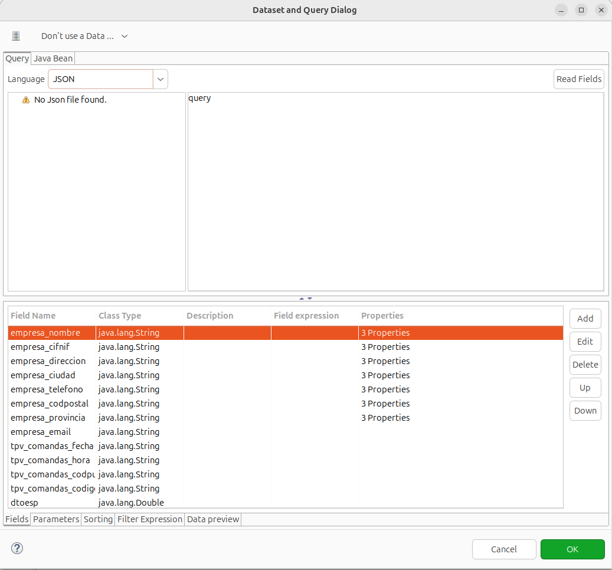
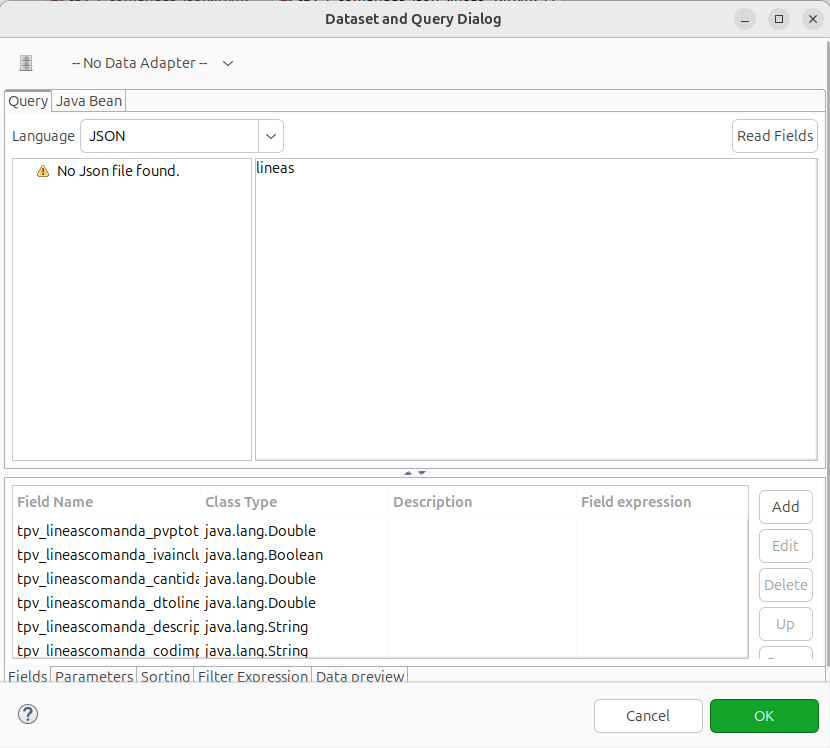
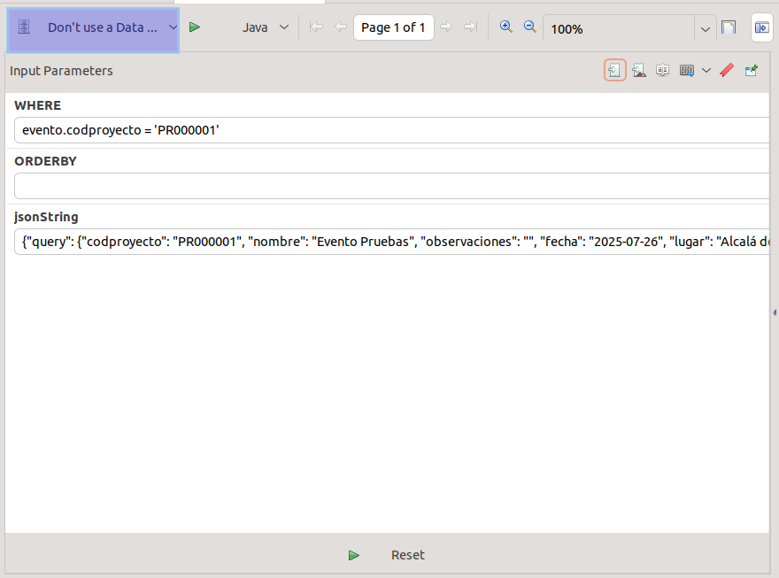

## Informes Jasper a partir de un JSON

### En eneboo
- En la función dameParamInforme crear un nuevo parámetro con el nombre jsonString y el siguiente formato:
```
{"query": 
    {
    "valorCabecera1": valor,
    "valorCabecera1": valor,
    "valorCabecera1": valor,
    ...
    "lineas": [
        {"valor1_Linea1" : "",
        "valor2_Linea1" : "",
        "valor3_Linea1" : "",
        ...},
        {"valor1_Linea2" : "",
        "valor2_Linea2" : "",
        "valor3_Linea2" : "",
        ...},
        ...
        ]
    ...
    }
};
```

Si necesitamos pasarle una imgen lo haremos transformándola a base64 de la siguiente forma:

```
var oEmpresa = formMODEL.carga(idEmpresa, "empresa");
var imgBase64 = formUTIL.stringToBase64(oEmpresa["logo"]);
var imagen = imgBase64.toString();
```

Y en el json la incluiremos de la siguiente forma:
```
{"query": 
    {
    "valorCabecera1": valor,
    ...
    ...
    "logo": {"imagenempresa": imagen}
    }
}
```

### En el Jasper

- Pulsar el botón **DataSet and query editor dialog**
- No poner adaptador. En adaptador seleccionamos **Don,' use a Data Adapter**
- En le valor de Lenguaje, seleccionar **JSON**
- En el texto donde iria la query poner **query**
- En el apartado Fields crear los campos con el mismo nombre que vayan en el json



- Creamos los parámetros:

    - jsonString de tipo java.lang.string
    - JSON_INPUT_STREAM de tipo java.io.InputStream con valor: 
    ```
    new java.io.ByteArrayInputStream($P{jsonString}.getBytes("UTF8"))
    ```


En el xml deberia quedar algo así:


### Subreport

Al la hora de incluir un subreport en el report debemos configurarlo como siempre con la diferencia de que en el Data Source Expresion debemos especificar qué parte del JSON le vamos a pasar al subrepor. Por ejemplo, en el caso de que en el json incluyamos un array de líneas:

```
((net.sf.jasperreports.engine.data.JsonDataSource)$P{REPORT_DATA_SOURCE}).subDataSource("lineas")
```


El subreport de las líneas lo configuraremos de la misma forma que el report con la diferencia de que donde se deberia establecer la query pondremos "lineas" que es el nombre del array de líneas que le pasamos por parámetro.
Tampoco es necesario crear los parámetros creados para el report.



### Imagen

En este ejemplo se ha usado un subrepor para mostrar la imagne. El subreport se creará de la misma forma que se ha indicado arriba, pero en lugar de pasar el valor del json como "lineas" se pasará como "logo" (nombre que se le hapuesto en el json). Y en la query del subreport se establecerá el valor "logo".

Para mostrar la imagnen. Lo haremos estableciendo lo siguietne en el valor Expresion de las propiedades de la imagen:

```
ERUtil.XpmToImage(new String(java.util.Base64.getDecoder().decode($F{imagenempresa})))
```


El xml del subreport de la imagen quedaría como:


NOTA: Hay un ejemplo de esto en fun_cremacafe para el informe tpv_i_comandas_json

### Preview

En la pestaña de Preview tenemos que seleccionar **Don't use Data Adapter** tomar los datos del parámetro de JSON.




  * [Volver al Índice](./index.md)