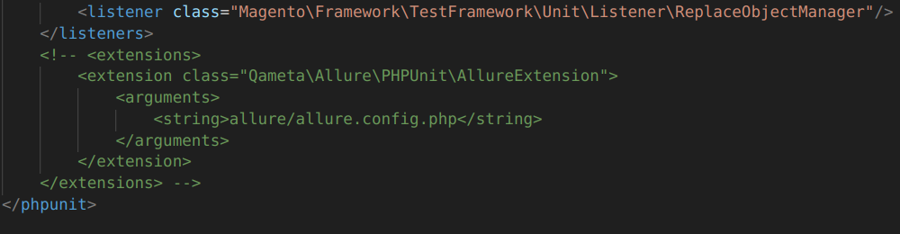
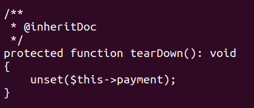
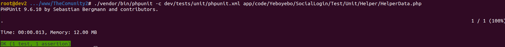

# TEST UNITARIOS MAGENTO 2

## 1. Preparación
- El Test Unitario es una operación crucial, un conjunto de las partes comprobables más pequeñas de una aplicación, que se denominan unidades, en el desarrollo de software. El test unitario garantizará que los códigos que escribió se ejecuten correctamente y aumentará la calidad del software que creó anteriormente. Además, recuerde que el proceso de prueba unitaria es independiente y completamente automático sin manipulación manual.
- Es decir no trata de comprobar valores directos devueltos por una función, sino si la funcion encaja correctamente. Por tanto los valores devueltos por la funcion los tendremos que simular.
- Los tests unitarios de magento estan basados en PHP unit. Documentación oficial en:
https://docs.phpunit.de/en/9.6/

## 2. Ejecución
- Para ejecutar un test unitario individual
~~~
./vendor/bin/phpunit -c <FICHERO XML DE CONFIGURACION> <FICHERO PHP DEL TEST UNITARIO>
~~~

- FICHERO XML DE CONFIGURACION

Magento ya tiene preconfigurado un fichero xml
~~~
dev/tests/unit/phpunit.xml.dist
~~~

Lo ideal es copiarlo y renombrarlo:

~~~
cp dev/tests/unit/phpunit.xml.dist dev/tests/unit/phpunit.xml
~~~

En El Ganso no funciona si no comentamos al final la extension Allure

Ejemplo de ejecución:

~~~
./vendor/bin/phpunit -c dev/tests/unit/phpunit.xml app/code/Yeboyebo/SocialLogin/Test/Unit/Helper/HelperData.php
~~~

Se pueden ejecutar todos los test del sistema con:

~~~
bin/magento dev:tests:run unit
~~~

## 3. Creación de test unitarios

- Pasos:
    
    - Estructura de la clase de test
    - Localizar la clase a testear y revisar su constructor
    - Creacion de la clase testing
    - Asserts, ejecución y resultados

3.1.- Estructura de la clase de test

Todas las clases de test deben extender de:

~~~
use PHPUnit\Framework\TestCase;

class HelperData extends TestCase
~~~

3 son los métodos principales en una clase test:

**protected function setUp(): void**:

Se encarga de crear un objeto simulado del constructor de la clase a testear, para ello se apoya en: Magento\Framework\TestFramework\Unidad\Helper\ObjectManager

**protected function tearDown(): void**

Se encarga de deshacer acciones realizadas en setUp. En la práctica, cuando crea objetos simples, esta parte se puede omitir.

**test***

Los métodos que empiezan por test son las purebas unitarias, puede haber más de uno en el fichero de testing, cada método sera una prueba

3.2.- Localizar la clase a testear y revisar su constructor

Ejemplo:

Como ejemplo vamos a crear un test para la clase de El Ganso 

~~~
Yeboyebo\SocialLogin\Helper\Data.php
~~~

Lo ideal es crear los test en la carpeta Test\Unit correspondiente, para este ejemplo:

~~~
Yeboyebo\SocialLogin\Test\Unit\HelperData.php
~~~

Si estudiamos el constructor y nos fijamos en los parámetros que lo inicializan vemos que:

~~~
public function __construct(
        \Magento\Framework\App\Config\ScopeConfigInterface $scopeConfig,
        ObjectManagerInterface $objectManager,
        \Magento\Framework\App\Helper\Context $context,
        StoreManagerInterface $storeManager,
        SocialHelper $socialHelper
    )
    {
        $this->scopeConfig = $scopeConfig;
        $this->socialHelper = $socialHelper;
        parent::__construct($context, $objectManager, $storeManager);
    }
~~~

3.3.- Creacion de la clase testing

Para replicar este constructor en el método Setup de la clase de testing:

~~~
class HelperData extends TestCase
{

    /**
     * @var MockObject|ScopeConfigInterface $scopeConfigMock
     */
    private $scopeConfigMock;

    /**
     * @var Manager|\PHPUnit\Framework\MockObject\MockObject
     */
    protected $eventManager;

    /**
     * @var Store|MockObject
     */
    protected $storeModelMock;

    /**
     * @var \Magento\Sales\Model\Order
     */
    protected $originalData;

    protected $socialHelper;

     /**
     * @var Data
     */
    protected $salesHelper;

    protected function setUp(): void
    {
        $helper = new ObjectManager($this);

        $this->scopeConfigMock = $this->getMockBuilder(ScopeConfigInterface::class)
            ->setMethods(['getValue'])
            ->disableOriginalConstructor()
            ->getMockForAbstractClass();

        $contextMock = $this->getMockBuilder(Context::class)
        ->disableOriginalConstructor()
        ->getMock();

        $contextMock->expects($this->any())
        ->method('getScopeConfig')
        ->willReturn($this->scopeConfigMock);

        $storeManagerInterfaceMock = $this->getMockForAbstractClass(StoreManagerInterface::class);

        $objectManagerInterfaceMock = $this->getMockForAbstractClass(ObjectManagerInterface::class);

        $this->socialHelper = $this->createMock(SocialHelper::class);

        $this->storeModelMock = $this->getMockBuilder(Store::class)
            ->disableOriginalConstructor()
            ->getMock();

        $storeManagerInterfaceMock->expects($this->any())->method('getStore')->willReturn($this->storeModelMock);
        $this->storeModelMock->method('getId')->willReturn(0);

        $this->salesHelper = new salesHelper($contextMock);

        $this->originalData = $helper->getObject(
            originalData::class,
            [
                'scopeConfig' => $this->scopeConfigMock,
                'objectManager' => $objectManagerInterfaceMock,
                'context' => $contextMock,
                'storeManager' => $storeManagerInterfaceMock,
                'socialHelper' => $this->socialHelper
            ]
        );
    }
    ...
    }
~~~

Básicamente vamos creando instancias mock de las clases que definen el constructor de la clase a testear.

Si son clases normales lo hacemos con:

~~~
$this->socialHelper = $this->createMock(SocialHelper::class);
~~~

Si son clases abstractas o interfaces usamos:

~~~
$this->scopeConfigMock = $this->getMockBuilder(ScopeConfigInterface::class)
            ->setMethods(['getValue'])
            ->disableOriginalConstructor()
            ->getMockForAbstractClass();
~~~

Una vez creados el mock para cada uno de los parámetros creamos una instancia Mock de la clase a testear con:

~~~
$this->originalData = $helper->getObject(
            originalData::class,
            [
                'scopeConfig' => $this->scopeConfigMock,
                'objectManager' => $objectManagerInterfaceMock,
                'context' => $contextMock,
                'storeManager' => $storeManagerInterfaceMock,
                'socialHelper' => $this->socialHelper
            ]
        );
~~~

3.4.- Asserts, ejecución y resultados

Vamos a crear un test muy simple para comprobar que el método para obtener la configuración se ejecuta correctamente, para ello creamos un objeto que simule una configuración devuelta:

~~~
public function getConfiguracion()
    {
        $confReturn = Array();
        $conf = Array();
        $general= Array();

        $general['enabled']=null;

        $conf["general"] = $general;

        $confReturn["sociallogin"] = $conf;

        return [
            [json_encode($confReturn)]
        ];
    }
~~~

Posteriormente lo utilizamos en el test como parámetro

~~~
/**
     * @dataProvider getConfiguracion
     * @return void
     */
    public function testJsonConfig($getConfiguracion)
    {

        $jsConfig = $this->originalData->getConfigJsonFormat();
        
        $this->assertEquals($getConfiguracion, $jsConfig);
        
    }
~~~

Y comprobamos que es igual al devuelto por el objeto simulado en la función setUp con 

~~~
$this->assertEquals($getConfiguracion, $jsConfig)
~~~

**Si ejecutamos el test sobre esta clase obtenemos:**

## 4. Documentación

https://docs.phpunit.de/en/9.6/
https://devdocs.magento.com/guides/v2.3/test/testing.html
https://matt-chad.medium.com/reclaim-your-sanity-in-magento-2-with-unit-tests-e035f3e32410
https://www.youtube.com/watch?v=RxEOk8MJojA
