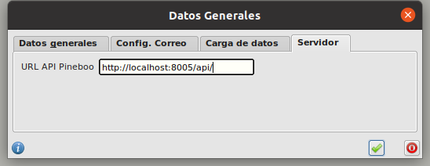
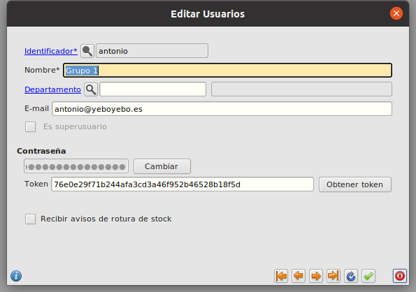

# Pineboo Server desde Eneboo / Configuración

## Tablas de autenticación
La autenticación de primer nivel y el uso de tokens de autenticación necesita de la existencia de dos tablas que Django genera de forma automática, *auth_user* y *authtoken_token*. Para generarlas:
  ```console
  ¿?
  ```

## Ckecklist inicial
Antes de continuar debemos asegurarnos de que tenemos instalado:
* [Pineboo Server](../pineboo_server/instalacion.md)
* Una versión de Eneboo que contenga **AQExtension**. Para comprobarlo hay que ver que en la carpeta *bin* del directorio de instalación de Eneboo hay un fichero ejecutable llamado *aqextension*.

## URL de la API 
Indicamos la URL de la API en Eneboo, en Facturacion > Principal > Configuracion, pestaña *Servidor*.



## Obtención del token
Para evitar pedir la contraseña en cada llamada, cada usuario tiene asociado un token de autenticación en su ficha de usuario (Facturación > Principal > Usuarios).

Una vez establecida su contraseña, pulsamos el botón *Obtener token*. Si todo va bien, el campo *token* se informará automáticamente.



## Activar llamadas a Pineboo Server
Para activar las llamadas de forma local, editamos el fichero *$HOME/.qt/eneboorc* y añadimos en su sección *[scripts]*:
```sh
[scripts]
...
flfactppal/usarServidorPineboo=true
...
```

Ciertas extensiones pueden tener activado esto por defecto, sobrecargando la función *usarServidorPineboo* de *flfactppal.qs*:
```js
function jsenar_usarServidorPineboo() {
  return true
}
```

### Más

  * [Volver al Índice](./index.md)
