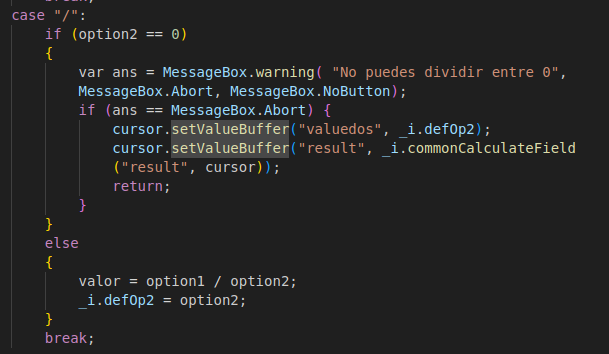

# <span style="color:purple">Calculadora Automática</span>

En este es un nuevo ejercicio que complementará lo aprendido en el ejercicio anterior de [Calculadora Base](../calculadoraBase/calculadoraBase.md).  
Anteriormente hicimos una interacción en la que cuando se presionaba un botón este haría el cálculo según los datos que estuvieran introducidos en los campos requeridos.

Ahora iremos un paso más allá, queremos conseguir que no haga falta utilizar la `connection` del botón `Calculate`. Pretendemos hacer el cambio sea automático, a que nos referimos con esto, pues quiere decir que al momento de que se efectue algún cambio en alguno de los `buffers` haga que se actualice el campo `Result`de forma instantánea.

## <span style="color:violet">Requisitos</span>

Como único requisito tenemos el a ver realizado con anterioridad el [ejercicio 1](../calculadoraBase/calculadoraBase.md) debido a que utilizaremos el mismo módulo y los mismo ficheros.

## <span style="color:violet">Resolución</span>

Para realizar este ejercio solo nos hará falta cambiar el fichero con extensión qs (calculadoraBase.qs), el cuál contiene el script anterior.  
No borraremos ninguna parte del código, ya que podría ser reutilizado a posteriori, simplemente omitiremos el botón y añadiremos el código necesario para la autamatización de la calculadora.

### <span style="color:cyan">1. Actualizar el script</span>

Lo primero que haremos será crear una `function` en la clase interna, esta función es la que llamara al cálculo que se hará con los resgistros.

```
class interna
{   
    var ctx;
    function interna(context)
    { 
        this.ctx = context
    }

    function init()
    {
		return this.ctx.interna_init();
	}

    function calculateField(fN)
    {
        return this.ctx.interna_calculateField(fN);
    }
}
```

Luego tenemos en la clase oficial dos funciones nuevas:
 - __bufferChanged__ destinada a recibir los cambios que se hacen en cada buffer a cada momento.
- __commonCalculateField__ que contendrá el algoritmo que realice al cálculo de la calculadora.

Y aparte una variable global que después veremos para que la utilizaremos.

```
class oficial extends interna
{   
    var defOp2 = 1;
    function oficial (context)
    {
        interna(context);
    }

    function bufferChanged(fN)
    {
        return this.ctx.oficial_bufferChanged(fN);
    }
    
    function qpbCalculate_Clicked()
    {
        return this.ctx.oficial_qpbCalculate_Clicked();
    }

    function commonCalculateField(fN, cursor) {
		return this.ctx.oficial_commonCalculateField(fN, cursor);
	}
}
```

Tendremos que añadir una nueva conexión en el init, esta es la que se ocupara de conectar los cambios que se realicen en los buffers para que haga algo siempre.

Se implementa la función __interna_calculateField__.


```
function interna_init() 
{
    const _i = this.iface;
    var cursor = this.cursor();
    
    connect(this.cursor(), "bufferChanged(QString)", this, "iface.bufferChanged");

    connect(this.child("qpbCalculate"), "clicked()", _i, "qpbCalculate_Clicked()");
}

function interna_calculateField(fN) 
{
    return this.iface.commonCalculateField(fN, this.cursor());
} 
```

Para el algoritmo del __commonCalculateField__ utilizaremos el mismo que realizamos en para el botón `Calculate` debido a que se realizará la misma acción.

```
function oficial_commonCalculateField(fN, cursor) 
{
    const _i = this.iface;

    var valor;

    if(fN == "result") {
        var option1 = parseFloat(cursor.valueBuffer("valueuno"));
        var option2 = parseFloat(cursor.valueBuffer("valuedos"));
        
        var type = cursor.valueBuffer("tipo");

        switch (type)
        {
            case "+":
                valor = option1 + option2;
                break;
            case "-":
                valor = option1 - option2;
                break;
            case "*":
                valor = option1 * option2;
                break;
            case "/":
                if (option2 == 0)
                {
                    var ans = MessageBox.warning( "No puedes dividir entre 0", MessageBox.Abort, MessageBox.NoButton);
                    if (ans == MessageBox.Abort) {
                        cursor.setValueBuffer("valuedos", _i.defOp2);
                        cursor.setValueBuffer("result", _i.commonCalculateField("result", cursor));
                        return;
                    }
                }
                else
                {
                    valor = option1 / option2;
                    _i.defOp2 = option2;
                }   
                break;
        }
    }

    cursor.setValueBuffer("result", _i.commonCalculateField("result", cursor));
    return valor;
}
```

Como podremos notar, este algoritmo es un poco diferente al que hicimos con anterioridad, eso se debe a esta parte:



Esta condición se ocupará de impedir que podamos realizar la acción de dividir entre 0 ya que eso daría una indeterminación que no podríamos calcular con esta calculadora.

Para ello lanzaremos un mensaje de `warning`, puedes encontrar las diferentes utilidades del warning y de otras extensiones clicando [aquí](https://doc.qt.io/archives/qsa-1.2.2/extensions-framework.html).

Por último, la última función que implementaremos será la que se ocupe de recolectar los cambios que reciban los buffers a cada momento.

En __oficial_bufferChanged__ tiene como objetivo que el campo resultado se actualice siempre que se modifique alguno de los otros campos.  
Esta actualización la realizaremos con __commonCalculateField__ y como solo queremos desempeñar esta acción cuando se cambia los campos que contiene los valores o el tipo de operación, colocaremos un `if` con la condición anterior.

```
function oficial_bufferChanged(fN)
{
	const _i = this.iface;
    const cursor = this.cursor();

    if (fN == "valueuno" || fN == "tipo" || fN == "valuedos") 
    {
        _i.commonCalculateField(fN, cursor)
    }
}
```

## <span style="color:violet">Conclusión</span>

Una vez que guardamos todo ya podremos ir a Enoboo a comprobar que los cambios se hallan realizado de la forma indicada. De esta forma aprenderemos y nos familiarizaremos con una de las funciones que más usaremos, la relacionada con los cambios de __buffers__.


### Más

  * [Volver al Índice](../index.md)
