# <span style="color:purple">Calculadora Base</span>

Una vez adquiridos los conocimientos básicos del funcionamiento tanto de __Eneboo__ como de __QT Designer__, propondremos una serie variada de ejercicios para ayudar a expandir aún más las habilidades con el Software.

En este primer ejercicio será hacer un formulario simple, deberás crear una calculadora que haga las operaciones más simples (el diseño del formulario puede variar, lo haremos como más cómodo estemos). 

## <span style="color:violet">Requisitos</span>

Crearemos un formulario con la siguiente estructura:

 - __Operando 1__: campo numérico
- __Tipo operación__: Campo string que contendrá los 4 tipos de operación básicos (`+`,`-`,`*`,`/`). Este campo deberá ser _optionList_
- __Operando 2__: Campo numérico
- __Resultado__: Campo numérico.
- __Botón calcular__: Botón que realizará el cálculo entre __Operando 1__ y __Operando 2__ dejando el resultado en el __Resultado__

## <span style="color:violet">Resolución</span>

Una vez determinado el objetivo, comenzaremos a realizar el ejercicio propuesto.

Para eso, podemos proseguir con los siguientes pasos:

### <span style="color:cyan">1. Crear una acción</span>

Como enseñamos en el [Tutorial. Programación en Abanq (II). Acciones](../../manual2/manual2.md) primero crearemos una acción editando el fichero -flfactppal.xml _flfactppal.xml_ y añadiremos el siguiente código:

```
<action>
		<name>calculadorabase</name>
    		<alias>QT_TRANSLATE_NOOP("MetaData","Calculadora Base")</alias>
    		<description>QT_TRANSLATE_NOOP("MetaData","Una calculadora que realiza los 4 tipos de calculos basicos")</description>
   		<table>calculadorabase</table>
  		 <form>master</form>
  		 <formrecord>calculadorabase</formrecord>
  		 <scriptform>mastercalculadorabase</scriptform>
  		 <scriptformrecord>calculadorabase</scriptformrecord>
</action>
```

Luego, nos ocuparemos de añadir el nuevo módulo al menú principal de _Tablas Generales_ ubicado en el formulario de flfactppal (_flfactppal.ui_).

Este paso lo recordaremos rápido porque ya fue efectuado en el Tutorial.

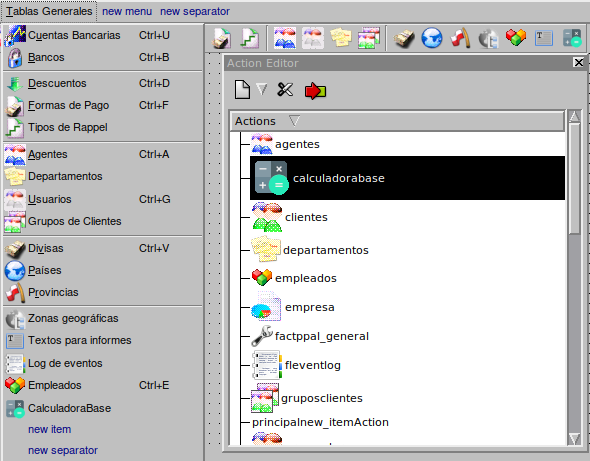

Añadimos el nuevo item de ___calculadorabase___ en Action Editor y lo añadiremos también al menú.

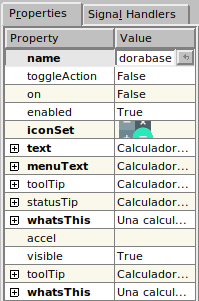

Después le daremos los siguietes valores a las _Properties_ del módulo.


Y no olvidemos, muy importante, hacer la conexión para que cuando abramos el módulo en Eneboo haga la acción que debería.

### <span style="color:cyan">2. Creacción de la tabla</span>

Una vez que preparamos el nuevo módulo, es hora de crear la tabla de este. para esto crearemos un nuevo fichero en el directorio de _tables_ y lo llamaremos ___calculadorabase.mtd___.

__Recuerda qeu el nombre del fichero tiene que ser el mismo que pongamos en la acción__

Ahora, crearemos todos los `<field>`necesarios, los cuales son la estructura que debería tener la calculadora. Siempre pondremos un id o código para facilitar busquedas y no haya semejanza uno con otros.

El código de la tabla quedaría de la siguiente forma:

```
<!DOCTYPE TMD>
<TMD>
    <name>calculadorabase</name>
    <!-- Calculadora que opera dos números-->
    <alias>QT_TRANSLATE_NOOP("MetaData", "Calculadora Base")</alias>
    <field>
        <name>id</name>
        <alias>QT_TRANSLATE_NOOP("MetaData", "Código")</alias>
        <null>false</null>
        <pk>true</pk>
        <type>serial</type>
    </field>

    <field>
        <name>valueuno</name>
        <alias>QT_TRANSLATE_NOOP("MetaData","Valor 1")</alias>
        <null>false</null>
        <pk>false</pk>
        <type>double</type>
        <partI>9</partI>
        <partD>5</partD>
        <default>0</default>
    </field>

    <field>
        <name>valuedos</name>
        <alias>QT_TRANSLATE_NOOP("MetaData","Valor 2")</alias>
        <null>false</null>
        <pk>false</pk>
        <type>double</type>
        <partI>9</partI>
        <partD>5</partD>
        <default>0</default>
    </field>

    <field>
        <name>tipo</name>
        <alias>QT_TRANSLATE_NOOP("MetaData","Tipo de operación")</alias>
        <null>false</null>
        <pk>false</pk>
        <type>string</type>
        <length>1</length>
        <optionslist>+,-,*,/</optionslist>
        <default>+</default>
    </field>

    <field>
        <name>result</name>
        <alias>QT_TRANSLATE_NOOP("MetaData","Resultado")</alias>
        <null>false</null>
        <pk>false</pk>
        <type>double</type>
        <partI>20</partI>
        <partD>5</partD>
        <default>0</default>
        <editable>false</editable>
    </field>

    <field>
        <name>calculoauto</name>
        <alias>QT_TRANSLATE_NOOP("MetaData","Activar cálculo automático")</alias>
        <null>false</null>
        <pk>false</pk>
        <type>bool</type>
        <default>false</default>
    </field>
</TMD>
```
### <span style="color:cyan">3. Creacción del formulario</span>

Teniendo la tabla preparada, podemos pasar a crear el formulario, esto ya dependerá de tu gusto propio.

Una forma fácil de hacer el diseño de es así:

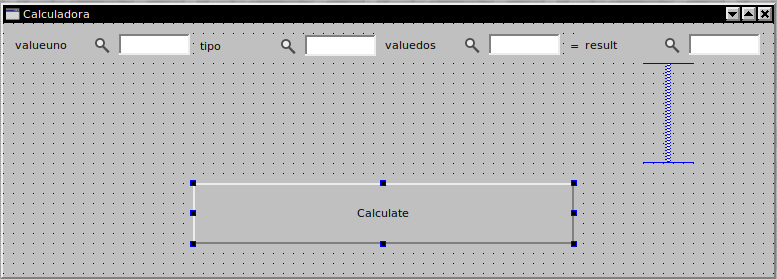

Y luego debemos rellenar las principales properties de todos los elementos según su funcionalidad:

1. __fdbValueUno__ valueuno
1. __fdbTipo__ tipo
1. __fdbValueDos__ valuedos
1. __fdbResult__ result
1. __qpbCalculate__ Calculate

Viendo se al final de la siguiente manera:

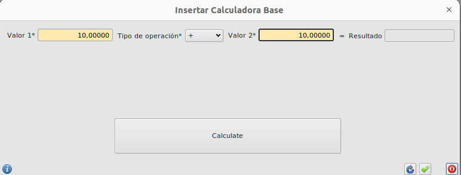

### <span style="color:cyan">4. Creacción de script </span>

Ahora vienela parte un poco más compleja, la creación del script que realizara la acción que desees (En este caso sumar los dos números).

Nos vamos al directorio _scripts_ y crearemos el siguiente fichero (calculadorabase.qs).  
Ahí dentro escribiremos las diferentes _clases_ y _functions_ que necesitemos para hacer funcionar la calculadora.

Primero, debemos saber que siempre hay que comentar e indicar en qeu parte del fichero nos encontramos. Un ejemplo sería el siguiente: 

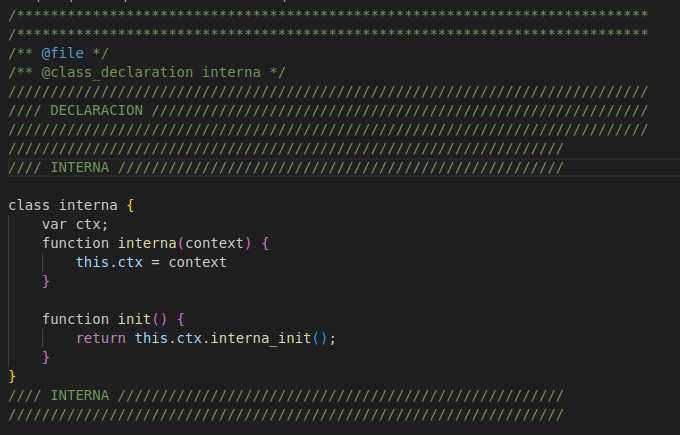

Primero se indica el nombre de donde estamos con el `@`.  
Luego explicamos la acción que se efectuará, en este caso es el `DESARROLLO`.  
Y por último se especifica el apartado en el que se esté situado. Siendo el del ejemplo `INTERNA`

Después se continua con la creación de las clases principales.

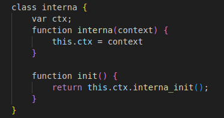

La primera será la **clase interna**, la cuál es la que se ejecutará de normal al principio. En ella colocaremos las funciones más globales como el ___init___, el cuál es la primera function que se realiza.

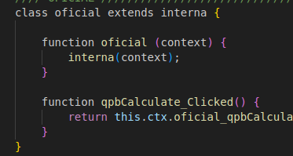

La siguiente clase es la **clase oficial**, está `"Heredará"` o `"Implementará"` la clase interna.  
Las funciones que contendrá están más dirigidas a acciones específicas como la que tenemos en este caso de _qpbCalculate_, creada para hacer el cálculo de la calculadora.  
Normalmente las funciones dentro de la clase tendrán el nombre propio `qpbCalculate_Clicked` (Le añadimos el clicked ya que es una acción de un botón), y las funciones tendrán el nombre de la clase + el nombre propio `oficial_qpbCalculate_Clicked`, aunque esto lo veremos más adelante.

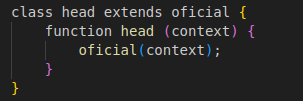

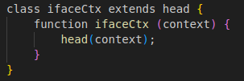

Las dos siguientes clases son la **clase head** que hereda de oficial y la **clase ifaceCtx** que hereda de la anterior.

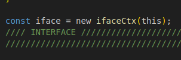

Tambíen se crea una constante que representa la clase ifaceCtx.

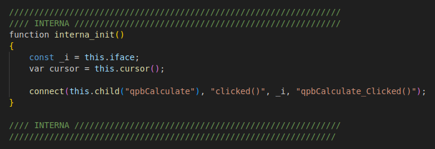

Una vez terminado de crear las clases empezaremos con las funciones. Se crearán en el ordén de la clase que pertenezcan y en el que estén dentro de está (aunque esto es más una guía).

La función **interna_init()** tiene una constante de la variable del fichero que creamos y un cursor propio.

Y lo más importante de está clase, se efectuan las conexiones necesarias.

En nuestro caso es la conexión con el botón que calculará la operación.

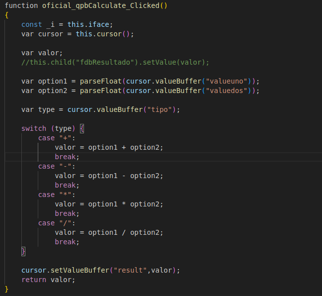

Esta función contiene el algoritmo necesario para que se realice el cálculo.

Ten en cuenta que no existe una única forma de hacer el algoritmo.

El código utilizado para este script es el siguiente:

```
/***************************************************************************
/***************************************************************************
/** @file */
/** @class_declaration interna */
////////////////////////////////////////////////////////////////////////////
//// DECLARACION ///////////////////////////////////////////////////////////
////////////////////////////////////////////////////////////////////////////
//////////////////////////////////////////////////////////////////
//// INTERNA ///////////////////////////////////////////////////// 

class interna {
    var ctx;
    function interna(context) { 
        this.ctx = context
    }

    function init() {
		return this.ctx.interna_init();
	}
} 
//// INTERNA /////////////////////////////////////////////////////
//////////////////////////////////////////////////////////////////

/** @class_declaration oficial */
//////////////////////////////////////////////////////////////////
//// OFICIAL /////////////////////////////////////////////////////
class oficial extends interna {
    
    function oficial (context) {
        interna(context);
    }

    function qpbCalculate_Clicked() {
        return this.ctx.oficial_qpbCalculate_Clicked();
    }
}
//// OFICIAL /////////////////////////////////////////////////////
//////////////////////////////////////////////////////////////////

/** @class_declaration head */
/////////////////////////////////////////////////////////////////
//// DESARROLLO /////////////////////////////////////////////////
class head extends oficial {
    function head (context) {
        oficial(context);
    }
}
//// DESARROLLO /////////////////////////////////////////////////
/////////////////////////////////////////////////////////////////

/** @class_declaration ifaceCtx */
/////////////////////////////////////////////////////////////////
//// INTERFACE //////////////////////////////////////////////////
class ifaceCtx extends head {
    function ifaceCtx (context) {
        head(context);
    }
}

const iface = new ifaceCtx(this);
//// INTERFACE //////////////////////////////////////////////////
/////////////////////////////////////////////////////////////////

/** @class_definition interna */
////////////////////////////////////////////////////////////////////////////
//// DEFINICION ////////////////////////////////////////////////////////////
////////////////////////////////////////////////////////////////////////////

//////////////////////////////////////////////////////////////////
//// INTERNA /////////////////////////////////////////////////////
function interna_init() 
{
    const _i = this.iface;
    var cursor = this.cursor();

    connect(this.child("qpbCalculate"), "clicked()", _i, "qpbCalculate_Clicked()");
}

//// INTERNA /////////////////////////////////////////////////////
/////////////////////////////////////////////////////////////////

/** @class_definition oficial */
//////////////////////////////////////////////////////////////////
//// OFICIAL /////////////////////////////////////////////////////

function oficial_qpbCalculate_Clicked()
{
    const _i = this.iface;
    var cursor = this.cursor();

    var valor;
    //this.child("fdbResultado").setValue(valor); 

    var option1 = parseFloat(cursor.valueBuffer("valueuno"));
    var option2 = parseFloat(cursor.valueBuffer("valuedos"));
    
    var type = cursor.valueBuffer("tipo");

    switch (type) {
        case "+":
            valor = option1 + option2;
            break;
        case "-":
            valor = option1 - option2;
            break;
        case "*":
            valor = option1 * option2;
            break;
        case "/":
            valor = option1 / option2;
            break;
    }

    cursor.setValueBuffer("result",valor);
    return valor;
}

//// OFICIAL /////////////////////////////////////////////////////
/////////////////////////////////////////////////////////////////

/** @class_definition head */
/////////////////////////////////////////////////////////////////
//// DESARROLLO /////////////////////////////////////////////////

//// DESARROLLO /////////////////////////////////////////////////
/////////////////////////////////////////////////////////////////
```

## <span style="color:violet">Comprobación</span>

Cuando ya tengamos todos los nuevos archivos y ficheros creados, actualizados y guardados podemos comprobar si el resulatado es el esperado.

Para ello solo se encesita ir a _Eneboo_, entrar al módulo que hemos creado y crear un nuevo registro

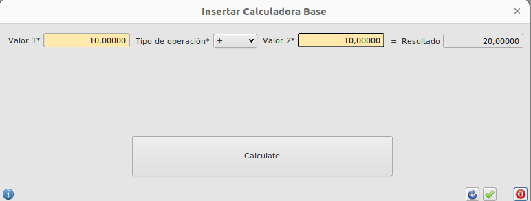

Si todo ha salido como debería, cuando cliques en el botón de _Calculate_ debería actualizarse el campo del resultado.

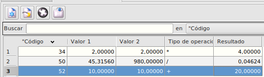

Por último, si guardamos el registro, luego a la hora de modificarlo también debería hacerse el cálculo.

### Más

  * [Volver al Índice](../index.md)