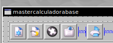
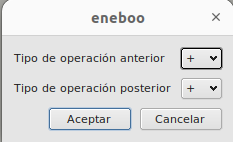

# <span style="color:purple">Master Calculadora</span>

En ejercicios anteriores creamos nuestra propia calculadora con diferentes funcionalidades, aprendimos a usar correctamente tanto los diseños de formularios, como la creación de tablas, como la incorparación de una nueva actividad o un script que contenga las difentes clases y funciones necesarias para que la calculadora se ejecute sin problemas.

Ahora nos ocuparemos de aprender la utilidad del formulario __master__. Este es aquel que ese muestra al seleccionar cualquier item de la Tabla General, un ejemplo es el formulario que se muestra abajo.


La finalidad de este apartado es crear una funcionalidad del formulario que cambie datos de los registros, sin utilizar el típico botón de __editar__. Para efectuar esta actividad crearemos un nuevo botón, que al ser seleccionado abrirá una nueva ventana llamada `dialog`, esta se ocupará de realizar el cambio que propondremos. 

## <span style="color:violet">Requisitos</span>

Lo necesario para realizar este ejercicio es haber creado una calculadora funcional que guarde los datos y los registros en una base de datos.

El botón mencionado anteriormente debe tener la siguiente función:  
 - Al ser seleccionado abrirá una dialog con los siguientes apartados $\rightarrow$ 2 __ComboBox__, 1 botón de aceptar, 1 botón de cancelar.
- La función que desempeñará es la de cambiar el tipo de operación. 
- Los ComboBox contendrán los 4 tipos de operaciones posibles a realizar
- En el primer CBx se seleccionar la operación que deseamos sustituir y en el segundo señalaremos la operación que la remplazará.
- Al clicar en el botón de aceptar se deben reflejar los cambios tanto en los registros del tipo de operación como en el del resultado final.

## <span style="color:violet">Resolución</span>

La correción del ejercicio contará de 3 pasos:
 1. Crear el botón en el formulario.
2. Añadir la referencia al formulario master de calculadora en la acción de `flfactppal.xml`
2. Crear script de mastercalculadora
	1. Asignarle la función al botón de crear un dialog.
	2. Crear el diálogo.
	3. Realizar una función que realice el cambio.


### <span style="color:cyan">1. Incluir botón el el formulario master</span>

Primero necesitamos un formulario master del que partir, podemos duplicar el archivo de `masterejercicios.ui`que ya tiene incorporado un botón. Al guardarlo tenemos que recordar cambiarle el nombre a `mastercalculadorabase.ui` y en el mismo formulario cambiaremos el __name__ y el __caption__




Una vez tengamos el formulario master preparado lo acomodaremos a nuestro gusto, dejaremos el antiguo botón del formulario anterior con un nuevo diseño, nombre y contenido como podemos ver en esta imagen.


### <span style="color:cyan">2. Crear script de mastercalculadorabase</span>

Una vez terminada la parte gráfica ya podemos empezar con la programación del código.  
Como de normal, crearemos un nuevo scrip para dicho formulario, lo llamaremos `mastercalculadorabase.qs`


Crearemos las clases por defecto (por llamarlas de alguna forma) y sus respectivos comentarios.  
La clase interna se quedará intacta, solo necesitamos recordar hacer la conexión en el __init_ del botón que creamos anteriormente.  
Y la clase oficial tendrá 3 funciones diferente, una para cada punto mencionados al principio de la resolución.


La función de __Clicked()__ será muy simple, en ella solo llamaremos a la función que cree el diálogo, a la cuál se le pasará un campo, el tipo del buffer que el cursor detecte que esté seleccionado, al final de la función refrescaremos la tabla para que se muestren los cambios.


Para la creación del dialogo facilitaremos un enlace con varias extensiones explicadas, entre ellas la del dialog ([QSA Extension Frameworks](https://doc.qt.io/archives/qsa-1.2.2/extensions-framework.html)).

El dialogo no se puede crear gráficamente, asi que se tiene que definir mediante código, primero crearemos un nuevo dialogo con su diferente contenido principal, y luego definiremos los intems que tendrá, y tendremos que añadirlos al dialogo mediante la función de `add()`.

Para el ComboBox tenemos que definir las opciones que contiene, en este caso los tipos de operaciones, que las guardaremos en un array y se la pasaremos a la prorpety. Además necesita saber cuál será su elección por defecto, esta será la del tipo que le pasamos por parámetro en la función.


Por último queda la implementación de la función que realice el cambio de los datos. Para esto crearemos un nuevo cursor que recorra una tabla con los datos específicos, habilitaremos la edición con `setModeAcess`, refrescaremos los datos, cambiaremos los datos del tipo de operación del resultado y haremos el `commit` para que se gaurden los cambios.

Proporcionaremos el código del fichero `mastercalculadora.qs`

```
/** @file */

/** @class_declaration interna */
////////////////////////////////////////////////////////////////////////////
//// DECLARACION ///////////////////////////////////////////////////////////
////////////////////////////////////////////////////////////////////////////

//////////////////////////////////////////////////////////////////
//// INTERNA /////////////////////////////////////////////////////
class interna {
	var ctx;
	
	function interna( context ) 
	{ 
		this.ctx = context; 
	}
	
	function init() 
	{
		return this.ctx.interna_init();
	}
}
//// INTERNA /////////////////////////////////////////////////////
//////////////////////////////////////////////////////////////////

/** @class_declaration oficial */
//////////////////////////////////////////////////////////////////
//// OFICIAL /////////////////////////////////////////////////////
class oficial extends interna 
{
	function oficial( context ) 
	{ 
		interna(context); 
	}

	function mismaOperacion(antes, despues):String 
	{
		return this.ctx.oficial_mismaOperacion(antes, despues);
	}

	function pbCTO_Clicked()
    {
        return this.ctx.oficial_pbCTO_Clicked();
    }

	function changeOperationDialog(tipo:string) 
	{
		return this.ctx.oficial_changeOperationDialog(tipo);
	}
}
//// OFICIAL /////////////////////////////////////////////////////
//////////////////////////////////////////////////////////////////

/** @class_declaration head */
/////////////////////////////////////////////////////////////////
//// DESARROLLO /////////////////////////////////////////////////
class head extends oficial 
{
	function head( context ) 
	{ 
		oficial(context); 
	}
}
//// DESARROLLO /////////////////////////////////////////////////
/////////////////////////////////////////////////////////////////

/** @class_declaration ifaceCtx */
/////////////////////////////////////////////////////////////////
//// INTERFACE //////////////////////////////////////////////////
class ifaceCtx extends head 
{
	function ifaceCtx( context ) 
	{ 
		head(context); 
	}
}

const iface = new ifaceCtx(this);
//// INTERFACE //////////////////////////////////////////////////
/////////////////////////////////////////////////////////////////

/** @class_definition interna */
////////////////////////////////////////////////////////////////////////////
//// DEFINICION ////////////////////////////////////////////////////////////
////////////////////////////////////////////////////////////////////////////

//////////////////////////////////////////////////////////////////
//// INTERNA /////////////////////////////////////////////////////
function interna_init()
{
	var _i = this.iface;
	//CONECTAS EL BOTON A FUNCION
    connect(this.child("pbCTO"), "clicked()", _i, "pbCTO_Clicked()");

}
//// INTERNA /////////////////////////////////////////////////////
/////////////////////////////////////////////////////////////////

/** @class_definition oficial */
//////////////////////////////////////////////////////////////////
//// OFICIAL /////////////////////////////////////////////////////


function oficial_pbCTO_Clicked()
{
	const _i = this.iface;
    var cursor = this.cursor();

	var tipoSeleccion = cursor.valueBuffer("tipo");

	_i.changeOperationDialog(tipoSeleccion);
	this.child("tableDBRecords").refresh();
}

function oficial_changeOperationDialog(tipo)
{
	const _i = this.iface;
    var cursor = this.cursor();

	var aTipos = ["+", "-", "*", "/"];
	//aTipos.push("+");

	var dialog = new Dialog;
	dialog.caption = sys.translate("Cambio de operación");
	dialog.okButtonText = sys.translate("Aceptar")
	dialog.cancelButtonText = sys.translate("Cancelar");
	dialog.width = 150;

	var cbAntes = new ComboBox;
	cbAntes.label = sys.translate("Tipo de operación anterior");
	cbAntes.itemList = aTipos;
	cbAntes.currentItem = tipo;
	dialog.add(cbAntes);

	var cbDespues = new ComboBox;
	cbDespues.label = sys.translate("Tipo de operación posterior");
	cbDespues.itemList = aTipos;
	cbDespues.currentItem = tipo;
	dialog.add(cbDespues);

	if(!dialog.exec())
		return false;

	_i.mismaOperacion(cbAntes.currentItem, cbDespues.currentItem);
}

function oficial_mismaOperacion(antes, despues)
{
    const cursorOperaciones = new FLSqlCursor("calculadorabase")
    
	cursorOperaciones.select("tipo = '" + antes + "'")

    while (cursorOperaciones.next()) 
	{
		cursorOperaciones.setModeAccess(cursorOperaciones.Edit);
		cursorOperaciones.refreshBuffer();

		cursorOperaciones.setValueBuffer("tipo",despues);
		
		var result = formRecordcalculadorabase.iface.commonCalculateField("result", cursorOperaciones);

		cursorOperaciones.setValueBuffer("result", result);

        cursorOperaciones.commitBuffer();
    }
}

//// OFICIAL /////////////////////////////////////////////////////
/////////////////////////////////////////////////////////////////

/** @class_definition head */
/////////////////////////////////////////////////////////////////
//// DESARROLLO /////////////////////////////////////////////////

//// DESARROLLO /////////////////////////////////////////////////
/////////////////////////////////////////////////////////////////
```

### <span style="color:cyan">3. Visualización del diálogo</span>

Si no se detecta ninguna incoherencia en el código deberiamos observar el siguiente resultado a la hora de presionar en el botón	



## <span style="color:violet">Conclusión</span>

En este apartado, hemos aprendido la utilidad del formulario "master" en nuestra calculadora personalizada. Mediante la implementación de un nuevo botón en la clase mastercalculadorabase.ui, hemos logrado agregar una funcionalidad que permite cambiar datos de los registros sin utilizar botón de "editar".

El nuevo botón, al ser seleccionado, abre una ventana de diálogo llamada "dialog" que se encarga de realizar el cambio propuesto. En dicha ventana de diálogo, se presentan dos ComboBox que contienen los cuatro tipos de operaciones posibles a realizar. El primer ComboBox se utiliza para seleccionar la operación que se desea sustituir, mientras que el segundo se utiliza para indicar la operación que la reemplazará.

Al hacer click en el botón de aceptar, los cambios se reflejan tanto en los registros del tipo de operación como en el resultado final. Esto se logra mediante la creación de un nuevo cursor que recorre una tabla con los datos específicos. Se habilita la edición, se actualizan los datos del tipo de operación del resultado y se realiza un commit para guardar los cambios.

En resumen, la implementación del botón en la clase mastercalculadorabase.ui ha brindado a nuestra calculadora la capacidad de cambiar los datos de los registros de manera eficiente y sin la necesidad de utilizar el botón de editar tradicional. Esta funcionalidad mejora la experiencia del usuario al permitirle actualizar los tipos de operaciones de manera rápida y sencilla.

¡Con esto concluye el apartado de implementación del botón en la clase mastercalculadorabase.ui! Ahora nuestra calculadora cuenta con una nueva funcionalidad que amplía su capacidad de personalización y manejo de datos.


### Más

  * [Volver al Índice](../index.md)