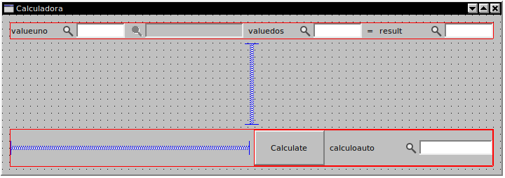

# Calculadora Mixta

En este es un ejercicio que pretende mejorar la calculadora creada en ejercicios anteriores añadiendo una última funcionalidad para que se parezca más a la realidad.

Pretenderemos hacer que el usuario pueda elegir entre las dos opciones que tenían las dos calculadoras anteriores.

Por una parte que siempre que cliques en el botón de `Calculate` se realice el cálculo, mientras que el cálculo automático sea opcional. Deberemos activar un __checkBox__ el cuál permitirá que se realice un cálculo sin necesidad de presionar el botón.

## Requisitos

Lo único que necesitamos para realizar este último apartado es a ver realizado los dos anteriores con éxito. Con eso queremos decir que debemos tener en nuestro módulo un apartado en el que hallamos creado una calculadora con las dos modalidades requeridas.

## Resolución

Si después de los anteriores ejercicios aún no sabemos como empezar no hace falta que nos preocupemos, a continuación explicaremos los pasos a seguir para completar este reto.

### 1. Añadir field en la tabla

Si queremos crear un checkBox en el formulario lo más óptimo es que tengamos un `field` concreto para realizar esa acción como se muestra en la siguiente imagen. Y a raíz del tipo del tipo de input que es, el _type_ dentro de la tabla será un _bool_

### 2. Cambio de diseño en el formulario

Una vez que tengamos la tabla actualizada podemos añadir el checkBox con tranquilidad a nuestro formulario y de paso aprenderemoso como utilizar el `layout` bien, siempre y cuando aún tengas dudas sobre él. 

Utilizaremos el siguiente diseño como guía, aunque esta parte depende más de gustos propios o en su defecto, de forma oficial, de lo que nos pida el cliente.

Queremos que el formulario resultante tenga este aspecto:

 
Para ello primero romperemos todos los layout que hallan.

Luego colocaremos cada item en su lugar correspondiente (incluyendo los __Spacer__).

Acuerdate de darle un minimo de tamaño a algunos items para que después no desaparezcan.

Una vez tengamos la disposición lista empezaremos a agrupar los items en minilayouts.  
Primero juntaremos los que estén alineados horizontalmente, para conseguir este resultado debemos seleccionar uno de los items y a su vez presionaremos `shift` y seguiremos seleccionando los demás items.  
Cuando ya tengamos todos seleccionados clicaremos en el siguiente botón.

Esto hace que se agrupen todos en un mismo layout de la siguente forma, no nos preocuparemos ahora de que hayan encogido todos.

Una vez que tengamos todos los items agrupados en sus propios Layouts podemos hacer la última agrupación. Seleccionaremos en cualquier parte del formulario original (QWidget) y clicaremos este botón:

Ahora, el formulario ya debería visualizarse a nuestro gusto según las medidas que hallamos puesto.

En este caso el resultado final debería quedar así:

### 3. Actualización del scrip

Lo único necesario para que el _cb_ haga lo que queremos es añadir una condición el el script.

Diremos que solo se realice el cálculo automático cuando el _cb_ esté _true_.

### 4. Optimización de código

Ahora mismo todo funciona según lo pediamos, pero hay un último punto que debemos ver tambiés, y es la optimización.

Nos daremos cuenta de que hay más código del necesario, y sino lo explicaremos ahora.

En el primer ejercicio se hizo un algoritmo para calcular el campo `Result` al clicar, y en el siguiente ejercicio se utilizo el mismo algoritmo pero en otra función diferente. Al tener dos funciones tan semejantes es bueno intentar simplificar, en este caso optimizar una de ellas como se muestra en la imágen siguente.

También añadimos otra condición al `commonCalculateField`, esta es que el field que se le pase debe ser __result__

A parte, una cosa del anterior código que podemos cambiar es la llamada al `setValueBuffer`, que antes la haciamos en dentro del Calculate.  
Ahora eso se ejecutará mejor cuando deba hacerse el cambio, ya sea clicando o el cambio automático. Y en la función de Calculate dejar únicamente un __return__ del valor final.

## Conclusión

Finalizado la optimización ya deberíamos tener nuestro código perfectamente funcional para realizar las funciones solicitadas. Asimismo, habremos aprendido como mejorar los Layouts de nusetros formularios y como se puede mejorar un código para que sea más eficiente.

### Más

  * [Volver al Índice](../index.md)