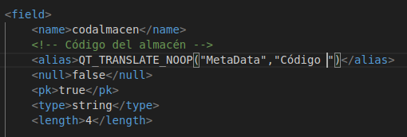
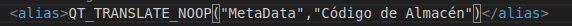
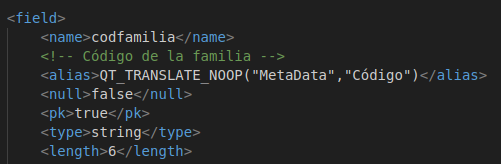
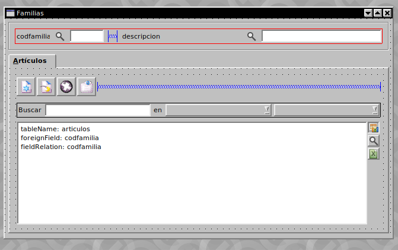
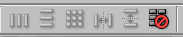
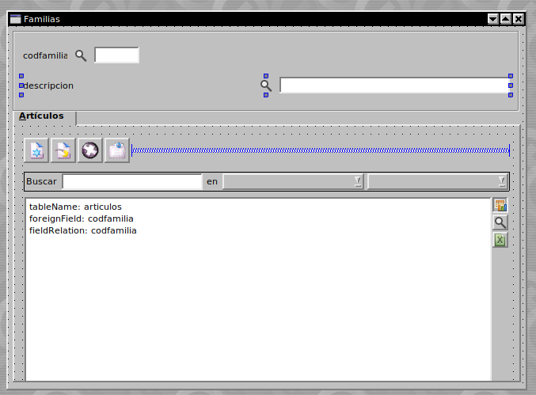
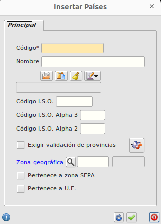
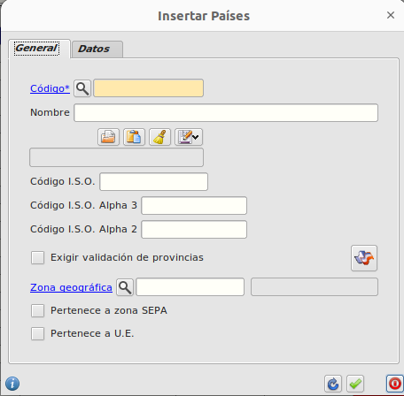
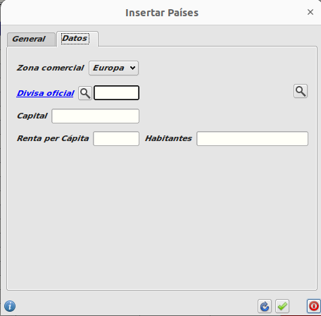
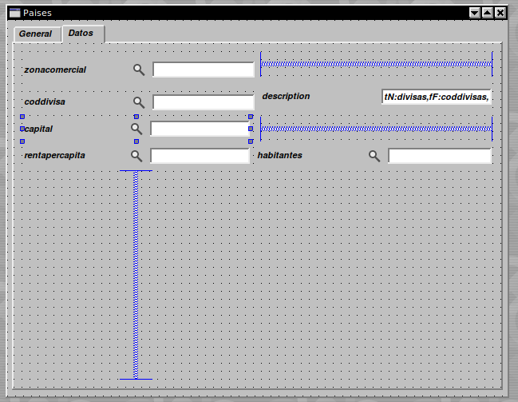

# <span style="color:purple">Tutorial. Programación en Abanq (I). Primer contacto</span>

Esta es la primera parte de una serie de tutoriales orientados a programadores y usuarios avanzados de Abanq. Aqui veremos como se realiza la personalización básica y sencilla del entorno, asi pues conseguiremos tener una idea clara de la facilidad y la flexibilidad que dispone la applicación para realizar cambios sobre la estructura de los datos y el aspecto de los formularios.

## <span style="color:violet">Requerimiento</span>

Antes de comenzar a trabajar:

- Descargar e instalar la aplicación base de Abanq (recomendamos la versión más reciente).  
- Descargar los módulos públicos. Para este tutorial bastarán los módulos del área de Facturación  
- Arrancar Abanq con una nueva base de datos y cargar los módulos

## <span style="color:violet">Glosario</span>

Desde este [glosario](../../glosario/glosario.md) podemos consultar el significado de algunos términos que se utilizarán a lo largo de este tutorial.


## <span style="color:violet">Algunos conceptos previos:</span>

El área de Sistema Abanq tiene diversas funciones, sirve tanto como software de gestión como a su vez de entorno de desarrollo, así tienes permitido realizar cambios y personalizaciones desde lo más básico a lo más avanzado.

Desde el área de Sistema puedes tanto cargar los módulos, como modificar los ficheros de tablas, formularios, informes, etc.  
Para ello abriremos el módulo de Administración dentro del área de Sistema.  

**Sistema $\rightarrow$ Admistración $\rightarrow$ Módulos**

Ahí aparecerán un listado de todos los módulos. Si abrimos, por ejemplo, el módulo flfactppal (principal de facturación) accedemos al listado de ficheros.

Algunos ejemplos:
clientes.mtd es la tabla de clientes; clientes.ui es el formulario de clientes, etc.

Los principales tipos de ficheros que maneja Abanq son:

- Tablas (extensión mtd)  
- Formularios (extensión ui)  
- Scripts (extensión qs)  
- Plantillas de informes (extensión kut)  
- Consultas sql para informes (extensión qry)

## <span style="color:violet">Cambios básicos en tablas y formularios</span>

Vamos a utilizar las herramientas que incorpora Abanq para realizar algunos cambios sencillos en tablas y formularios de los módulos previamente cargados.

### <span style="color:cyan">1. Cambio de propiedades de un campo</span>

Cambio de alias. El alias de un campo es el nombre que aparece en los formularios y las tablas maestras.  
Para los almacenes vamos a modificar el alias del campo _"Código"_ cambiándolo por "Código de Almacén".

Para visualizar el cambio nos dirigimos a   Almacenes y mostramos el listado de estos de nuestra base de datos. Si nos fijamos el primer campo tiene el alias Código. Estos alias se especifícan en las tablas.

Desde el módulo de sistema::administración, abrimos el módulo flfactalma (almacén), y a
continuación la tabla Almacenes (almacenes.mtd). En el campo codalmacen cambiamos la
propiedad alias.

  
*Campo original*  

  
_Campo con el Alias cambiado_

Aceptamos todos los formularios. Podemos verificar el cambio abriendo de nuevo el formulario de almacenes y comprobando el alias nuevo.

### <span style="color:cyan">2. Cambio de la longitud máxima de un campo.</span>

Para las familias de artículos, el campo Código tiene una longitud máxima de 4 caracteres. Vamos a ampliar esta longitud hasta 6 caracteres. Dentro del módulo Almacén abrimos la tabla Familias (familias.mtd) y en el campo código cambiamos la propiedad lenght de 4 a 6:

  
_Longitud del campo incrementada_

Podemos verificar el cambio abriendo el formulario de familias y comprobando que efectivamente el código admite ahora hasta 6 caracteres.

### <span style="color:cyan">3. Cambios en el diseño de los formularios</span>

A la hora de trabajar con formularios vamos a utilizar la herramienta QT Designer. Tal como vimos, cuando editamos un fichero con extensión .ui en el módulo de sistema, el editor que aparece es QT Designer.  

Algunos aspectos importantes acerca de QT Designer:  

- Los componentes de un formulario pueden cambiarse de posición pulsando sobre ellos con el ratón y arrastrando.
- Los componentes pueden agruparse en layouts, utilizando los botones correspondientes (menú
Window / Toolbars / Layout).
- Todas las propiedades de los componentes están en la paleta de propiedades (menú window / views / Property Editor).

Vamos a utilizar este editor para cambiar el aspecto del formulario de familias:

  
_Formulario de familias antes del cambio._  

  
_Con esa función se puede romper el Layout._  

  
_Formulario de familias después del cambio._

Para conseguir este resultado abriremos el fichero familias.ui dentro del módulo de Almacén y procederemos a editarlo según las figuras anteriores.

## <span style="color:violet">Cambios en el modelo de datos y formularios</span>

Continuando con la personalización de tablas y formularios, vamos a realizar algunas modificaciones importantes en el formulario y tabla de países

**facturacion $\rightarrow$ forms $\rightarrow$ paises.ui**

El objetivo del ejercicio es ampliar la información sobre los países que almacenamos en nuestra base de datos.
Vamos a añadir los siguientes campos:

- Zona comercial. Un valor a elegir entre Europa, EEUU, Asia, Latinoamérica
- Divisa oficial. Se podrá obtener de la tabla Divisas
- Capital
- Habitantes
- Renta per cápita

El formulario actual de países tiene este aspecto:

  
_Formulario de países antes de los cambios._  

Nuestro objetivo es crear un formulario de dos pestañas (General y Datos) con el aspecto siguiente:  

  
_Pestaña general del nuevo formulario de Países._

  
_Pestaña datos del nuevo formulario de países_

### <span style="color:cyan">1. Modificar el modelo de datos</span>

Debemos añadir los nuevos campos a la tabla de países. Abrimos la tabla e insertamos el código siguiente:  

```
<field>
    <name>zonacomercial</name>
    <alias>QT_TRANSLATE_NOOP("MetaData","Zona comercial")</alias>  
    <null>true</null>
    <pk>false</pk>
    <optionslist>Europa,EEUU,Asia,Latinoamérica</optionslist>
    <default>Europa</default>
    <type>string</type>
    <length>20</length>
</field>  
<field>
    <name>coddivisa</name>
    <alias>QT_TRANSLATE_NOOP("MetaData","Divisa oficial")</alias>
    <null>true</null>
    <pk>false</pk>
    <type>string</type>
    <length>3</length>
    <relation>
    <table>divisas</table>
    <field>coddivisa</field>
    <card>M1</card>
    </relation>
</field>
<field>
    <name>capital</name>
    <alias>QT_TRANSLATE_NOOP("MetaData","Capital")</alias>
    <null>true</null>
    <pk>false</pk>
    <type>string</type>
    <length>40</length>
</field>
<field>
    <name>habitantes</name>
    <alias>QT_TRANSLATE_NOOP("MetaData","Habitantes")</alias>
    <null>true</null>
    <pk>false</pk>
    <type>double</type>
    <partI>10</partI>
    <partD>0</partD>
    </field><field>
    <name>rentapercapita</name>
    <alias>QT_TRANSLATE_NOOP("MetaData","Renta per Cápita")</alias>
    <null>true</null>
    <pk>false</pk>
    <type>double</type>
    <partI>6</partI>
    <partD>0</partD>
</field> 
```

Características comunes de los nuevos campos:  

- Hemos establecido la propiedad null a true en todos los campos. Con ello permitiremos que dichos campos permanezcan vacíos.

- La propiedad pk (clave primaria) forzosamente ha de ser false porque no puede haber más de un campo clave primaria en la tabla, en este caso es el campo codpais.

- La propiedad alias establece el nombre del campo de cara a la interfaz de usuario; es el texto que aparece en los formularios y las cabeceras de campo de las tablas. Siempre pondremos QT_TRANSLATE_NOOP("MetaData", "alias del campo").  Esta función es necesaria para realizar las traducciones de textos a distintos idiomas.  

Características específicas de los campos:  

- zonacomercial $\rightarrow$ La propiedad optionslist permite establecer la lista de valores que aparecerán en el desplegable del formulario. Los valores se separan por comas. La propiedad default establecida a Europa indica que éste es el valor por defecto para los nuevos registros. En la propiedad type vemos que se trata de un string -cadena de caracteres-, y en la propiedad length que su longitud máxima es de 20 caracteres.

- coddivisa $\rightarrow$ Este campo almacena el código de la divisa del país. Vemos que está relacionado con la tabla divisas (propiedad table) mediante el campo coddivisa (propiedad field) de dicha tabla. El valor M1 de la propiedad card establece que puede haber varios países (M) para cada divisa (1).

- capital $\rightarrow$ Se trata de un campo sencillo de tipo string y 40 caracteres de longitud máxima.

- habitantes $\rightarrow$ Este es un campo numérico que debe almacenar números grandes. Hemos optado por el tipo double. Las propiedades partI y partD indican la longitud de la parte izquierda (entera) y derecha (decimal) del número respectivamente.

- rentapercapita $\rightarrow$ Similar a habitantes.

Para terminar, debemos modificar la tabla divisas para incluir la relación establecida con el
campo coddivisa de la tabla de países. El código es el siguiente:

```
<relation>
    <table>divisas</table>
    <field>coddivisa</field>
    <card>M1</card>
</relation>
```

Fijémonos en que ahora la propiedad card toma el valor contrario (1M: una divisa, varios países).

### <span style="color:cyan">2. Modificar el formulario</span>

Vamos a abrir el formulario de países en QT Designer para modificarlo según las figuras 7 y 8 Una vez abierta la aplicación, vamos a abrir las paletas de herramientas (menú Window / Views / Toolbox) y propiedades (menú Window / Views / Property Editor).  
De la paleta de herramientas
seleccionaremos los componentes a insertar en el formulario. En la paleta de propiedades editaremos las mismas.

Pasos:

- Antes de comenzar debemos romper los layouts

-Las pestañas forman parte de un control tipo TabWiget. Insertamos el control desde la paleta de herramientas y establecemos los nombres de ambas pestañas (General y Datos). Esto puede hacerse pulsando el botón derecho del ratón sobre el control y seleccionando Edit Page Title

- Movemos los campos actuales del formulario hasta la pestaña General

- Activamos la pestaña Datos

- En la paleta de herramientas seleccionamos Database y FLFieldDB para insertar el primer campo, Zona Comercial
- Establecemos la propiedad name del nuevo campo a fdbZonaComercial.

- Establecemos la propiedad fieldName del nuevo campo a zonacomercial. Este es el nombre del campo en la tabla

- Repetimos los pasos anteriores para el resto de campos.

- De los campos anteriores, utilizamos uno que no está en la tabla de países. Es el que muestra la descripción de la divisa. Abanq permite mostrar este valor que se encuentra en otra tabla -la tabla divisas- siempre que exista una relación entre ambas tablas. Para este campo las propiedades son
fieldName con valor descripcion, tableName con valor divisas, foreignField con valor coddivisa y fielRelation con valor coddivisa.

- Damos formato al formulario mediante controles spacer y layouts, y modificando las propiedades de tamaño de los campos:  

  
_Modificando el formulario de países en QT Designer._

### Más

- [Volver al Índice](../index.md)
