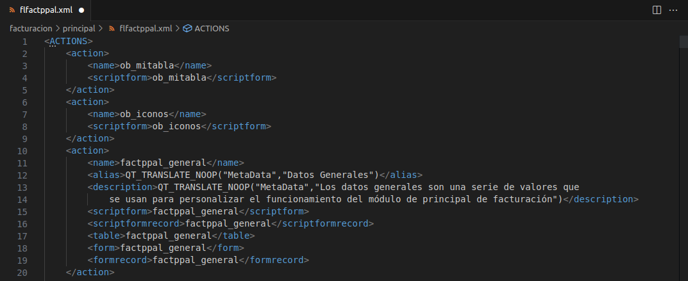
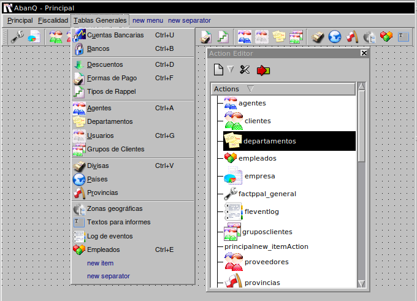
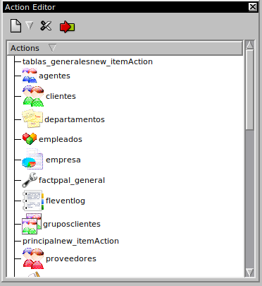
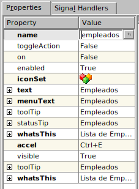
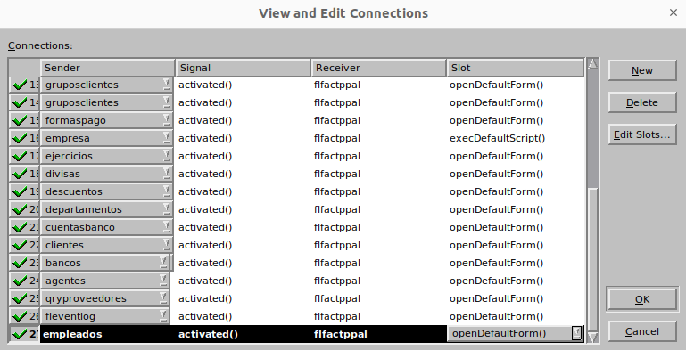
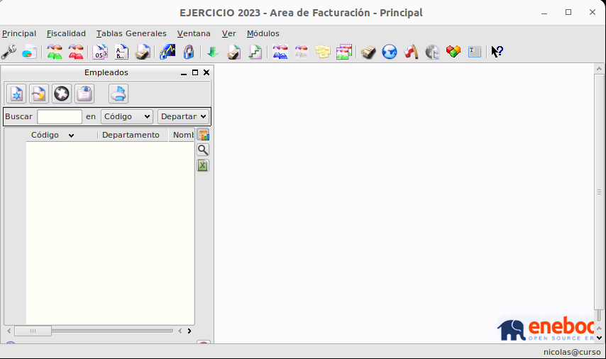
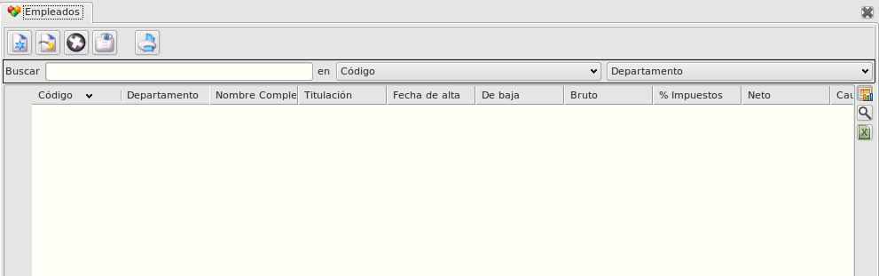
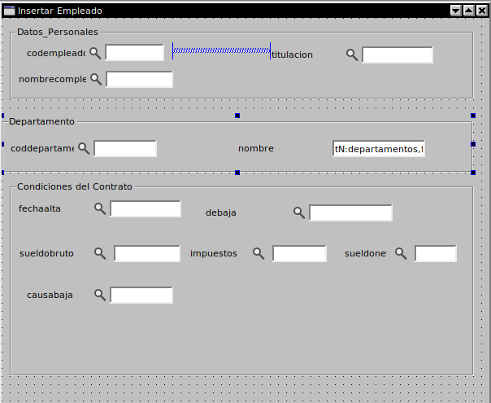
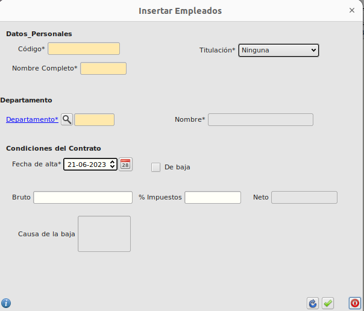
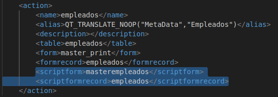

# <span style="color:purple">Tutorial. Programación en Abanq (II). Acciones</span>

En el capítulo anterior de esta serie de artículos sobre programación en Abanq vimos cómo realizar pequeñas modificaciones sobre módulos ya existentes. Básicamente, eran modificaciones sobre tablas y formularios en las que añadíamos campos o modificábamos sus propiedades.

En el presente artículo describiremos la forma de realizar lo que Abanq denomina acciones completas. Esto quiere decir que aprenderemos a crear nuestras propias tablas y formularios, y a relacionarlos con otros elementos ya existentes.

Además, dotaremos a nuestros formularios de funcionalidades añadidas mediante la programación de scripts, veremos la estructura del lenguaje QSA y usaremos las clases más importantes que Abanq pone a disposición de los programadores.

Para terminar, confeccionaremos un informe sencillo para obtener un resumen bien presentado de los datos contenidos en las nuevas tablas.

## <span style="color:violet">Antes de comenzar a trabajar</span>

Realizaremos todos los ejemplos prácticos sobre el módulo Principal del área Facturación. Por ello es necesario acceder a una base de datos con este módulo cargado, tal y como hicimos en el artículo anterior. Si queremos disponer de una base de datos nueva para realizar estos ejemplos, basta con especificar el nuevo nombre de base de datos al arrancar Abanq, y cargar a continuación el módulo Principal de Facturación.

## <span style="color:violet">Las acciones en Abanq</span>

Como vimos en el artículo anterior, el motor de Abanq lee e interpreta los metadatos (información sobre tablas, formularios, scripts, etc.) que el Sistema Gestor de Base de Datos (SGDB) le proporciona. Estos metadatos se organizan
en lo que llamamos módulos. Cada módulo agrupa un conjunto de metadatos que implementan una funcionalidad concreta (facturación, almacén, etc.).

Vamos a ver ahora la estructura interna de estos módulos. El fichero de metadatos que define esta estructura es el fichero de acciones, y su nombre es id_modulo.xml, donde id_modulo es el identificador que cada módulo tíene asignado en la tabla Módulos del módulo de Administración.

Tomaremos como ejemplo el módulo Principal del área de Facturación. Su código es flfactppal, por tanto, el fichero de acciones será _flfactppal.xml_. Lo visualizaremos de la forma ya descrita en el artículo anterior: 

**Área de Sistema $\rightarrow$ Módulo de Admistración $\rightarrow$ Módulos $\rightarrow$ flfactppal $\rightarrow$  Seleccionar flfactppal.xml $\rightarrow$  Ver registro**

Aparecerá una ventana similar a la de la imagen 1:

  
*flfactppal.xml(imagen1)*  

Vemos que el fichero de acciones está compuesto por nodos `<action>`. Cada uno de estos nodos define una acción. Una acción es una unidad funcional concreta, que agrupa una serie de elementos necesarios para su correcto funcionamiento.

Cada acción puede contener los nombres de una tabla, un formulario maestro, un formulario de edición, un script de formulario maestro y un script de formulario edición.

Por ejemplo, la acción clientes agrupa las funcionalidades de la gestión de clientes: la tabla donde se almacenan sus
datos, los formularios utilizados para acceder a dichos datos, los scripts que gestionan los formularios, etc.

Las etiquetas que conforman cada acción son:

 - `<name>` Nombre de la acción.
- `<alias>` Alias o título de la acción
- `<description>` Descripción de la funcionalidad acción
- `<table>` Nombre de la tabla asociada a la acción.
- `<form>` Nombre del formulario maestro asociado a la acción.
- `<formrecord>` Nombre del formulario de edición asociado a la acción.
- `<scriptform>` Nombre del script asociado al formulario maestro.
- `<scriptformrecord>` Nombre del script asociado al formulario edición.

Veremos qué significa cada una de estas etiquetas a medida que progresemos en el desarrollo de nuestro ejemplo.

## <span style="color:violet">Creando nuestra acción</span>

Vamos a suponer que nos es necesario llevar un control de los empleados de nuestra empresa. Para ello es necesario recoger los datos personales de cada uno de ellos. Cada empleado está asociado a un departamento de la empresa, y queremos poder emitir informes con un listado de los empleados de alta agrupados por departamento. Para realizar esta
ampliación, el primer paso será crear la acción empleados (la acción departamentos ya existe en el módulo principal). Editaremos el fichero de acciones _flfactppal.xml_  , añadiendo un nuevo nodo `<action>` escribiendo el siguiente código:

```
<action>
    <name>empleados</name>
    <alias>QT_TRANSLATE_NOOP("MetaData","Empleados")</alias>
    <description></description>
    <table>empleados</table>
    <form>master_print</form>
    <formrecord>empleados</formrecord>
    <scriptform>masterempleados</scriptform>
    <scriptformrecord>empleados</scriptformrecord>
</action>
```

Para hacer esta acción recuerda que debemos entrar desde un editor de código a dicho módulo, y en el fichero mencionado antes añadiremos la nueva `<action>`

En la nueva acción indicamos que la tabla de empleados debe definirse en el fichero empleados.mtd, y que los formularios maestro y de edición (veremos qué significan estos términos más adelante) son i_master.ui y empleados.ui.  
Por ahora no indicaremos los nombres de los scripts. Una vez guardados los cambios ya tenemos nuestra acción creada. Para completar este apartado, vamos a crear un acceso desde la ventana principal del módulo de Facturación, de manera que podamos acceder a la gestión de empleados desde una opción de menú o desde un botón de la barra de herramientas.  
Las ventanas principales de cada módulo son formularios cuyo nombre sigue el esquema id_modulo.ui. En nuestro caso, deberemos editar el formulario flfactppal.ui. Una vez abierto el formulario mediante QtDesigner, incluiremos una
nueva opción Empleados en el menú Tablas Generales como se muestra en la imagen 3

  
_Tabla General con el nuevo campo Empleados_

Para añadir el campo podemos seleccionar la opción de

**Tablas Generales $\rightarrow$ new item**

Donde aparecerá un nuevo campo como se muestra en la imagen

 

Luego editaremos las propiedades de este item para modificarlo a nuetro antojo. Esto lo haremos accediendo a la parte de properties (Property Editor) de dicho item.

 

Como podemos ver, hemos añadido un icono y especificado las teclas de acceso rápido a la acción. Para incluir un botón en la barra de herramientas arrastraremos el icono desde el Action Editor hasta la posición de la barra en la que
deseemos ubicar el botón.

Cada acción de la ventana principal del módulo debe corresponderse con una acción del fichero de acciones. Esta correspondencia se establece haciendo coincidir la propiedad name de la acción de la ventana con la etiqueta `<name>` del correspondiente nodo action del fichero de acciones. En nuestro caso este valor es empleados.

Nos falta por último determinar qué sucederá cuando se seleccione la acción empleados en la ventana principal del
módulo. Lo que haremos será abrir el formulario por defecto asociado a la acción. Para ello, en el Action Editor, seleccionamos la acción empleados y pulsamos el botón de conexiones:

 

En la ventana View and Edit Connections nos aparece la lista de conexiones establecidas. La última entrada de la lista nos propone conectar la acción empleados con el objeto FLWidgetApplication.
Como veremos más adelante, es muy común en la arquitectura de Abanq establecer conexiones entre objetos. Estas conexiones determinan que cuando un objeto -el emisor- envíe una determinada señal, otro objeto -el receptor- ejecutará un determinado método o slot.

En nuestro caso, deseamos que cuando el objeto acción empleados se active (emita la señal activated), el objeto ventana principal de la aplicación Abanq (FLWidgetApplication) muestre el formulario por defecto de la acción (slot
openDefaultForm). La conexión debe quedar por tanto tal y como describe la imagen 6.

 

Una vez establecida la conexión pulsamos Ok y guardamos los cambios en flfactppal.ui. Ya podemos probar nuestra acción. Si accedemos al módulo Principal del área de Facturación y pulsamos el botón o la opción de menú Empleados, Abanq nos mostrará una ventana tal que así.



El mensaje 'No hay metadatos' hace referencia a que no hemos definido todavía la tabla empleados. En el siguiente punto veremos cómo hacer esto.

## <span style="color:violet">Creando las tablas</span>

Las tablas se definen dentro del directorio tables de los módulos, y tienen la extensión mtd.

El nombre del fichero de la tabla, según nuestra nomenclatura, debe ser empleados.mtd. Insertamos un registro en el módulo, igual que hicimos con la creación del fichero de acciones, para la nueva tabla con el nombre anterior y el
contenido siguiente:

```
<!DOCTYPE TMD> <TMD>
<name>empleados</name>
<alias>QT_TRANSLATE_NOOP("MetaData","Empleados")</alias>
    <field>
        <name>codempleado</name>
        <alias>QT_TRANSLATE_NOOP("MetaData","Código")</alias>
        <null>false</null>
        <pk>true</pk>
        <type>string</type>
        <length>18</length>
    </field>
    <field>
        <name>coddepartamento</name>
        <alias>QT_TRANSLATE_NOOP("MetaData","Departamento")</alias>
        <null>false</null>
        <pk>false</pk>
        <type>string</type>
        <length>6</length>
        <relation>
        <table>departamentos</table>
        <field>coddepartamento</field>
        <card>M1</card>
        </relation>
    </field>
    <field>
        <name>nombrecompleto</name>
        <alias>QT_TRANSLATE_NOOP("MetaData","Nombre Completo")</alias>
        <null>false</null>
        <pk>false</pk> <!--Código de departamento-->
        <type>string</type>
        <length>150</length>
    </field>
    <field>
        <name>titulacion</name>
        <alias>QT_TRANSLATE_NOOP("MetaData","Titulación")</alias>
        <null>false</null>
        <pk>false</pk>
        <type>string</type>
        <length>20</length>
        <optionslist>Ninguna,Ed. Primaria,Ed. Secundaria,FP,Título Universitario</optionslist>
        <default>OFICINA</default>
    </field>
    <field>
        <name>fechaalta</name>
        <alias>QT_TRANSLATE_NOOP("MetaData","Fecha de alta")</alias>
        <null>false</null>
        <pk>false</pk>
        <type>date</type>
    </field>
    <field>
        <name>debaja</name>
        <alias>QT_TRANSLATE_NOOP("MetaData","De baja")</alias><null>false</null>
        <pk>false</pk>
        <type>bool</type>
        <default>false</default>
    </field>
    <field>
        <name>sueldobruto</name>
        <alias>QT_TRANSLATE_NOOP("MetaData","Bruto")</alias>
        <null>true</null>
        <pk>false</pk>
        <type>double</type>
        <partI>4</partI>
        <partD>2</partD>
    </field>
    <field>
        <name>impuestos</name>
        <alias>QT_TRANSLATE_NOOP("MetaData","% Impuestos")</alias>
        <null>true</null>
        <pk>false</pk>
        <type>double</type>
        <partI>2</partI>
        <partD>2</partD>
    </field>
    <field>
        <name>sueldoneto</name>
        <alias>QT_TRANSLATE_NOOP("MetaData","Neto")</alias>
        <null>true</null>
        <pk>false</pk>
        <type>double</type>
        <partI>4</partI>
        <partD>2</partD>
    </field>
    <field>
        <name>causabaja</name>
        <alias>QT_TRANSLATE_NOOP("MetaData","Causa de la baja")</alias>
        <null>true</null>
        <pk>false</pk>
        <type>stringlist</type>
    </field>
</TMD>
```

El campo sección lo hemos definido como una lista de opciones con varias secciones de la empresa a modo de ejemplo.

Es muy recomendable repasar la estructura xml de esta tabla y comprender bien todos los campos y etiquetas.

Podemos repasar las especificaciones de las tablas. 

Pulsamos Aceptar cambios y cerrar formulario.

## <span style="color:violet">Creando los formularios</span>

Abanq usa dos tipos principales de formularios: El formulario maestro y el formulario de edición. Veamos cómo es y cómo se crea cada uno de ellos.

El formulario maestro es el que muestra en una lista un subconjunto de los registros de la tabla, ofreciendo al usuario la posibilidad de realizar ciertas operaciones (crear, modificar, borrar, etc.) sobre el registro seleccionado. Sirve además para localizar un determinado registro realizando una búsqueda por cualquiera de los campos de la tabla. El formulario maestro asociado a una acción está determinado por el valor de la etiqueta `<form>` del nodo `<action>`.

En el caso de la acción de empleados, hemos nombrado a este formulario i_master. Éste no es un nombre al azar, sino el de un formulario predeterminado, ya incluido en Abanq. De hecho, podemos volver a pulsar sobre la acción de empleados y veremos que ya nos aparece un formulario Empleados con los campos de la tabla.



En el caso de que quisiéramos crear un formulario maestro personalizado, procederíamos de forma similar a como se describe a continuación para el formulario de edición.

El formulario de edición es el que ofrece al usuario la posibilidad de visualizar, crear o modificar los datos de un determinado registro de la tabla. El formulario de edición asociado a una acción está determinado por el valor de la etiqueta `<formrecord>` del nodo `<action>`.

Vamos a crear el formulario de edición correspondiente a la acción empleados. Lo habíamos llamado empleados, luego el fichero deberá llamarse _empleados.ui_ . Siguiendo el mismo procedimiento que para crear la tabla empleados.mtd,
crearemos un nuevo registro en el módulo flfactppal. Al tener el fichero la extensión .ui, Abanq lanzará QtDesigner en lugar del editor de textos. En el cuadro de diálgo New File seleccionaremos el tipo Widget.

Nuestro formulario de edición debe.



Hemos agrupado los controles __FLFieldDB__ en tres controles groupBox para mayor claridad, aunque esto no es necesario.

Las principales propiedades de cada campo son las siguientes:  
1. __fdbCodEmpleado__ codempleado
1. __fdbTitulacion__ titulacion
1. __fdbNombreCompleto__ nombrecompleto
1. __fdbCodDepartamento__ coddepartamento
1. __fdbNomDepartamento__ nombre departamentos coddepartamento coddepartamento
1. __fdbFechaAlta__ fechaalta
1. __fdbDeBaja__ debaja
1. __fdbSueldoBruto__ sueldobruto
1. __fdbImpuestos__ impuestos
1. __fdbSueldoNeto__ sueldoneto
1. __fdbCausaBaja__ causabaja

Hemos optado por establecer los nombres de los controles como __fdb + NombreCampo__. Aunque la propiedad name puede tomar cualquier valor, en este ejemplo es recomendable mantener los de la tabla anterior, para que los scripts que crearemos a continuación no tengan que ser retocados.

En el campo 5 vamos a mostrar el nombre del departamento al que pertenece el empleado. Como este campo no pertenece a la tabla de empleados sino a la de departamentos, debemos establecer el resto de propiedades tal y como ya describimos en el artículo anterior.

Una vez guardado el formulario ya podemos probarlo. Si abrimos la acción empleados aparecerá el
fomulario maestro (i_master.ui). Si pulsamos ahora sobre el botón Insertar Registro, se abrirá nuestro
formulario empleados.ui con el siguente aspecto.



Podemos apreciar cómo dependiendo del tipo de campo, el control FLFieldDB correspondiente toma el aspecto
adecuado para mostrar su valor.

Llegados a este punto ya podriamos comenzar a trabajar con esta ventana. Los botones de aceptar y cancelar, así como las validaciones de datos de cada campo están plenamente operativos, de forma que si establecemos todos los campos requeridos (marcados como <null>false</null> en empleados.mtd) y pulsamos aceptar habremos creado nuestro primer
empleado.

## <span style="color:violet">Creando los scripts</span>

Vamos a dotar a nuestros formularios de una mayor funcionalidad asociándoles un script. No vamos a hacer una descripción demasiado formal del lenguaje QSA usado en Abanq, simplemente diremos que es muy similar a JavaScript e incluiremos comentarios en el código de los ejemplos que aclaren su funcionamiento.
Algo que sí es importante recalcar es que, al margen de las clases y funciones que QSA ofrece al
programador de scripts, el motor de Abanq también publica una serie de clases que nos permiten acceder a ciertos objetos internos del motor. Como veremos, esto da una gran potencia a los scripts, ya que permite hacer muchas operaciones que de otra manera sólo podrían conseguirse recompilando el código C++ del motor.

Podemos consultar la documentación de QSA pulsando [aqui][docQSA] , y la de la interfaz de
objetos de Abanq en el apartado de documentación de esta web. Lo primero será añadir las referencia a los scripts en el correspondiente nodo `<action>` del fichero de acciones.



Hemos asociado al formulario maestro el script masterempleados.qs, y al formulario de edición el script empleados.qs.

Crearemos primero el script asociado al formulario de edición, empleados.qs. A continuación mostramos el código completo del script que contiene algunas de las principales funciones que son llamadas automáticamente por el motor de Abanq en ciertos momentos de la ejecución del formulario.

El sistema de clases y herencias escapa al ámbito de este tutorial y se verá con posterioridad.

```
/***************************************************************************
/***************************************************************************
/** @file */
/** @class_declaration interna */
////////////////////////////////////////////////////////////////////////////
//// DECLARACION ///////////////////////////////////////////////////////////
////////////////////////////////////////////////////////////////////////////
//////////////////////////////////////////////////////////////////
//// INTERNA /////////////////////////////////////////////////////
class interna
{
    var ctx;
    function interna(context)
    {
        this.ctx = context;
    }
    function init()
    {
        this.ctx.interna_init();
    }
    function calculateField(fN)
    {
        return this.ctx.interna_calculateField(fN);
    }
}
//// INTERNA /////////////////////////////////////////////////////
//////////////////////////////////////////////////////////////////
/** @class_declaration oficial */
//////////////////////////////////////////////////////////////////
//// OFICIAL /////////////////////////////////////////////////////
class oficial extends interna
{
    function oficial(context) { interna(context); }
    function bufferChanged(fN)
    {
        return this.ctx.oficial_bufferChanged(fN);
    }
}
//// OFICIAL /////////////////////////////////////////////////////
//////////////////////////////////////////////////////////////////
/** @class_declaration head */
/////////////////////////////////////////////////////////////////
//// DESARROLLO /////////////////////////////////////////////////
class head extends oficial
{
    function head(context) { oficial(context); }
}
//// DESARROLLO /////////////////////////////////////////////////
/////////////////////////////////////////////////////////////////
/** @class_declaration ifaceCtx */
/////////////////////////////////////////////////////////////////
//// INTERFACE
class ifaceCtx extends head
{
    function ifaceCtx(context) { head(context); }
} const iface = new ifaceCtx(this);
//// INTERFACE
/////////////////////////////////////////////////////////////////
/** @class_definition interna */
////////////////////////////////////////////////////////////////////////////
//// DEFINICION ////////////////////////////////////////////////////////////
////////////////////////////////////////////////////////////////////////////
//////////////////////////////////////////////////////////////////
//// INTERNA /////////////////////////////////////////////////////
/* Función que se llama al iniciar el formulario
Conecta la señal bufferchanged (cambio en el buffer,cambio en un campo) con el slot o función
bufferChanged
Si se la llama en modo alta inhabilitará el campo 'Causa de la baja'
*/
function interna_init()
{
    var cursor = this.cursor(); // Objeto FLSqlCursor asociado al formulario
    var baja_habilitada = cursor.valueBuffer("debaja");
    if (baja_habilitada)
    {
        this.child("fdbCausaBaja").setDisabled(false);
    }
    else
    {
        this.child("fdbCausaBaja").setDisabled(true);
    }
    connect(this.cursor(), "bufferChanged(QString)", this, "iface.bufferChanged");
    if (cursor.modeAccess() == cursor.Insert)
        this.child("fdbSueldoNeto").setDisabled(true);
}
/* Función que calcula el valor de un campo. En este caso el sueldo neto cuando a partir del bruto y los
impuestos
fN: Nombre del campo a calcular
Resultado: Valor del campo
*/
function interna_calculateField(fN)
{
    var cursor = this.cursor(); // Objeto FLSqlCursor asociado al formulario
    var valor = "";
    switch (fN)
    {
    // El sueldo neto será el sueldo bruto tras descontarle los impuestos
    case "sueldoneto":
        var sueldoBruto = parseFloat(cursor.valueBuffer("sueldobruto"));
        var impuestos = parseFloat(cursor.valueBuffer("impuestos"));
        valor = sueldoBruto * (100 - impuestos) / 100;
        return valor;
        break;
    }
}
/* Función que se llama al pulsar el botón aceptar y que decide si los datos del formulario son válidos.
Si los datos no son válidos, los datos no se guardarán y el formulario de edición no se cerrará.
Resultado: true si los datos son válidos, false en caso contrario
*/
function interna_validateForm()
{
    var cursor = this.cursor();
    // La fecha de alta no puede superar la fecha actual
    var hoy = new Date();
    var fechaAlta = cursor.valueBuffer("fechaalta");
    if (AQUtil.daysTo(fechaAlta, hoy) < 0)
    {
        MessageBox.warning(util.translate("scripts", "La fecha de alta no puede ser superior a la fecha actual"), MessageBox.Ok, MessageBox.NoButton);
        return false;
    }
    return true;
}
//// INTERNA /////////////////////////////////////////////////////
/////////////////////////////////////////////////////////////////
/** @class_definition oficial */
//////////////////////////////////////////////////////////////////
//// OFICIAL /////////////////////////////////////////////////////
function oficial_bufferChanged(fN)
{
    var cursor = this.cursor();
    var habilitada = cursor.valueBuffer("debaja");
    switch (fN)
    {
    case "sueldobruto":
    case "impuestos":
        this.child("fdbSueldoNeto").setValue(this.iface.calculateField("sueldoneto"));
        break;
    case "debaja":
        if (habilitada)
        { // Si la casilla está marcada, se habilitará la causa de la baja
            form.child("fdbCausaBaja").setDisabled(false);
            form.child("fdbCausaBaja").setValue("");
        }
        else
        { // Si la casilla no está marcada el cuadro de Causa de la Baja estará deshabilitado
            form.child("fdbCausaBaja").setDisabled(true);
            form.child("fdbCausaBaja").setValue("");
        }
        break;
    }
}
//// OFICIAL /////////////////////////////////////////////////////
/////////////////////////////////////////////////////////////////
/** @class_definition head */
/////////////////////////////////////////////////////////////////
//// DESARROLLO /////////////////////////////////////////////////
/////////////////////////////////////////////////////////////////
```

Si tratamos de ejecutar la función imprimir la aplicación fallará, dado que la consulta empleados.qry todavía no está creada.

[docQSA]: http://doc.trolltech.com/qsa-1.2/index.html

## <span style="color:violet">Creando los informes</span>

Para finalizar, vamos a crear un pequeño informe en el que recogeremos los datos de nuestro empleados
organizados por departamentos. Para ello crearemos primero una consulta que extraiga dichos datos.

Crearemos el fichero _empleados.qry_ con el siguiente contenido:

```
<?xml version="1.0" encoding="UTF-8"?>
<!DOCTYPE KugarTemplate SYSTEM "kugartemplate.dtd">
<KugarTemplate BottomMargin="10" LeftMargin="20" PageOrientation="0" PageSize="0"
    RightMargin="10" TopMargin="10">
    <PageHeader PrintFrequency="1" Height="80">
        <Label BackgroundColor="255,255,255" BorderColor="0,0,0"
            BorderStyle="1" BorderWidth="1" FontFamily="Arial"
            FontItalic="1" FontSize="14" FontWeight="50"
            ForegroundColor="0,0,0" HAlignment="1" Height="32"
            Text="INFORME DE EMPLEADOS DE ALTA" VAlignment="1" Width="606"
            WordWrap="0" X="5" Y="4" />
    </PageHeader>
    <Detail Height="80" Level="0">
        <Label BackgroundColor="255,255,255" BorderColor="0,0,0"
            BorderStyle="0" BorderWidth="1" FontFamily="Arial"
            FontItalic="0" FontSize="12" FontWeight="70"
            ForegroundColor="0,0,0" HAlignment="0" Height="24"
            Text="Departamento" VAlignment="1" Width="123"
            WordWrap="0" X="4" Y="2" />
        <Field BackgroundColor="255,255,255" BorderColor="0,0,0"
            BorderStyle="0" BorderWidth="1" CommaSeparator="44"
            Currency="32" DataType="0" DateFormat="11"
            Field="departamentos.nombre" FontFamily="Arial" FontItalic="0"
            FontSize="10" FontWeight="50" ForegroundColor="0,0,0"
            HAlignment="0" Height="24" NegValueColor="0,0,0" Precision="2"
            Text="[departamentos.nombre]"
            Width="123" WordWrap="0" X="100" Y="2" />
        <Label BackgroundColor="255,255,255" BorderColor="0,0,0"
            BorderStyle="0" BorderWidth="1" FontFamily="Arial"
            FontItalic="0" FontSize="12" FontWeight="70"
            ForegroundColor="0,0,0" HAlignment="0" Height="24"
            Text="Cod" VAlignment="1" Width="100"
            WordWrap="0" X="250" Y="2" />
        <Field BackgroundColor="255,255,255" BorderColor="0,0,0"
            BorderStyle="0" BorderWidth="1" CommaSeparator="44"
            Currency="32" DataType="0" DateFormat="11"
            Field="departamentos.coddepartamento" FontFamily="Arial" FontItalic="0"
            FontSize="10" FontWeight="50" ForegroundColor="0,0,0"
            HAlignment="0" Height="24" NegValueColor="0,0,0"
            Precision="2" Text="[departamentos.coddepartamento]"
            Width="100" WordWrap="0" X="400" Y="2" />
    </Detail>
    <DetailHeader Height="10" Level="1">
        <Label BackgroundColor="255,255,255" BorderColor="0,0,0"
            BorderStyle="0" BorderWidth="1" FontFamily="Arial"
            FontItalic="0" FontSize="12" FontWeight="70"
            ForegroundColor="0,0,0" HAlignment="0" Height="27"
            Text="Cod" VAlignment="1" Width="123"
            WordWrap="0" X="50" Y="10" />
        <Label BackgroundColor="255,255,255" BorderColor="0,0,0"
            BorderStyle="0" BorderWidth="1" FontFamily="Arial"
            FontItalic="0" FontSize="12" FontWeight="70"
            ForegroundColor="0,0,0" HAlignment="0" Height="27"
            Text="Nombre" VAlignment="1" Width="123"
            WordWrap="0" X="200" Y="10" />
        <Label BackgroundColor="255,255,255" BorderColor="0,0,0"
            BorderStyle="0" BorderWidth="1" FontFamily="Arial"
            FontItalic="0" FontSize="12" FontWeight="70"
            ForegroundColor="0,0,0" HAlignment="0" Height="27"
            Text="Fecha Alta" VAlignment="1" Width="123"
            WordWrap="0" X="350" Y="10" />
        <Label BackgroundColor="255,255,255" BorderColor="0,0,0"
            BorderStyle="0" BorderWidth="1" FontFamily="Arial"
            FontItalic="0" FontSize="12" FontWeight="70"
            ForegroundColor="0,0,0" HAlignment="0" Height="27"
            Text="Sueldo Bruto" VAlignment="1" Width="123"
            WordWrap="0" X="500" Y="10" />
    </DetailHeader>
    <Detail Height="68" Level="1">
        <Field BackgroundColor="255,255,255" BorderColor="0,0,0"
            BorderStyle="0" BorderWidth="1" CommaSeparator="44"
            Currency="32" DataType="0" DateFormat="11"
            Field="empleados.codempleado" FontFamily="Arial" FontItalic="0"
            FontSize="10" FontWeight="50" ForegroundColor="0,0,0"
            HAlignment="0" Height="16" NegValueColor="0,0,0"
            Precision="2" Text="[empleados.codempleado]" VAlignment="1"
            Width="288" WordWrap="0" X="50"
            Y="30" />
        <Field BackgroundColor="255,255,255" BorderColor="0,0,0"
            BorderStyle="0" BorderWidth="1" CommaSeparator="44"
            Currency="32" DataType="0" DateFormat="11"
            Field="empleados.nombrecompleto" FontFamily="Arial" FontItalic="0"
            FontSize="10" FontWeight="50" ForegroundColor="0,0,0"
            HAlignment="0" Height="16" NegValueColor="0,0,0" Precision="2"
            Text="[empleados.nombrecompleto]" VAlignment="1"
            Width="288" WordWrap="0" X="200"
            Y="30" />
        <Field BackgroundColor="255,255,255" BorderColor="0,0,0"
            BorderStyle="0" BorderWidth="1" CommaSeparator="44"
            Currency="32" DataType="0" DateFormat="11"
            Field="empleados.fechaalta" FontFamily="Arial" FontItalic="0"
            FontSize="10" FontWeight="50" ForegroundColor="0,0,0"
            HAlignment="0" Height="16" NegValueColor="0,0,0"
            Precision="2" Text="[empleados.fechaalta]" VAlignment="1"
            Width="288" WordWrap="0" X="350"
            Y="30" />
        <Field BackgroundColor="255,255,255" BorderColor="0,0,0"
            BorderStyle="0" BorderWidth="1" CommaSeparator="44"
            Currency="32" DataType="0" DateFormat="11"
            Field="empleados.sueldobruto" FontFamily="Arial" FontItalic="0"
            FontSize="10" FontWeight="50" ForegroundColor="0,0,0"
            HAlignment="0" Height="16" NegValueColor="0,0,0"
            Precision="2" Text="[empleados.sueldobruto]" VAlignment="1"
            Width="288" WordWrap="0" X="500"
            Y="30" />
    </Detail>
    <DetailFooter Height="10" Level="1">
        <Line Color="0,0,0" Style="2"
            Width="2" X1="1" X2="612"
            Y1="45" Y2="45" />
        <Label BackgroundColor="255,255,255" BorderColor="0,0,0"
            BorderStyle="0" BorderWidth="1" FontFamily="Arial"
            FontItalic="0" FontSize="12" FontWeight="70"
            ForegroundColor="0,0,0" HAlignment="0" Height="27"
            Text="Total Empleados" VAlignment="1" Width="123"
            WordWrap="0" X="4" Y="50" />
        <CalculatedField BackgroundColor="255,255,255" BorderColor="0,0,0"
            BorderStyle="0" BorderWidth="1" CommaSeparator="44"
            Currency="32" DataType="0" DateFormat="11"
            Field="empleados.codempleado" CalculationType="0" FontFamily="Arial" FontItalic="0"
            FontSize="10" FontWeight="50" ForegroundColor="0,0,0"
            HAlignment="0" Height="16" NegValueColor="0,0,0"
            Precision="2" Text="[empleados.codempleado]" VAlignment="1"
            Width="50" WordWrap="0" X="150"
            Y="52" />
        <Label BackgroundColor="255,255,255" BorderColor="0,0,0"
            BorderStyle="0" BorderWidth="1" FontFamily="Arial"
            FontItalic="0" FontSize="12" FontWeight="70"
            ForegroundColor="0,0,0" HAlignment="0" Height="27"
            Text="Gasto total en salarios" VAlignment="1" Width="200"
            WordWrap="0" X="250" Y="50" />
        <CalculatedField BackgroundColor="255,255,255" BorderColor="0,0,0"
            BorderStyle="0" BorderWidth="1" CommaSeparator="44"
            Currency="32" DataType="2" DateFormat="11"
            Field="empleados.sueldobruto" CalculationType="1" FontFamily="Arial" FontItalic="0"
            FontSize="10" FontWeight="50" ForegroundColor="0,0,0"
            HAlignment="0" Height="16" NegValueColor="0,0,0"
            Precision="2" Text="[empleados.sueldobruto]" VAlignment="1"
            Width="100" WordWrap="0" X="400"
            Y="50" />
    </DetailFooter>
    <PageFooter PrintFrequency="1" Height="30">
        <Special BackgroundColor="255,255,255" BorderColor="0,0,0"
            BorderStyle="0" BorderWidth="1" DateFormat="11"
            FontFamily="Arial" FontItalic="0" FontSize="12" FontWeight="50" ForegroundColor="0,0,0"
            HAlignment="0"
            Height="20" Text="[Fecha]" Type="0"
            VAlignment="1" Width="99" WordWrap="0"
            X="1" Y="8" />
        <Line Color="0,0,0" Style="1"
            Width="1" X1="1" X2="612"
            Y1="6" Y2="6" />
        <Special BackgroundColor="255,255,255" BorderColor="0,0,0"
            BorderStyle="0" BorderWidth="1" DateFormat="11"
            FontFamily="Arial" FontItalic="0" FontSize="12"
            FontWeight="50" ForegroundColor="0,0,0" HAlignment="2"
            Height="21" Text="[NºPagina]" Type="1"
            VAlignment="1" Width="83" WordWrap="0"
            X="528" Y="8" />
    </PageFooter>
</KugarTemplate>
```
Una vez guardado ya podemos probar el informe. El visor de informes debe mostrarnos algo parecido a la
imagen siguiente:

Bien, nuestro informe funciona, pero todavía no estamos en condiciones de ir enseñándolo por ahí. Ahora debemos darle una buena presentación. Como este trabajo es cuestion de gustos, dejaremos que cada uno dé al informe la apariencia que prefiera.

Podemos obtener más información sobre las distintas propiedades de las secciones y campos de los informes
en el apartado Documentación de <http://www.Abanq.org>

Como ejemplo de presentación podemos ver el informe que muestra la figura 17


## <span style="color:violet">Conclusión</span>

Hemos explotado la flexibilidad de Abanq para crear una funcionalidad que necesitábamos y que no existía
en los módulos actuales. Con un poco de práctica seremos capaces de realizar este tipo de ampliaciones / modificaciones en muy poco tiempo y, como hemos comprobado, con resultados profesionales.

Éste es en esencia el objetivo de Abanq: proporcionar un solución informática que se adapte a la forma de trabajar de la empresa, y no al revés como por experiencia sabemos que tantas veces sucede.
En el próximo artículo iremos un poco más lejos, creando nuestro propio módulo y analizando cómo
funciona el motor de Abanq.

***<p style="text-align: right;">Actualizado el 22/06/2023</p>***

### Más

  * [Volver al Índice](../index.md)