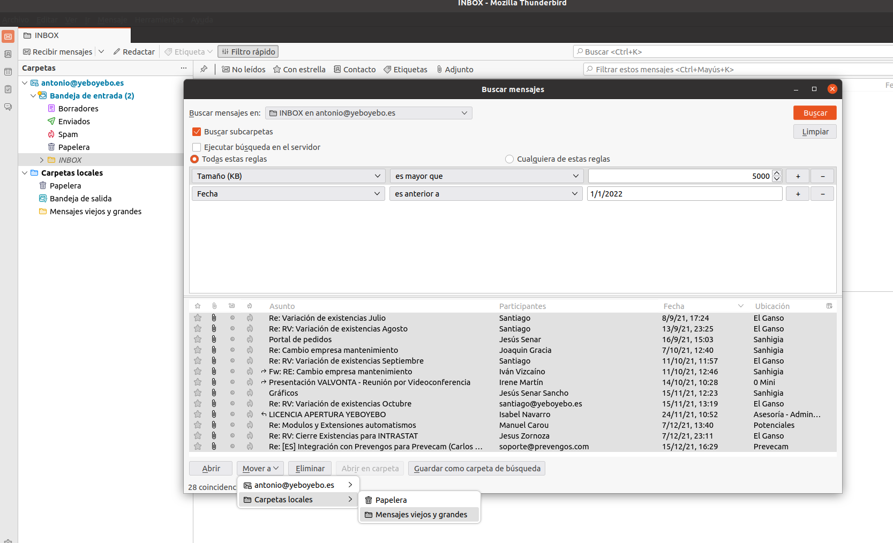

# Correo electrónico
---------------------------
## Cómo saber el tamaño de nuestra cuenta de correo en el servidor
Podémos ver el tamaño de nuestra cuenta en el webmail, haciendo hover sobre el icono del disco de la parte inferior izquierda.

## Cómo controlar el tamaño del correo

Para controlar el tamaño del correo, moveremos a carpetas locales los correos más antiguos y pesados.

**Nota**: Es bueno, antes de realizar esta tarea, borrar todos los mensajes de la papelera, para que no aparezcan en las búsquedas.

1. Vamos a Thunderbird

1. En *Carpetas locales* creamos una o varias carpetas.

1. Buscamos correos en toda nuestra cuenta desde *Editar - Buscar - Buscar mensajes*, indicando en los criterios de búsqueda tamaño y fecha)

    

1. Podemos ahí borrar los correos que sea innecesario mantener. Movemos todos los demás a la/s carpeta/s creadas en *Carpetas locales*.
  
### Más

  * [Volver al índice de manuales](../README.md)
