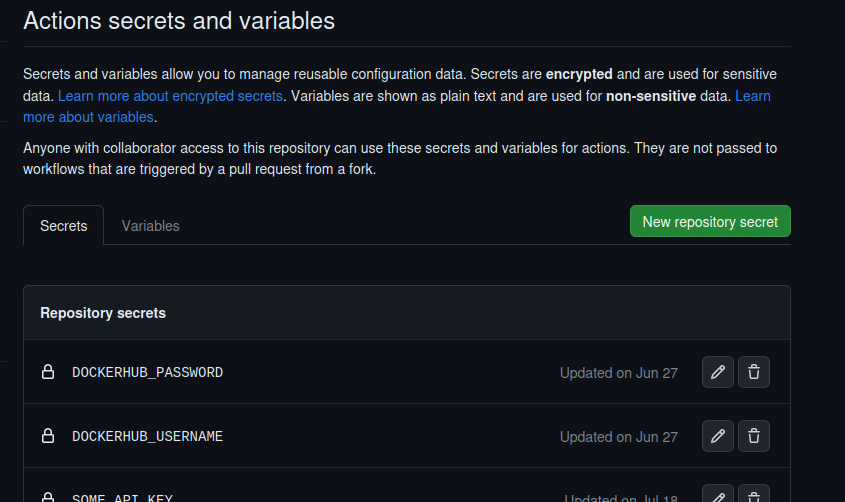
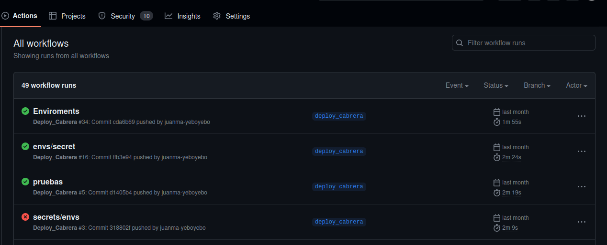

# Quimera / Despliegue automático GitHub Workflow 

Para el despliegue automático necesitamos:
* Conexion SSH con el cliente
* Acceso al puerto 443 y 80 en la maquina donde se despliegue
* Docker y Docker-Compose instalados en la maquina del cliente

En la raiz de la carpeta de quimera-mono en 

```console
    .github/workflows
```

Encontramos los ficheros **.yml**


## Estructura fichero workflow

Existira un fichero **.yml** por cada web de quimera con el siguiente formato:

```sh
name: Deploy_Cabrera

# Aqui indicaremos el nombre de la rama sobre la cual al hacer push se iniciara el proceso de despliegue automatico
on:
  push:
    branches:
      - deploy_cabrera  

jobs:
  Docker:
    runs-on: ubuntu-latest
    steps:
      - uses: actions/checkout@v3
        with:
          repository: 'yeboyebo/quimera-mono'
      - uses: actions/setup-node@v3
        with:
          node-version: 16
      
      # - name: Generate dist
      #  run: mkdir dist && mkdir apps/tienda-nativa-vbarba/dist/ && chmod 777 -R dist/ && chmod 777 -R apps/tienda-nativa-vbarba/dist/

      - name: Install pnpm
        run: npm install -g pnpm

      - name: Install Dependecies
        run: pnpm install 
      
      - name: Build
        run: pnpm build tienda-nativa-vbarba
              
      - name: Copy Configuration File
        run: cp docker-compose.yml dist/

      - name: Login to DockerHub Registry
        run: echo ${{ secrets.YB_DOCKERHUB_PASSWORD }} | docker login -u ${{ secrets.YB_DOCKERHUB_USERNAME }} --password-stdin
        
      - name: Build Docker image (test)
        run: docker build . --file Dockerfile --tag ${{ secrets.YB_DOCKERHUB_USERNAME }}/tienda-nativa-vbarba
        
      - name: Push to Docker Hub
        run: docker push ${{ secrets.YB_DOCKERHUB_USERNAME }}/tienda-nativa-vbarba
      
      - name: create ENV
        run: export CONTAINER_NAME=tienda-nativa-vbarba

      - name: Make envfile
        uses: SpicyPizza/create-envfile@v2.0
        with:
          envkey_LETSENCRYPT_HOST: ${{ secrets.TNVB_HOST }}
          envkey_LETSENCRYPT_EMAIL: ${{ secrets.TODOS_LETSENCRYPT_EMAIL }}
          envkey_VIRTUAL_HOST: ${{ secrets.TNVB_HOST }}
          envkey_SOME_API_KEY: ${{ secrets.SOME_API_KEY }}
          envkey_SECRET_KEY: ${{ secrets.YB_DOCKERHUB_PASSWORD }}
          envkey_DOCKERHUB_USERNAME: ${{ secrets.YB_DOCKERHUB_USERNAME }}
          envkey_DOCKERHUB_IMAGE: ${{ secrets.YB_DOCKERHUB_USERNAME }}/tienda-nativa-vbarba
          envkey_CONTAINER_NAME: "tienda-nativa-vbarba"
          file_name: .env
          fail_on_empty: false
          sort_keys: false

      - name: copy .env file via ssh password
        uses: appleboy/scp-action@v0.1.4
        with:
          host: ${{ secrets.TNVB_HOST }}
          username: ${{ secrets.TNVB_SSH_USER }}
          key: ${{ secrets.SSH_PRIVATE_KEY }}
          port: ${{ secrets.SSH_PORT }}
          source: ".env"
          target: /home/${{ secrets.TNVB_SSH_USER }}/tienda-nativa-vbarba

      - name: copy .env file via ssh password to stacks
        uses: appleboy/scp-action@v0.1.4
        with:
          host: ${{ secrets.TNVB_HOST }}
          username: ${{ secrets.TNVB_SSH_USER }}
          key: ${{ secrets.SSH_PRIVATE_KEY }}
          port: ${{ secrets.SSH_PORT }}
          source: ".env"
          target: /home/${{ secrets.TNVB_SSH_USER }}/tienda-nativa-vbarba/stacks

      - name: Docker Remote Deployment
        uses: wshihadeh/docker-deployment-action@master
        with:
          remote_docker_host: ${{ secrets.TNVB_SSH_USER }}@${{ secrets.TNVB_HOST }}
          ssh_private_key: ${{ secrets.SSH_PRIVATE_KEY }}
          ssh_public_key: ${{ secrets.SSH_PUBLIC_KEY }}
          docker_registry_username: ${{ secrets.YB_DOCKERHUB_USERNAME }}
          docker_registry_password: ${{ secrets.YB_DOCKERHUB_PASSWORD }}
          pull_images_first: true
          deployment_mode: docker-compose
          copy_stack_file: true
          deploy_path: /home/${{ secrets.TNVB_SSH_USER }}/tienda-nativa-vbarba
          stack_file_name: docker-compose.yml
          keep_files: 3
          pre_deployment_command_args: config 
          args: -p tienda-nativa-vbarba --env-file /home/${{ secrets.TNVB_SSH_USER }}/tienda-nativa-vbarba/.env up -d --build 
```

## Secretos GitHub

En el fichero **.yml** del ciente encontramos varias variables **${{ secrets.SECRETO }}** 

Hay un secreto por cada dato sensible del cliente tendremos que declarar estos en la web de github

https://github.com/yeboyebo/quimera-mono/settings/secrets/actions

Seleccionando **New repository secret**



Necesitamos los siguientes datos del cliente:


* TODOS_LETSENCRYPT_EMAIL: **No es necesario crear nuevo, por defecto todos.yeboyebo@gmail.com**
* SOME_API_KEY: **No es necesario crear uno nuevo**
* YB_DOCKERHUB_PASSWORD: **No cambiar, por defecto apunta a una cuenta de dockerhub de yeboyebo**
* YB_DOCKERHUB_USERNAME: **No cambiar, por defecto apunta a una cuenta de dockerhub de yeboyebo**
* CLIENT_HOST: Url al host del cliente, utilizar DNS ej: app.yeboyebo.es
* CLIENT_SSH_USER: Usuario para conexion SSH
* SSH_PORT: Puerto de conexion por ssh
* SSH_PRIVATE_KEY: Hay que generar las claves en el servidor donde se despliegue para el usuario de conexion SSH con **ssh-keygen**
* SSH_PUBLIC_KEY: Hay que generar las claves en el servidor donde se despliegue para el usuario de conexion SSH con **ssh-keygen**


## Logs despliegue

Si queremos saber como ha ido el despliegue automatico podemos acudir a github

https://github.com/yeboyebo/quimera-mono/actions

Donde podremos consultar logs sobre el estado de la instalacion y comprobar que todo se haya realizado correctamente:

